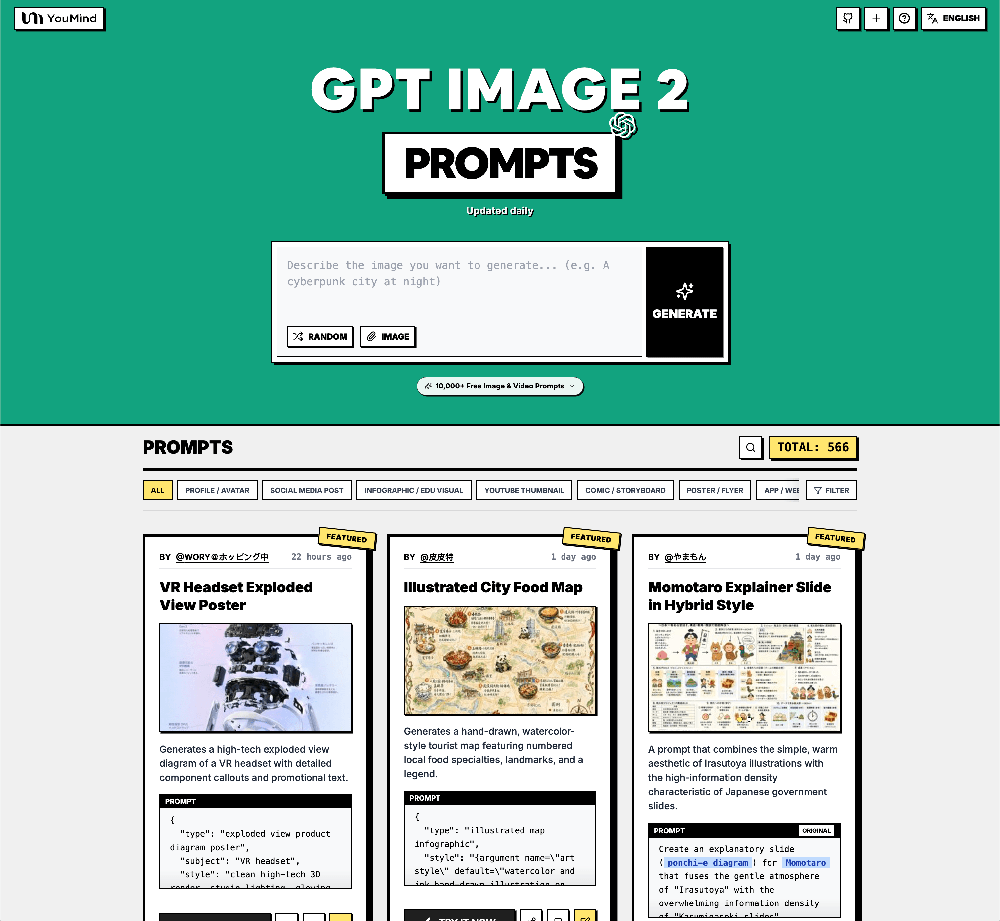

<a href="https://www.atlascloud.ai/prompts-hub/gpt-image-2-prompt?locale=ja-JP">
  
</a>

> 💡 🍌 **Nano Banana Pro** プロンプト集もチェック — Google 旗艦モデル、10000+ 厳選プロンプト 👉 [awesome-nano-banana-pro-prompts](https://github.com/AtlasCloudAI/awesome-nano-banana-pro-prompts)
# 🚀 GPT Image 2 プロンプト集

[](https://github.com/sindresorhus/awesome)
[](https://github.com/AtlasCloudAI/gpt-image2-prompt-awesome)
[](https://creativecommons.org/licenses/by/4.0/)
[](https://github.com/AtlasCloudAI/gpt-image2-prompt-awesome/actions)
[](docs/CONTRIBUTING.md)

> 🎨 OpenAI GPT Image 2 のクリエイティブなプロンプトコレクション

> ⚠️ **著作権に関する通知**: すべてのプロンプトは教育目的でコミュニティから収集されています。権利を侵害していると思われるコンテンツがある場合は、[issue を作成](https://github.com/AtlasCloudAI/gpt-image2-prompt-awesome/issues/new?template=bug-report.yml)してください。速やかに削除いたします。

---

[](README.md) [](README_zh.md) [](README_zh-TW.md) [](README_ja-JP.md) [](README_ko-KR.md) [](README_th-TH.md) [](README_vi-VN.md) [](README_hi-IN.md) [](README_es-ES.md) [-Click%20to%20View-lightgrey)](README_es-419.md) [](README_de-DE.md) [](README_fr-FR.md) [](README_it-IT.md) [-Click%20to%20View-lightgrey)](README_pt-BR.md) [](README_pt-PT.md) [](README_tr-TR.md)

---

## 🌐 Web ギャラリーで見る

<div align="center">



</div>

**[👉 AtlasCloud GPT Image 2 プロンプトギャラリーを見る](https://www.atlascloud.ai/prompts-hub/gpt-image-2-prompt?locale=ja-JP)**

ギャラリーを使用する理由

| Feature | GitHub README | atlascloud.ai ギャラリー |
|---------|--------------|---------------------|
| 🎨 ビジュアルレイアウト | 線形リスト | 美しいメイソンリグリッド |
| 🔍 検索 | Ctrl+F のみ | 全文検索とフィルター |
| 🤖 AI ワンクリック生成 | - | AI ワンクリック生成 |
| 📱 モバイル | 基本 | 完全レスポンシブ |
| 🏷️ カテゴリー | - | カテゴリー閲覧 |

### 🏷️ カテゴリーで閲覧

- **Use Cases**
  - [Profile / Avatar](https://www.atlascloud.ai/prompts-hub/gpt-image-2-prompt?locale=ja-JP&categories=profile-avatar)
  - [Social Media Post](https://www.atlascloud.ai/prompts-hub/gpt-image-2-prompt?locale=ja-JP&categories=social-media-post)
  - [Infographic / Edu Visual](https://www.atlascloud.ai/prompts-hub/gpt-image-2-prompt?locale=ja-JP&categories=infographic-edu-visual)
  - [YouTube Thumbnail](https://www.atlascloud.ai/prompts-hub/gpt-image-2-prompt?locale=ja-JP&categories=youtube-thumbnail)
  - [Comic / Storyboard](https://www.atlascloud.ai/prompts-hub/gpt-image-2-prompt?locale=ja-JP&categories=comic-storyboard)
  - [Product Marketing](https://www.atlascloud.ai/prompts-hub/gpt-image-2-prompt?locale=ja-JP&categories=product-marketing)
  - [E-commerce Main Image](https://www.atlascloud.ai/prompts-hub/gpt-image-2-prompt?locale=ja-JP&categories=ecommerce-main-image)
  - [Game Asset](https://www.atlascloud.ai/prompts-hub/gpt-image-2-prompt?locale=ja-JP&categories=game-asset)
  - [Poster / Flyer](https://www.atlascloud.ai/prompts-hub/gpt-image-2-prompt?locale=ja-JP&categories=poster-flyer)
  - [App / Web Design](https://www.atlascloud.ai/prompts-hub/gpt-image-2-prompt?locale=ja-JP&categories=app-web-design)
- **Style**
  - [Photography](https://www.atlascloud.ai/prompts-hub/gpt-image-2-prompt?locale=ja-JP&categories=photography)
  - [Cinematic / Film Still](https://www.atlascloud.ai/prompts-hub/gpt-image-2-prompt?locale=ja-JP&categories=cinematic-film-still)
  - [Anime / Manga](https://www.atlascloud.ai/prompts-hub/gpt-image-2-prompt?locale=ja-JP&categories=anime-manga)
  - [Illustration](https://www.atlascloud.ai/prompts-hub/gpt-image-2-prompt?locale=ja-JP&categories=illustration)
  - [Sketch / Line Art](https://www.atlascloud.ai/prompts-hub/gpt-image-2-prompt?locale=ja-JP&categories=sketch-line-art)
  - [Comic / Graphic Novel](https://www.atlascloud.ai/prompts-hub/gpt-image-2-prompt?locale=ja-JP&categories=comic-graphic-novel)
  - [3D Render](https://www.atlascloud.ai/prompts-hub/gpt-image-2-prompt?locale=ja-JP&categories=3d-render)
  - [Chibi / Q-Style](https://www.atlascloud.ai/prompts-hub/gpt-image-2-prompt?locale=ja-JP&categories=chibi-q-style)
  - [Isometric](https://www.atlascloud.ai/prompts-hub/gpt-image-2-prompt?locale=ja-JP&categories=isometric)
  - [Pixel Art](https://www.atlascloud.ai/prompts-hub/gpt-image-2-prompt?locale=ja-JP&categories=pixel-art)
  - [Oil Painting](https://www.atlascloud.ai/prompts-hub/gpt-image-2-prompt?locale=ja-JP&categories=oil-painting)
  - [Watercolor](https://www.atlascloud.ai/prompts-hub/gpt-image-2-prompt?locale=ja-JP&categories=watercolor)
  - [Ink / Chinese Style](https://www.atlascloud.ai/prompts-hub/gpt-image-2-prompt?locale=ja-JP&categories=ink-chinese-style)
  - [Retro / Vintage](https://www.atlascloud.ai/prompts-hub/gpt-image-2-prompt?locale=ja-JP&categories=retro-vintage)
  - [Cyberpunk / Sci-Fi](https://www.atlascloud.ai/prompts-hub/gpt-image-2-prompt?locale=ja-JP&categories=cyberpunk-sci-fi)
  - [Minimalism](https://www.atlascloud.ai/prompts-hub/gpt-image-2-prompt?locale=ja-JP&categories=minimalism)
- **Subjects**
  - [Portrait / Selfie](https://www.atlascloud.ai/prompts-hub/gpt-image-2-prompt?locale=ja-JP&categories=portrait-selfie)
  - [Influencer / Model](https://www.atlascloud.ai/prompts-hub/gpt-image-2-prompt?locale=ja-JP&categories=influencer-model)
  - [Character](https://www.atlascloud.ai/prompts-hub/gpt-image-2-prompt?locale=ja-JP&categories=character)
  - [Group / Couple](https://www.atlascloud.ai/prompts-hub/gpt-image-2-prompt?locale=ja-JP&categories=group-couple)
  - [Product](https://www.atlascloud.ai/prompts-hub/gpt-image-2-prompt?locale=ja-JP&categories=product)
  - [Food / Drink](https://www.atlascloud.ai/prompts-hub/gpt-image-2-prompt?locale=ja-JP&categories=food-drink)
  - [Fashion Item](https://www.atlascloud.ai/prompts-hub/gpt-image-2-prompt?locale=ja-JP&categories=fashion-item)
  - [Animal / Creature](https://www.atlascloud.ai/prompts-hub/gpt-image-2-prompt?locale=ja-JP&categories=animal-creature)
  - [Vehicle](https://www.atlascloud.ai/prompts-hub/gpt-image-2-prompt?locale=ja-JP&categories=vehicle)
  - [Architecture / Interior](https://www.atlascloud.ai/prompts-hub/gpt-image-2-prompt?locale=ja-JP&categories=architecture-interior)
  - [Landscape / Nature](https://www.atlascloud.ai/prompts-hub/gpt-image-2-prompt?locale=ja-JP&categories=landscape-nature)
  - [Cityscape / Street](https://www.atlascloud.ai/prompts-hub/gpt-image-2-prompt?locale=ja-JP&categories=cityscape-street)
  - [Diagram / Chart](https://www.atlascloud.ai/prompts-hub/gpt-image-2-prompt?locale=ja-JP&categories=diagram-chart)
  - [Text / Typography](https://www.atlascloud.ai/prompts-hub/gpt-image-2-prompt?locale=ja-JP&categories=text-typography)
  - [Abstract / Background](https://www.atlascloud.ai/prompts-hub/gpt-image-2-prompt?locale=ja-JP&categories=abstract-background)

---

## 📖 目次

- [🌐 Web ギャラリーで見る](#-view-in-web-gallery)
- [🤔 GPT Image 2 とは？](#-what-is-gpt-image-2)
- [📊 統計](#-statistics)
- [🔥 おすすめプロンプト](#-featured-prompts)
- [📋 すべてのプロンプト](#-all-prompts)
- [🤝 貢献方法](#-how-to-contribute)
- [📄 ライセンス](#-license)
- [🙏 謝辞](#-acknowledgements)
- [⭐ スター履歴](#-star-history)

---

## 🤔 GPT Image 2 とは？

**GPT Image 2**（コードネーム **"duct-tape"**）は OpenAI の次世代画像生成モデルです。コミュニティのテストにより、以下の点で大きな進化が確認されています：

- 🎯 **ピクセル精度のテキストレンダリング** — 中国語・英語・日本語すべてネイティブ品質、誤字や字形の歪みなし
- 🎨 **画像間のピクセル一貫性** — 同じキャラクター・スタイル・IP が複数画像間で完全に一致
- ⚡ **商用レベルのイラスト品質** — 手直し不要で商業利用可能なイラスト出力
- 🌈 **真のアートスタイル表現** — 参照画像の模倣ではなく、スタイルの本質を理解して再現
- 🔧 **ストーリーボード・製品シリーズ対応** — ストーリーボード、IP キャラ、製品シリーズ画像など一貫性が必要なシーンに最適
- 📐 **多言語グラフィックデザイン** — SNS カード・バナー・ポスターを多言語タイポグラフィで一発生成

📚 **詳細：** コミュニティテストの [レポート要点](docs/FAQ.md) を参照

### 🚀 Raycast 統合

一部のプロンプトは [Raycast Snippets](https://raycast.com/help/snippets) 構文を使用した**動的引数**をサポートしています。🚀 Raycast Friendly バッジを探してください！

**例：**
```
A quote card with "{argument name="quote" default="Stay hungry, stay foolish"}"
by {argument name="author" default="Steve Jobs"}
```

Raycast で使用すると、引数を動的に置き換えて迅速に反復できます！

---

## 📊 統計

<div align="center">

| 指標 | 数 |
|--------|-------|
| 📝 プロンプト総数 | **1123** |
| ⭐ おすすめ | **6** |
| 🔄 最終更新 | **2026年4月24日金曜日 14:32:11 UTC** |

</div>

---

## 🔥 おすすめプロンプト

> ⭐ 優れた品質と創造性のためにチームが厳選

### No. 1: ほっこり温かい 4 コマ夫婦漫画


#### 📖 説明

夫婦の絆をテーマにした、柔らかくロマンチックな 4 コマ漫画を生成するプロンプトです。SNS 投稿や記念イラスト、カップル向けの漫画制作に最適です。

#### 📝 プロンプト

```
{"type":"4 コマのロマンチックな漫画イラスト","style":"温かみのあるベージュとライトブラウンのモノクロパレット、清潔感のある手描き風アニメ線画、柔らかなクリーム色の背景、シンプルな陰影、居心地の良い優しい雰囲気、SNS 投稿向けのデザイン","format":"薄い茶色の枠線で区切られた 2x2 の正方形コミックレイアウト","headline":{"text":"{argument name=\"headline text\" default=\"夫婦の日\"}","position":"top center","decorations":{"count":2,"items":["左側に小さなハート","右側に小さなハート"]}},"panels":[{"panel":1,"count":2,"scene":"若い夫婦の立ち姿","composition":"男性が女性の後ろに立ち、片手を肩に置いている。二人とも穏やかで愛情に満ちた表情","characters":[{"role":"man","appearance":"無造作なライトブラウンの髪、メガネ、クリーム色のパーカー、長身でスリム"},{"role":"woman","appearance":"ライトブラウンの髪を低めのルーズなお団子にまとめ、顔周りに後れ毛、白い長袖シャツ、温かみのあるブラウンのニットベスト、ショルダーバッグのストラップが見える"}],"text":["今日は","夫婦の日！"],"decorations":{"count":3,"items":["小さなハート","小さなハート","小さなハート"]}},{"panel":2,"count":2,"scene":"室内でマグカップを手に持ち、微笑み合う二人","characters":[{"role":"man","appearance":"同じメガネとパーカー、くすんだグリーンのマグカップを持っている"},{"role":"woman","appearance":"同じ髪型と服装、明るい色のマグカップを持っている"}],"speech_bubble":{"speaker":"man","text":"いつもありがとう。 一緒にいられることが、 いちばんの幸せだよ。"},"decorations":{"count":4,"items":["小さなキラキラ","小さなキラキラ","小さなドットの集まり","小さなドットの集まり"]}},{"panel":3,"count":2,"scene":"キッチンで一緒に料理をし、コンロの上のフライパンをかき混ぜている二人","background":"シンプルな棚と鉢植えを柔らかなスケッチ風のディテールで描く","characters":[{"role":"man","appearance":"同じメガネとパーカー"},{"role":"woman","appearance":"同じお団子ヘアと重ね着スタイル"}],"speech_bubble":{"speaker":"man","text":"これからも、 笑い合って、支え合って、 一緒にいろんな景色を 見ていこうね。"}},{"panel":4,"count":2,"scene":"親密な抱擁、男性が女性の肩を抱きながら額にキスをしている","characters":[{"role":"man","appearance":"同じメガネとパーカー"},{"role":"woman","appearance":"同じ髪型と服装、男性に寄り添っている"}],"speech_bubble":{"speaker":"man","text":"大好きだよ。 これからも、 よろしくね！"},"decorations":{"count":3,"items":["小さなハート","小さなハート","小さなハート"]}},{"footer":{"text":"{argument name=\"footer text\" default=\"いつもそばにいてくれて、ありがとう。\"}","position":"bottom center","decorations":{"count":1,"items":["小さなハート"]}},"character_design":{"count":2,"items":[{"role":"husband","hair color":"{argument name=\"hair color\" default=\"ライトブラウン\"}","expression":"親切、穏やか、愛情深い"},{"role":"wife","hair color":"{argument name=\"hair color\" default=\"ライトブラウン\"}","expression":"優しい笑顔、愛情深い、少し照れ屋"}]},"rendering_notes":"すべてのテキストは日本語の手書き風にし、余白を十分に持たせること。夫婦の感謝を伝える投稿にふさわしい、甘く記念的なムードを維持する。線画は磨き上げられたインク調ではなく、少しラフなスケッチ風に仕上げる"}
```

#### 🖼️ 生成画像

##### Image 1

<div align="center">

</div>

#### 📌 詳細

- **作者:** [むく | AIアート× Threads](https://x.com/muku_sns)
- **ソース:** [Twitter Post](https://x.com/muku_sns/status/2046932542998364645#reversed-1)
- **公開日:** 2026年4月22日
- **言語:** EN

**[👉 今すぐ試す →](https://www.atlascloud.ai/prompts-hub/gpt-image-2-prompt?locale=ja-JP&id=14492)**

---

### No. 2: かわいい黒猫の日本語ステッカーシート


#### 📖 説明

表情豊かな黒猫と日本語のフレーズを組み合わせた、15 パネルのステッカーシート。チャット用ステッカー、LINE スタンプのコンセプト、SNS 用のビジュアルに最適です。

#### 📝 プロンプト

```
{"type":"かわいいステッカーシートのイラスト","subject":{"species":"黒猫","style":"愛らしいちびキャラ、柔らかい水彩風アニメ・カートン調、大きな丸い琥珀色の瞳、小さな口元、表情豊かな耳、ふわふわのダークチャコールブラックの毛並みに温かみのあるブラウンのハイライト、太くきれいな輪郭線"},"layout":{"background":"無地の白","grid":{"rows":3,"columns":5,"count":15},"sections":[{"title":"01. ありがとう！","position":"1 行目 1 列目","count":1,"labels":["両手を胸の前で合わせた感謝のポーズ、口を開けて笑顔、猫の周りに桜の花びら"]},{"title":"02. おつかれさま！","position":"1 行目 2 列目","count":1,"labels":["肉球マークの緑色のマグカップを持ったリラックスした猫、目を閉じている、小さな湯気、お祝いの黄色いアクセントライン"]},{"title":"03. 了解です！","position":"1 行目 3 列目","count":1,"labels":["了解の意を込めて片手を挙げた直立した子猫、明るく注意深い表情、頭上に黄色いアクセントライン"]},{"title":"04. ＯＫ！","position":"1 行目 4 列目","count":1,"labels":["片手で OK サインを作ってウィンクする子猫、少し微笑んでいる、黄色いアクセントライン"]},{"title":"05. はーい！","position":"1 行目 5 列目","count":1,"labels":["元気に片手を高く振る子猫、口を開けて笑顔、黄色いアクセントライン"]},{"title":"06. いいね！","position":"2 行目 1 列目","count":1,"labels":["親指を立ててウィンクする子猫、横に小さなピンクのハート、黄色いアクセントライン"]},{"title":"07. がんばる！","position":"2 行目 2 列目","count":1,"labels":["拳を握りしめ、気合の入った目をした子猫、スタイリッシュなオレンジ色の炎に囲まれている"]},{"title":"08. なんとかなる！","position":"2 行目 3 列目","count":1,"labels":["自信に満ちた穏やかな表情の子猫、目を閉じて胸を少し張っている、周りにピンクの花が舞っている"]},{"title":"09. ごめんね…","position":"2 行目 4 列目","count":1,"labels":["胸の前で手を合わせ、申し訳なさそうにしている悲しい子猫、垂れ目、青い汗のしずく"]},{"title":"10. 待ってるね！","position":"2 行目 5 列目","count":1,"labels":["木の縁から両手を出して覗き込んでいる子猫、期待に満ちた表情、両側に小さな動きの線"]},{"title":"11. おやすみなさい","position":"3 行目 1 列目","count":1,"labels":["ピンクのクッションの上で丸まって眠る子猫、青い ZZZ の文字、頭上に三日月と小さな星"]},{"title":"12. いってきます！","position":"3 行目 2 列目","count":1,"labels":["肉球パッチと小さなチャームが付いた緑のリュックを背負い、片手を挙げて元気に歩き去る後ろ姿、黄色いアクセントライン"]},{"title":"13. ただいま！","position":"3 行目 3 列目","count":1,"labels":["両手を高く上げた正面向きの子猫、幸せそうな満面の笑み、周りに金色のキラキラマーク"]},{"title":"14. よろしくね！","position":"3 行目 4 列目","count":1,"labels":["正座して丁寧にお辞儀をする子猫、優しい微笑み、頭の横に黄色いアクセントライン"]},{"title":"15. 大好き！","position":"3 行目 5 列目","count":1,"labels":["大きなピンクのハートを抱きしめて満足そうな子猫、目を閉じている、周りに浮かぶ小さなピンクのハート"]}],"spacing":"十分な余白をとった均等配置"},"rendering":{"quality":"高精細","lighting":"柔らかく均一なスタジオ照明","color_palette":"黒い毛並み、温かみのある茶色の瞳、ピンクのハートと花、黄色いアクセントマーク、緑のアクセサリー、ミニマルなパステルカラーの装飾","mood":"フレンドリー、健康的、ステッカー向け、メッセージアプリ用パック","composition":"各ステッカーは独立してセルの中央に配置され、上部に太字の日本語テキストを記載"}}
```

#### 🖼️ 生成画像

##### Image 1

<div align="center">

</div>

#### 📌 詳細

- **作者:** [むく | AIアート× Threads](https://x.com/muku_sns)
- **ソース:** [Twitter Post](https://x.com/muku_sns/status/2046932542998364645#reversed-0)
- **公開日:** 2026年4月22日
- **言語:** EN

**[👉 今すぐ試す →](https://www.atlascloud.ai/prompts-hub/gpt-image-2-prompt?locale=ja-JP&id=14490)**

---

### No. 3: パリのグルメランキングポスター用プロンプト


#### 📖 説明

GPT Image 2 で使用するために設計された、都市のグルメランキングポスターを作成するためのシンプルなプロンプトです。

#### 📝 プロンプト

```
{argument name="city" default="パリ"} の {argument name="topic" default="グルメ"} ランキングポスターを作成してください
```

#### 🖼️ 生成画像

##### Image 1

<div align="center">

</div>

#### 📌 詳細

- **作者:** [ToroJushiAi](https://x.com/ToroJushiAi)
- **ソース:** [Twitter Post](https://x.com/ToroJushiAi/status/2046930310613332075)
- **公開日:** 2026年4月22日
- **言語:** ZH

**[👉 今すぐ試す →](https://www.atlascloud.ai/prompts-hub/gpt-image-2-prompt?locale=ja-JP&id=14370)**

---

### No. 4: ブラウンを基調としたブティックでの自然なポートレート


#### 📖 説明

このプロンプトは、温かみのある色調のショップ内での女性のリアルな縦型ライフスタイル写真を生成します。ファッション、小売、SNS のエディトリアル画像に最適です。

#### 📝 プロンプト

```
温かみのある色調のブティックやホームフレグランスショップに立つ、若い東アジア人女性の自然で写実的な縦型のスマートフォン風写真。少し高い位置から上半身と胴体を捉えたアングルです。彼女は {argument name="hair color" default="ダークブラウンからブラック"} の髪を低い位置でポニーテールにまとめ、顔周りに数本の毛束を遊ばせており、片手でクリームホワイトの小さなカップやキャンドルジャーを口元に近づけています。服装は {argument name="outfit color" default="チョコレートブラウン"} の体にフィットしたリブ素材のジップアップ長袖トップス（ジッパーは少し開いた状態）に、同色のハイウエストパンツを合わせたモノトーンコーデです。ポーズは少し寄りかかったカジュアルなもので、もう片方の腕は背後に自然に回しており、オフショットのようなライフスタイル感を出しています。周囲の木製棚にはガラス製のキャンドルジャーや小さな商品容器が並び、背景やフレーム左側は柔らかくぼかされています。温かみのある室内照明、浅い被写界深度、リアルな肌の質感、髪の繊細なハイライト、自然な手のポーズ、そして居心地の良い職人気質な小売店の雰囲気を表現してください。被写体を中央に配置し、背景を斜めに傾けることで自然な視点を強調した、タイトなミドルからフルボディのポートレート構図にしてください。写真スタイル：写実的、高精細、ソフトなボケ味、ブティックでのスナップショット、35mm レンズ風、自然なカラーグレーディング。
```

#### 🖼️ 生成画像

##### Image 1

<div align="center">

</div>

#### 📌 詳細

- **作者:** [浅野 美咲（Asano Misaki）](https://x.com/Asan0_Misaki)
- **ソース:** [Twitter Post](https://x.com/Asan0_Misaki/status/2046904727674462560#reversed-2)
- **公開日:** 2026年4月22日
- **言語:** EN

**[👉 今すぐ試す →](https://www.atlascloud.ai/prompts-hub/gpt-image-2-prompt?locale=ja-JP&id=14630)**

---

### No. 5: サイバーパンク：屋上での突入作戦


#### 📖 説明

雨の降るネオン街の屋上で、5 人のタクティカルチームがドアを爆破突入するドラマチックなサイバーパンク・アクションシーンを生成するプロンプトです。ディストピア SF のコンセプトアートや映画のようなゲームビジュアルに最適です。

#### 📝 プロンプト

```
未来的な巨大都市の雨に濡れた屋上バルコニーで繰り広げられる、映画のようなサイバーパンクの夜間襲撃シーン。分隊の後方斜めから捉えた広角ショット。黒い未来的なボディアーマーとフルフェイスヘルメットを装着した 5 人の重武装兵が、左端の金属製ドアに集結している。1 人はブーツを上げてドアを爆破突入中で、鮮やかなオレンジ色の火花が飛び散っている。1 人はそのすぐ後ろで出入り口に照準を合わせ、1 人は中央で低くしゃがみ込みライフルを構え、1 人は右中央でバルコニー越しに街を狙い、1 人は右前景の手すりの後ろで膝をついている。周囲にはそびえ立つ超高層ビル、高架橋、遠くの交通レーン、濡れて反射する金属面、立ち込める蒸気、雨の霞、そして深く青黒い嵐の空が広がっている。マゼンタ、シアン、バイオレット、エレクトリックブルーのネオンサインや巨大な看板がシーンを支配しており、「POCARI SWEAT」（2 箇所）、「softsys」、「DATA INC」、「ROSE」、「BARIKI」、「2F」、「KIROSHI」、そして多数の縦書きの日本語や中国語風のネオンサインが見える。中距離の空には 2 機のホバー飛行車両が浮かび、背景には無数の光る窓が奥へと続いている。全体的な雰囲気は、ザラついた、ムーディーでコントラストの強い、少しグリッチのかかったものにする。懐かしいオールドスクールな AI アートの不安定さを取り入れ、看板のポートレートの一部が崩れていたり、紫色の長方形のブロックで部分的に隠されていたり、一部の看板の整合性が取れていなかったり、建築の細部がわずかに滲んだり繰り返されたりしている。濡れた反射、ボリューム感のある霧、火花、兵士のリムライト、密度の高い都市の奥行きを強調し、ディストピア SF コンセプトアートのキーフレームのようなドラマチックなアクション映画の構図で仕上げる。
```

#### 🖼️ 生成画像

##### Image 1

<div align="center">

</div>

#### 📌 詳細

- **作者:** [AI東京にセクシーではない現るおじさんイラスト](https://x.com/AIgendora)
- **ソース:** [Twitter Post](https://x.com/AIgendora/status/2046895274917077140#reversed-0)
- **公開日:** 2026年4月22日
- **言語:** EN

**[👉 今すぐ試す →](https://www.atlascloud.ai/prompts-hub/gpt-image-2-prompt?locale=ja-JP&id=14507)**

---

### No. 6: 中国書体比較シート


#### 📖 説明

5 つの著名な書体で同じ中国語のフレーズを表現した縦型のリファレンスポスター。タイポグラフィのテスト、文化デザインの研究、筆文字の比較に最適です。

#### 📝 プロンプト

```
{"type":"中国書体比較シート","subject":"5 つの歴史的な書体で書かれた同一の 5 文字のフレーズ","phrase":"{argument name=\"calligraphy text\" default=\"视觉新时代\"}","canvas":{"orientation":"縦型ポスター","background":"繊維の質感が残る温かみのあるオフホワイトの宣紙、わずかな経年変化と柔らかな色ムラ"},"layout":{"structure":"薄い区切り線で分けられた 5 つの水平行","row count":5,"left labels count":5,"seal count":5,"left labels":["王羲之","宋徽宗","趙孟頫","顔真卿","蘇軾"],"rows":[{"position":"1 行目","style":"王羲之にインスパイアされた行書","main text":"视觉新时代","label":"王羲之","seal":"右端に小さな赤い正方形の印"},{"position":"2 行目","style":"宋徽宗の痩金体にインスパイアされた、鋭い角と軽やかな間隔を持つ優雅な書体","main text":"视觉新时代","label":"宋徽宗","seal":"右端に小さな赤い正方形の印"},{"position":"3 行目","style":"趙孟頫にインスパイアされた洗練された楷行書","main text":"视觉新时代","label":"趙孟頫","seal":"右端に小さな赤い正方形の印"},{"position":"4 行目","style":"顔真卿にインスパイアされた力強く重厚な楷書","main text":"视觉新时代","label":"顔真卿","seal":"右端に小さな赤い正方形の印"},{"position":"5 行目","style":"蘇軾にインスパイアされた表現力豊かで力強い行書","main text":"视觉新时代","label":"蘇軾","seal":"右端に小さな赤い正方形の印"}],"left label design":"各行の左端に、黒い漢字が記された細長いベージュ色の名札を配置","centerpiece":"各行の中央に配置された大きな黒い筆文字"},"style":{"ink":"かすれや筆の運び、筆圧の変化、自然な筆致が感じられる深みのある墨色","mood":"学術的、実験的、博物館の展示資料のような雰囲気","composition":"余白を活かしたクリーンな構成、バランスの取れた行間、正面からのスキャンまたは撮影画像"},"quality":{"detail":"高解像度、鮮明な筆の質感、リアルな紙の粒子","lighting":"影のない柔らかく均一なスタジオ照明"}}
```

#### 🖼️ 生成画像

##### Image 1

<div align="center">

</div>

#### 📌 詳細

- **作者:** [-Zho-](https://x.com/ZHO_ZHO_ZHO)
- **ソース:** [Twitter Post](https://x.com/ZHO_ZHO_ZHO/status/2046852355535274063#reversed-0)
- **公開日:** 2026年4月22日
- **言語:** EN

**[👉 今すぐ試す →](https://www.atlascloud.ai/prompts-hub/gpt-image-2-prompt?locale=ja-JP&id=14448)**

---

## 📋 すべてのプロンプト

> 📝 公開日でソート（新しい順）

### No. 1: オーバーヘッド・ミラー・セルフィーと大げさなポーズ


#### 📖 説明

俯瞰（トップダウン）視点からのミラー・セルフィーにおいて、キャラクターの一貫性とダイナミックな表情をテストするためのプロンプトです。

#### 📝 プロンプト

```
{argument name="number of people" default="3 人"} が鏡の前でトップアングルから {argument name="pose type" default="大げさなポーズ"} で集合写真を撮影している様子。
```

#### 🖼️ 生成画像

##### Image 1

<div align="center">

</div>

#### 📌 詳細

- **作者:** [-Zho-](https://x.com/ZHO_ZHO_ZHO)
- **ソース:** [Twitter Post](https://x.com/ZHO_ZHO_ZHO/status/2046921531322974390)
- **公開日:** 2026年4月22日
- **言語:** ZH

**[👉 今すぐ試す →](https://www.atlascloud.ai/prompts-hub/gpt-image-2-prompt?locale=ja-JP&id=14341)**

---

### No. 2: ブラウンのモノトーンで統一したスタジオでの座り姿のポートレート


#### 📖 説明

このプロンプトは、ブラウンのコーディネートに身を包んだ女性の座り姿を写した、フォトリアルな屋内ファッションポートレートを生成します。エディトリアルライフスタイルやアパレル関連のイメージ画像に最適です。

#### 📝 プロンプト

```
シンプルな黒い折りたたみ椅子に座った、東アジア系の若い女性のフォトリアルなスタジオポートレート。太ももから頭までを捉えた縦構図です。{argument name="hair color" default="ダークブラウン"} の髪はセンター分けに近い位置で分けられ、低い位置でポニーテールにまとめられています。耳元には数本の柔らかな後れ毛があり、小さな繊細なイヤリングを着用。肌はきめ細やかで、両手を膝の間に置いた穏やかでニュートラルなポーズをとっています。服装は、{argument name="top color" default="深いチョコレートブラウン"} のリブ編みジップフロントクロップトップで、ポインテッドカラーと七分袖が特徴です。ジッパーを少し開けて深いネックラインを作り、ボトムスには同系色の {argument name="pants color" default="温かみのあるブラウン"} のハイウエストストレートパンツを合わせています。スタイリングはブラウンで統一したモノトーンで、生地の繊細な質感と自然な体のラインを表現。背景は柔らかなひだのあるオフホワイトの布地で、窓からの自然な拡散光が、清潔感のある柔らかなエディトリアル風の屋内ルックを演出しています。フォトリアル、浅い被写界深度、柔らかな影、控えめなファッションポートレート、ミニマルなセット、中央に配置された被写体、リラックスした座り姿勢、肌と生地の質感まで高精細に再現。
```

#### 🖼️ 生成画像

##### Image 1

<div align="center">

</div>

#### 📌 詳細

- **作者:** [浅野 美咲（Asano Misaki）](https://x.com/Asan0_Misaki)
- **ソース:** [Twitter Post](https://x.com/Asan0_Misaki/status/2046904727674462560#reversed-0)
- **公開日:** 2026年4月22日
- **言語:** EN

**[👉 今すぐ試す →](https://www.atlascloud.ai/prompts-hub/gpt-image-2-prompt?locale=ja-JP&id=14628)**

---

### No. 3: スーパーの卵パックを持つ女性のポートレート


#### 📖 説明

このプロンプトは、スーパーマーケットで卵の6個入りパックを持つスタイリッシュな女性の、リアルな縦型ライフスタイル写真を生成します。SNSやエディトリアルスタイルのショッピング画像に最適です。

#### 📝 プロンプト

```
夜のモダンなスーパーマーケットの通路で買い物をする {argument name="woman age" default="若い成人"} 女性を捉えた、スマートフォン撮影風の自然な縦型写真。太ももから頭までを収めた、やや広角のクローズアップ構図。色鮮やかなパッケージの野菜や食料品が並ぶ冷蔵棚の横に立ち、光沢のある黒い棚、明るい店内照明、反射する表面、背景の柔らかなボケ味が特徴。左手には開いた再生紙製の卵パックを持ち、中に6個の茶色い卵がはっきりと見えるようにカメラに向けている。右手は食料品が入った黒いショッピングカートの近くにある。長くダークブラウンの髪を下ろしており、顔は中央に配置された大きなソフトエッジの長方形のぼかしで意図的に隠されている。胸元までジッパーを開けたタイトなリブ編みの茶色の長袖クロップトップと、お揃いのハイウエストの茶色のパンツを着用。ポーズはカジュアルで自信に満ちており、卵パックが焦点となる小道具として提示されている。リアルな写真、フラッシュなしの屋内照明、浅い被写界深度、肌や生地の緻密な質感、自然な反射、高コントラスト、ファッショナブルなライフスタイル美学、洗練されたエディトリアルな雰囲気、縦型 9:16 の構図。
```

#### 🖼️ 生成画像

##### Image 1

<div align="center">

</div>

#### 📌 詳細

- **作者:** [浅野 美咲（Asano Misaki）](https://x.com/Asan0_Misaki)
- **ソース:** [Twitter Post](https://x.com/Asan0_Misaki/status/2046904727674462560#reversed-1)
- **公開日:** 2026年4月22日
- **言語:** EN

**[👉 今すぐ試す →](https://www.atlascloud.ai/prompts-hub/gpt-image-2-prompt?locale=ja-JP&id=14629)**

---

### No. 4: 日本語 AI マンガデモページ


#### 📖 説明

AI によるマンガのテキスト品質をアピールするのに最適な、印象的な日本語のセリフが描かれた猫耳キャラクターの 4 コママンガページです。

#### 📝 プロンプト

```
{
  "type": "4 コマアニメマンガページ",
  "style": "洗練されたきれいなアニメイラスト、温かみのある室内の照明、非常に読みやすい縦書きの日本語吹き出し、柔らかな陰影、表情豊かなマンガのコマ割り、詳細で居心地の良いリビングルームの背景、ライトブラウンとベージュのインテリア、木製の床、ソファ、コーヒーテーブル、マグカップ、小さな観葉植物、壁に飾られたアート",
  "format": {
    "page_orientation": "縦長",
    "panel_count": 4,
    "reading_flow": "左上、右上、中段ワイド、下段ワイド",
    "borders": "太い黒枠のマンガコマ",
  },
  "characters": [
    {
      "id": "青い猫耳少女",
      "appearance": "短いボブカットの {argument name="hair color" default="青い"} 髪をした小さなちびキャラの猫耳少女、アホ毛、白い毛が混じった猫耳、白い毛先のふわふわした尻尾、大きな琥珀色の瞳、小さな牙のような口",
      "outfit": "白い襟付きシャツの上にオレンジ色のセーター、青い縁取り、リボンベルト付きの茶色のスカート、黄色い X 字型のヘアクリップ"
    },
    {
      "id": "金色の猫耳少女",
      "appearance": "長くウェーブのかかった金髪の元気な猫耳少女、猫耳、ふわふわした尻尾、明るく陽気な表情",
      "outfit": "マスタードイエローのケーブルニットセーター、ダークブラウンのチェック柄スカート"
    },
    {
      "id": "白髪の女性",
      "appearance": "長い白髪の美しい女性、白い猫耳、小麦色の肌、金色の瞳、穏やかで自信に満ちた笑顔",
      "outfit": "黒いトップスの上に白いジャケット、重ね付けしたゴールドのネックレスとイヤリング"
    },
    {
      "id": "メイドの女性",
      "appearance": "長いライトブロンドの髪を持つ大人の女性、猫耳",
      "outfit": "白いフリルのヘッドドレスと赤いリボンが付いた黒と白のメイド服"
    }
  ],
  "layout": {
    "sections": [
      {
        "title": "1 コマ目",
        "position": "左上",
        "count": 1,
        "labels": ["どうせ日本語微妙なんでしょ？文字がダメなら認めないよ"],
        "scene": "居心地の良いリビングのソファに座り、顎に指を当てて、疑わしげで好奇心旺盛な表情をしている青い猫耳少女。頭上に小さなクエスチョンマークが浮かんでいる"
      },
      {
        "title": "2 コマ目",
        "position": "右上",
        "count": 1,
        "labels": ["ねぇねぇ！GPT Image2 すごいよ！"],
        "scene": "背後にスピード線を描きながら、ドアから劇的に飛び込んでくる金色の猫耳少女。両手を広げ、興奮に満ちた様子"
      },
      {
        "title": "3 コマ目",
        "position": "中段ワイド",
        "count": 3,
        "labels": ["うわっ びっくりした！めちゃくちゃキレイじゃん！", "ねぇねぇ！GPT Image2 すごいよ！ 微妙なんでしょ？ 文字がダメなら認めないよ", "ほら見て！わたしたちのセリフ！"],
        "scene": "両手を顔の近くに添えて驚く青い猫耳少女と、その横で誇らしげに指をさす金色の猫耳少女。中央の大きな吹き出しには、議論している日本語のセリフ例が表示されている"
      },
      {
        "title": "4 コマ目",
        "position": "下段ワイド",
        "count": 3,
        "labels": ["進化が早すぎてもう驚かないよね〜", "絵も可愛く描けてるし文字の白抜きも完璧よね", ""],
        "scene": "手前では、メイドの女性が感銘を受けて口元を覆い、白髪の女性が顎に手を当てて思慮深くコメントしている。背景では、ソファの前で青い猫耳少女と金色の猫耳少女が嬉しそうに飛び跳ねて喜んでいる"
      }
    ]
  },
  "text_handling": {
    "language": "日本語",
    "balloon_direction": "縦書きレイアウト",
    "emphasis": "日本語のタイポグラフィを鮮明かつ自然にし、マンガの吹き出しにきれいに統合すること。必要に応じて白抜き文字を使用する"
  },
  "tone": "遊び心があり、お祝いムードで、AI 生成マンガにおける高品質な日本語テキストのレンダリングに感銘を受けている様子",
  "quality": "高精細、一貫性のあるキャラクターデザイン、キュートで読みやすいプロモーション用マンガ"
}
```

#### 🖼️ 生成画像

##### Image 1

<div align="center">

</div>

#### 📌 詳細

- **作者:** [芽乃葉-めいのは-](https://x.com/maynoha_maru)
- **ソース:** [Twitter Post](https://x.com/maynoha_maru/status/2046902204670611919#reversed-0)
- **公開日:** 2026年4月22日
- **言語:** EN

**[👉 今すぐ試す →](https://www.atlascloud.ai/prompts-hub/gpt-image-2-prompt?locale=ja-JP&id=14471)**

---

### No. 5: 狼を連れたワイルドなファンタジー戦士


#### 📖 説明

このプロンプトは、華麗な鎧と槍を身にまとい、狼を連れたファンタジーのヒロインの映画のような全身ポートレートを生成します。壮大なキャラクターアートやダークファンタジーのキービジュアルに最適です。

#### 📝 プロンプト

```
ゴールデンアワーの荒涼とした日当たりの良い荒野を前進する、勇敢な女性戦士の映画のようなファンタジーポートレート。彼女の右側には大きな狼が 1 匹寄り添っています。彼女は中央に配置された全身像で、背が高く力強い姿をしています。風になびく長い {argument name="hair color" default="深い銅赤色"} の髪が左側へドラマチックになびき、頭の横には金属製の羽のような華麗なヘッドピースを 1 つ装着しています。顔は部分的に隠れているか強調を抑え、シルエット、髪、鎧、そして雰囲気に焦点を当てています。彼女は、アイボリー、シルバー、落ち着いたシャンパンカラーの精巧なバイオメカニカル・エルフ風の鎧を身にまとっています。鎧はフィリグリー（金銀線細工）、彫刻されたライン、層状のプレート、宝石のセッティング、繊細な鎖、そして女性らしいフィット感のある輪郭で非常に詳細に描かれています。鎧には、彫刻が施された胸当て 1 つ、肩当て 2 つ、彫刻された腕当て 2 つ、宝石がちりばめられたベルトの中央飾り 1 つ、太もも当て 2 つ、複雑なプレート状のすね当て 2 つが含まれます。鎧からは半透明の裂けた布地と、火花のように光を捉えてリボンのように背後になびく長い赤色のケープ（またはベール）が流れています。右手には、華麗な刃先、揺れる鎖、赤い宝石のアクセントが付いた背の高い儀式用の槍杖を 1 本持っています。狼は痩せていて警戒心が強く、戦い用に装飾されたハーネスを身に着けており、エッチングされた金属のディテールと赤いマーキングが施され、彼女の横を歩調を合わせて進んでいます。環境は、遠くに丘や山々が見える開けた岩だらけの平原で、乾いた草、浮遊する塵、そしてシーン全体に輝く粒子が漂っています。ドラマチックな逆光、温かみのある琥珀色の太陽光、高いコントラスト、浅い大気の霞、超詳細なテクスチャ、ファンタジーリアリズム、壮大なダークゴールドのパレットを使用し、髪と布のダイナミックな動きを表現。プレミアムな gpt-image-2 ファンタジーキャラクターキービジュアルのスタイルで、雄大で野生的な雰囲気を演出してください。テキスト、ロゴ、透かしは一切なし。
```

#### 🖼️ 生成画像

##### Image 1

<div align="center">

</div>

#### 📌 詳細

- **作者:** [𝗟𝗼𝗸𝗶𝘁𝗮 ▪︎ 𝗖𝗮𝗼𝘀 𝗖𝗿𝗲𝗮𝘁𝗶𝘃𝗼](https://x.com/Loky__86)
- **ソース:** [Twitter Post](https://x.com/Loky__86/status/2046887873719267657#reversed-0)
- **公開日:** 2026年4月22日
- **言語:** EN

**[👉 今すぐ試す →](https://www.atlascloud.ai/prompts-hub/gpt-image-2-prompt?locale=ja-JP&id=14616)**

---

### No. 6: 夢幻的な山水画風の女性シルエット


#### 📖 説明

このプロンプトは、女性の横顔のシルエットと中国の山水画のモチーフを融合させた、詩的で幻想的な縦型アートを生成します。ポスター、ブックカバー、上品なウォールアートに最適です。

#### 📝 プロンプト

```
東アジアの幻想的な水墨画と水彩画を組み合わせたイラスト。女性の横顔のシルエットと雄大な山々の風景が融合した、縦型のポスター構図です。流れるような黒髪は、渦巻く筆致や霧のように外側へと広がり、山並みや雲、装飾的な墨の曲線へと変化します。シルエットと髪の内側には、層をなす青緑色の峰々、柔らかな滝、漂う霧、そして崖の間に佇む 4 つの伝統的な仏塔を配した、緻密で古典的な中国の山水の世界を描いてください。左上から中央の空にかけて、4 羽の白い鶴を飛ばしてください。髪、肩、下半身にわたって 5 つの主要な房で構成される、ピンクの花を咲かせた桜の枝を加え、花びらがシーン全体に舞い散るようにします。下部中央付近には、穏やかな川に架かる 1 つのアーチ状の石橋を配置し、その下に 1 人の人物が乗った小さな木舟を描いてください。右上には温かみのある黄金色の夕空を配し、淡い桃色とクリーム色の羊皮紙のような色調で、寒色のティールブルー、スレートブルー、そして墨色の山々と対比させてください。女性の横顔は右向きで、額、鼻、唇、首、肩の美しい輪郭のみを描き、顔の詳細は描き込まないでください。全体的なスタイルは {argument name="art style" default="幻想的な中国の水墨画と水彩画"} のような雰囲気で、非常に詳細かつ情緒的で詩的、そしてシュールな仕上がりにしてください。繊細な線画、柔らかな霧、輝くハイライト、質感のある紙の表現、そして余白と密度の高い風景描写のバランスを重視してください。右下に {argument name="calligraphy text" default="山水如夢"} と書かれた縦書きの書道風の銘を加え、その下に 2 つの小さな赤い落款印を押してください。メインカラーパレット: {argument name="main color palette" default="ティールブルー、温かみのあるゴールド、クリーム色、ブラッシュピンク、チャコールインク"}。構図の重点: {argument name="composition focus" default="風景と流れる髪で形成された女性のシルエット"}。ムード: {argument name="mood" default="静寂、荘厳、ロマンチック、夢幻的"}。
```

#### 🖼️ 生成画像

##### Image 1

<div align="center">

</div>

#### 📌 詳細

- **作者:** [烁皓](https://x.com/eternityspring)
- **ソース:** [Twitter Post](https://x.com/eternityspring/status/2046885457800450412#reversed-0)
- **公開日:** 2026年4月22日
- **言語:** EN

**[👉 今すぐ試す →](https://www.atlascloud.ai/prompts-hub/gpt-image-2-prompt?locale=ja-JP&id=14437)**

---

### No. 7: 夕日に映える豪華絢爛な秋の女帝


#### 📖 説明

このプロンプトは、ドラマチックな展示用アートやインパクトの強い SNS 用ビジュアルに最適な、宝石をちりばめた鮮烈な秋のファンタジーポートレートを生成します。

#### 📝 プロンプト

```
エレガントな女性の横顔を捉えた超豪華なファンタジーポートレート。少し左寄りに配置された彼女は、紅葉、菊のような花々、金のフィリグリー、宝石、クリスタルのペンダント、半透明のステンドグラス装飾で彩られた豪華な秋のヘッドドレスとローブを身にまとっています。長く暗い髪が肩に流れ落ち、顔の大部分は影と角度によって隠されており、神秘的で理想化された雰囲気を醸し出しています。彼女の周囲を、琥珀色、ルビー色、オレンジ色の透明なガラスでできた大きな円形のフレームと曲線を描くリボンが囲み、そこにはカットされた宝石や反射するクリスタルの雫が埋め込まれています。画面内には、はっきりと視認できる 9 枚の浮遊する紅葉を配置してください。背景は夕日に照らされた山の谷間とし、地平線近くに沈む太陽、温かみのある黄金の光線、遠くの山々、秋の森、そして眼下に流れる反射する川を描写します。全体を燃えるようなオレンジ、銅色、ゴールド、スカーレットの色調で満たし、極めて高い視覚的豊かさ、眩いハイライト、緻密なレイヤーのディテール、きらめくボケ味、映画のようなバックライト、そして意図的に強調された、目がくらむほどの華麗な美しさを表現してください。超高精細、マキシマリスト、幻想的、光り輝く、ファンタジー・クチュール、光沢のある質感、宝石のようなライティング、ワイドな映画的構図。
```

#### 🖼️ 生成画像

##### Image 1

<div align="center">

</div>

#### 📌 詳細

- **作者:** [AIおじさん](https://x.com/AIojisan1952)
- **ソース:** [Twitter Post](https://x.com/AIojisan1952/status/2046881419344134446#reversed-0)
- **公開日:** 2026年4月22日
- **言語:** EN

**[👉 今すぐ試す →](https://www.atlascloud.ai/prompts-hub/gpt-image-2-prompt?locale=ja-JP&id=14508)**

---

### No. 8: 優雅なアニメ風女剣士の 4 コマシート


#### 📖 説明

このプロンプトは、高貴な白髪の女剣士を描いた高精細な 4 コマ構成のアニメ風キャラクターイラストを生成します。ファンタジーのキービジュアルやキャラクター紹介、プレミアムな SNS 投稿に最適です。

#### 📝 プロンプト

```
2x2 のグリッドで構成された、洗練されたアニメ風ファンタジーイラストシート。同一の優雅な女剣士を 4 つのパネルで表現しています。キャラクターは、大きな濃紺のリボンを結んだ高いポニーテールの非常に長いプラチナホワイトの髪を持つ若い女性。柔らかく緩やかなカールと流れるような毛束、透き通るような肌、そして輝く赤ピンクの瞳を持つ、繊細で洗練された容姿です。彼女は装飾的な白と紺のゴシック調貴族ドレスを纏っています。レースの縁取りと金刺繍が施された白いハイカラーのフリルブラウス、赤い宝石のブローチが付いた胸元の大きな紺色のリボン、リボンカフス付きのパフスリーブ、金色のディテールが施されたダークネイビーのコルセットウエスト、そして金色の花柄や重なり合うフリル、サテンの光沢で飾られたボリュームのある紺色のスカートが特徴です。ダークな柄と金色のアクセントが施された鞘入りの刀を携えています。パネル 1 は胸から上のクローズアップ・バストアップで、少し横を向き、暗く輝く夜の背景にドラマチックなリムライトで髪が輝いています。パネル 2 はダイナミックな上半身のアクションショットで、キャラクターが刀を抜くか、あるいは視聴者に向けて水平に構えており、髪が激しくなびき、映画のような夜の街のボケ味と輝く花びらが周囲を舞っています。パネル 3 は全身のファッションポートレートで、高く輝く建造物に囲まれた光り輝くホールに優雅に立ち、ドレスのシルエット全体、リボン付きのヒール、腰に差した刀を見せています。パネル 4 は夕暮れや夜明けのきらめく海辺での 3/4 バックショットで、キャラクターが肩越しに振り返り、背後には温かみのあるパステルの空と輝く水面、そして風に舞う桜の花びらが描かれています。超高精細なアニメレンダリング、プレミアムなライトノベルの表紙品質、複雑な生地の質感、光沢のあるハイライト、金色の装飾、柔らかなブルーム効果、ドラマチックな逆光、舞い散る花びら、輝く粒子、優雅でロマンチックな雰囲気、そしてネイビー、ホワイト、ゴールド、ブラッシュピンクの調和のとれた配色を使用してください。
```

#### 🖼️ 生成画像

##### Image 1

<div align="center">

</div>

#### 📌 詳細

- **作者:** [ユキノ❄ AIart](https://x.com/yukinono_ai)
- **ソース:** [Twitter Post](https://x.com/yukinono_ai/status/2046879433462854011#reversed-0)
- **公開日:** 2026年4月22日
- **言語:** EN

**[👉 今すぐ試す →](https://www.atlascloud.ai/prompts-hub/gpt-image-2-prompt?locale=ja-JP&id=14413)**

---

### No. 9: アニメ風侍ゲーム広告ポスター


#### 📖 説明

スーツ姿の剣士 2 名、巨大な侍メカ、ゲームプレイ UI、QR コード、アプリストアへのダウンロード誘導など、アプリプロモーション用の派手な縦型モバイルゲーム広告。

#### 📝 プロンプト

```
光沢のあるアニメアクションスタイルで、ドラマチックなサイバー侍ファンタジーの美学と、高密度でプレミアムなガチャ RPG プロモーション構成を特徴とする、インパクトの強い縦型モバイルゲーム広告ポスターを作成してください。メインシーンでは、現代的な黒のビジネススーツを着た 2 名の若い男性ファイターが前景で攻撃的にしゃがみ込み、それぞれが視聴者に向かって刀を抜いています。2 名ともスタイリッシュな金髪で、鋭くハンサムな顔立ち、白いドレスシャツ、青いネクタイを着用し、激しいアクションポーズをとっており、遠近法で強調された手と刀が前景下部を占めています。片方の刀の柄の近くには青いリボンが結ばれています。彼らの背後、中央には、豪華な金の角、層状のメタリックな青黒い鎧、光る青い目、背中に納刀された剣を持ち、守護神のように配置された巨大な装甲メカ侍を配置してください。鮮やかなネオン街と、エレクトリックブルー、バイオレット、マゼンタ、ゴールドのエネルギーバーストを背景に使用し、光の筋、火花、花びら、斬撃エフェクト、墨絵の爆発テクスチャを加えてください。右上に、太い白の日本語テキストで「この刃で、未来を斬り拓け。」と書かれた縦型の黒い筆文字バナーを 1 つ追加してください。中下部には、太い筆の質感と黒い影を持つ巨大な金の日本語カリグラフィーの見出しで「切り捨て御免」と書き、ほぼ全幅にわたって配置してください。左下には、金の枠で囲まれたゲームプレイのスクリーンショットパネルを 1 つ埋め込み、赤い日本庭園の前での夜の戦闘、戦闘中のプレイアブルな剣士 1 名、複数の敵、5324、5329、6132 を含む浮遊するダメージ数値、左側の仮想ジョイスティック、垂直および下部に配置された合計 5 名のキャラクターポートレート、右側の 3 つの円形スキルボタン、上部の HUD に 01:28 頃のタイマーと WAVE 3/3 を表示してください。右下には、白い正方形の枠内に大きな白黒の QR コードを 1 つ配置してください。その下と横に、青い縁取りの白い太字で「今すぐダウンロード」という日本語テキストを追加してください。最下部には、左側に App Store、右側に Google Play という公式スタイルのストアバッジを 2 つ含めてください。全体的な外観：超高精細、洗練されたキーアート、ダイナミックな遠近法、メタリックなハイライト、シャープなセルシェーディングのアニメレンダリング、プレミアムなモバイルゲームマーケティングポスター、激しいアクションエネルギー、映画のようなライティング、レイヤー化された UI 重視のプロモーションレイアウト。
```

#### 🖼️ 生成画像

##### Image 1

<div align="center">

</div>

##### Image 2

<div align="center">

</div>

##### Image 3

<div align="center">

</div>

#### 📌 詳細

- **作者:** [春永睦月　Harunaga Mutsuki](https://x.com/HarunagaMutsuki)
- **ソース:** [Twitter Post](https://x.com/HarunagaMutsuki/status/2046876482224746543#reversed-0)
- **公開日:** 2026年4月22日
- **言語:** EN

**[👉 今すぐ試す →](https://www.atlascloud.ai/prompts-hub/gpt-image-2-prompt?locale=ja-JP&id=14432)**

---

### No. 10: クリスタルビーストを従えた北欧神話風の天空の戦士


#### 📖 説明

このプロンプトは、角を持つ天空の戦士と 3 体のクリスタルアーマーを纏った動物の仲間を描いた、ドラマチックな縦型ファンタジーアニメ風のイラストを生成します。ポスター、カードアート、ゲームのキービジュアルに最適です。

#### 📝 プロンプト

```
輝く雲、青いクリスタルの破片、舞い散るターコイズ色の羽に満ちた嵐の空に浮かぶ 4 人の英雄を描いた、縦型ポスター構成のダイナミックなハイファンタジーアニメイラスト。中央には、北欧神話を彷彿とさせる背の高い鎧姿の男性戦士が司令塔として配置されています。長くなびく茶色の髪、ゴールドとティールカラーの角付きヘルメット、風になびくダークグリーンとブルーのマント、筋肉質な胸元を露出させた装飾的なブラック・ティール・ゴールドの鎧を纏い、胸には明るいシアン色の狼の紋章が輝いています。彼は片手を頭上の輝く円形の魔法陣にかざし、もう片方の手にはクリスタルブルーの穂先を持つ長い槍を握っています。彼の周囲には、お揃いの氷のクリスタルアーマーを纏った 3 体の狐や狼のような仲間がいます。手前下部には、大きく口を開けて咆哮しながらこちらへ突進する 1 体の獰猛なオレンジ色の狼が描かれ、巨大な爪、白い鬣、青いクリスタルの頭部装甲、背中と脚部の青と金の鎧、そして大きなふさふさした尻尾が特徴です。左上には、鋭角的な青いクリスタルの鎧と大きな多面体の青い翼を身につけ、空中を素早く駆け抜ける攻撃者のようなポーズをとる 1 体のアスリート風のオレンジ色の狐の戦士がいます。右側には、大きな青い瞳と満面の笑みを浮かべ、輝くシアン色の模様が入った青いチュニックとクリスタルの冠を身につけた、小さくて可愛いちび狐の仲間が楽しげに浮かんでいます。鮮やかで彩度の高い色使い（特にエレクトリックシアン、サファイアブルー、ティール、ゴールド、オレンジ）を使用してください。力強いモーションライン、ドラマチックな遠近法、輝くハイライト、緻密な毛並みと羽、磨き上げられたクリスタルの質感、そして映画のようなファンタジー・トレーディングカードのイラスト品質を備えた、壮大で神々しく魔法のような雰囲気に仕上げてください。
```

#### 🖼️ 生成画像

##### Image 1

<div align="center">

</div>

#### 📌 詳細

- **作者:** [Davis](https://x.com/Davis_pxa)
- **ソース:** [Twitter Post](https://x.com/Davis_pxa/status/2046857850224357510#reversed-0)
- **公開日:** 2026年4月22日
- **言語:** EN

**[👉 今すぐ試す →](https://www.atlascloud.ai/prompts-hub/gpt-image-2-prompt?locale=ja-JP&id=14617)**

---

### No. 11: ロボット画家のコラージュ広告


#### 📖 説明

かわいいロボットが 4 つの異なるアート作品を描いている、洗練された 2x2 のプロモーション用コラージュ画像。AI 画像生成ツールの発表やソーシャルメディアのバナーに最適です。

#### 📝 プロンプト

```
{"type":"プロモーション用コラージュイラスト","subject":{"main":"大きな青い光る目を持つ、かわいい白い人型ロボットのアーティスト","design":"滑らかで丸みを帯びた白い外殻、黒い機械的な関節、小さな笑顔、親しみやすい子供のようなプロポーション、光沢のある仕上げ","activity":"絵筆を持ち、パレットを手にキャンバスに絵を描いている"},"layout":{"composition":"2x2 グリッドのコラージュ、中央の継ぎ目をまたぐように大きなタイトルをオーバーレイ","sections":[{"position":"左上","count":1,"label":"3","scene":"ロボットが水平線に輝く太陽、ピンクとオレンジの空、青い海を描いたカラフルな夕日の海景画を描いている、表現力豊かな筆致"},{"position":"右上","count":1,"label":"6","scene":"ロボットが青い花瓶に生けられたピンクの花束を描いている、柔らかなパステル調の静物画"},{"position":"左下","count":1,"label":"4","scene":"ロボットが緑豊かな滝の風景、森の木々と小川を描いている"},{"position":"右下","count":1,"label":"7","scene":"ロボットが夕暮れ時の輝く現代都市のスカイライン、高い摩天楼と温かい反射を描いている"}],"title_overlay":{"text":"{argument name=\"headline text\" default=\"ChatGPT Images 2.0\"}","style":"非常に大きく太い白のサンセリフ体、暗いドロップシャドウ付き、コラージュの中央に水平配置"}},"environment":{"setting":"居心地の良いアートスタジオの室内","background":"ソフトフォーカスの棚、額縁に入った絵、温かみのある環境光、ニュートラルなカーテン、時折見える観葉植物","easel":"各パネルに木製の卓上イーゼル","palette":"各パネルに鮮やかな絵の具がいくつも乗った丸いパレット"},"style":{"rendering":"非常に洗練された 3D カートゥーンリアリズム","mood":"遊び心があり、創造的で、魅力的、テクノロジーとアートの融合","camera":"ミディアムクローズアップのフレーミング、各パネルの右側にロボットを配置し、左側のキャンバスに向かっている","lighting":"温かみのある室内光、柔らかなハイライトと浅い被写界深度"}}
```

#### 🖼️ 生成画像

##### Image 1

<div align="center">

</div>

#### 📌 詳細

- **作者:** [01net](https://x.com/01net)
- **ソース:** [Twitter Post](https://x.com/01net/status/2046856808921248120#reversed-0)
- **公開日:** 2026年4月22日
- **言語:** EN

**[👉 今すぐ試す →](https://www.atlascloud.ai/prompts-hub/gpt-image-2-prompt?locale=ja-JP&id=14556)**

---

### No. 12: レトロな ChatGPT Images 2.0 スペースポスター


#### 📖 説明

ChatGPT Images 2.0 を宇宙時代のロケット広告として描いた、風化したレトロフューチャーなポスター。AI 画像生成の飛躍的進歩に関するエディトリアルビジュアルに最適です。

#### 📝 プロンプト

```
荒い白い漆喰の壁に貼られた、ミッドセンチュリーの宇宙開発競争時代のヴィンテージ風プロパガンダポスター。自然光の中で正面から撮影。ポスターにはわずかなシワや折り目、風化が見られ、端の摩耗や小さな破れが本物の古い紙の質感を醸し出しています。デザインは、深いネイビーブルー、色あせたクリーム色、落ち着いた赤オレンジ、くすんだティールブルーという限定されたレトロな配色を採用。左上には大きく太い見出しテキスト {argument name="headline text" default="ChatGPT Images 2.0"} があり、「ChatGPT」は特大のクリーム色のサンセリフ体で、「Images 2.0」はその下に太い赤オレンジ色で配置されています。右側には、クリーム色の煙の中を上昇する背の高いレトロなロケットが描かれ、垂直のボディテキスト {argument name="rocket text" default="OpenAI"} が赤オレンジ色で記されています。細い軌道線がポスターの上半分を左から右へ弧を描き、ロケットの周囲をループしています。中央左付近には、軌道に沿って浮かぶ小さな分離された宇宙カプセルがあります。左下には地球の湾曲した地平線が、ティールブルーの海とクリーム色の陸地というヴィンテージのイラストスタイルで描かれています。下部の帯は赤オレンジ色の無地で、小さなクリーム色のテキスト {argument name="tagline text" default="EXPLORING TOMORROW"} が間隔を空けて配置されています。暗い空には 4 つの星または天体ドット（小さなスターバースト 2 つ、小さなクリーム色のドット 1 つ、大きめのクリーム色のドット 1 つ）を含めてください。全体的な構成は、1950 年代から 1960 年代の SF 旅行ポスターやソ連・アメリカの宇宙時代の広告プリントを彷彿とさせ、スクリーン印刷の質感、繊細な折り目、ノスタルジックなタイポグラフィ、そして映画のようなレトロフューチャーな雰囲気を演出してください。
```

#### 🖼️ 生成画像

##### Image 1

<div align="center">

</div>

#### 📌 詳細

- **作者:** [BlogNT](https://x.com/BlogNT)
- **ソース:** [Twitter Post](https://x.com/BlogNT/status/2046852005998531067#reversed-0)
- **公開日:** 2026年4月22日
- **言語:** EN

**[👉 今すぐ試す →](https://www.atlascloud.ai/prompts-hub/gpt-image-2-prompt?locale=ja-JP&id=14558)**

---

### No. 13: モノクローム Infra ブランドキットボード


#### 📖 説明

架空のインフラテックブランド向けの、洗練された白黒のブランドガイドラインおよびグッズプレゼンテーションボード。ピッチデッキ、ブランディングのショーケース、プロフェッショナルなデザインモックアップに最適です。

#### 📝 プロンプト

```
{"type":"モノクロームブランドキットおよびグッズプレゼンテーションボード","brand":{"name":"{argument name=\"brand name\" default=\"A16Z INFRA\"}","tagline":"私たちは、AI 時代の基盤となるインフラを構築するビルダーを支援します。","campaign_line":"[ 次の時代を築く。ゼロから。 ]","version":"バージョン 1.0"},"style":{"overall":"スイスデザインに着想を得たクリーンなブランドガイドラインシート、ミニマルなインダストリアルテックの美学、黒・白・グレーのみを使用、オフホワイトの紙の背景、シャープなスタジオ製品の切り抜き、繊細な影、精密なグリッドレイアウト、編集デザイン風のプレゼンテーション","mood":"プロフェッショナル、プレミアム、未来的、インフラストラクチャ重視"},"layout":{"header":{"left":"A16Z INFRA / ブランドキット & グッズ","right":"バージョン 1.0","divider":"破線の水平線"},"sections":[{"title":"01 アイデンティティ","position":"左上","count":3,"labels":["大型ロゴタイプ","ブランドステートメント","ブラケット付きキャンペーンライン"]},{"title":"02 パレット","position":"右上","count":4,"labels":["ウォームオフホワイト","ブラック","チャコール","ミュートグレー"]},{"title":"03 タイポグラフィ","position":"パレット右下","count":2,"labels":["プライマリ -- 等幅フォント","セカンダリ -- サンセリフ"]},{"title":"06 グッズ","position":"下部 2/3","count":16,"labels":["黒パーカー（前面）","黒パーカー（背面）","オフホワイト T シャツ","黒ベースボールキャップ","オフホワイトトートバッグ","正方形ステッカー/カード 6 枚セット","黒スパイラルノート","黒マグカップ","黒ウォーターボトル","黒ジップポーチ","携帯型レトロゲーム機","マイクロビルドボックスセット","キーボードキットケース（開）","クラウドキーキャップピン","スタックキューブキーキャップピン","長方形ブランドパッチピン"]}],"footer":{"left":"A16Z INFRA / ブランドキット","right":"© 2024 A16Z INFRA. ALL RIGHTS RESERVED.","divider":"破線の水平線"}},"identity":{"logotype":{"text":"{argument name=\"logo text\" default=\"A16Z INFRA\"}","appearance":"角をカットした非常に大きなカスタム幾何学的ブロックワードマーク、太い黒のレタリング、2 行積み"}},"palette":{"swatches":[{"name":"ウォームオフホワイト","hex":"#F2EEE9","rgb":"243 238 233","cmyk":"4 4 6 0"},{"name":"ブラック","hex":"#000000","rgb":"13 13 13","cmyk":"75 68 67 90"},{"name":"チャコール","hex":"#3A3A3A","rgb":"58 58 58","cmyk":"63 53 51 27"},{"name":"ミュートグレー","hex":"#A6A6A6","rgb":"166 166 166","cmyk":"36 28 28 0"}]},"typography":{"primary":{"label":"プライマリ -- 等幅フォント","family":"{argument name=\"primary font\" default=\"Infra Mono\"}","sample":"ABCDEFGHIJKLMNOPQRSTUVWXYZ abcdefghijklmnopqrstuvwxyz 0123456789 !@#$%^&*()_+-=[]{}`~;:'\",.<>/?"},"secondary":{"label":"セカンダリ -- サンセリフ","family":"{argument name=\"secondary font\" default=\"Inter Regular\"}","sample":"ABCDEFGHIJKLMNOPQRSTUVWXYZ abcdefghijklmnopqrstuvwxyz 0123456789 !@#$%^&*()_+-=[]{}`~;:'\",.<>/?"}} ,"swag":{"items":[{"name":"パーカー前面","color":"ブラック","print":"胸元に小さなロゴ"},{"name":"パーカー背面","color":"ブラック","print":"BUILDING THE INFRASTRUCTURE LAYER OF AI と記された複数行のマニフェストリスト、点線のガイドライン付き。カテゴリ：SYSTEMS, TOOLS, DATA, CLOUD, SECURITY, NETWORKS, DEVELOPER TOOLS"},{"name":"T シャツ","color":"オフホワイト","print":"中央に大きなロゴ"},{"name":"ベースボールキャップ","color":"ブラック","print":"前面に刺繍ロゴ"},{"name":"トートバッグ","color":"オフホワイト","print":"積み重ねられたマニフェストリストと下部に BUILDING WHAT'S NEXT. の文字"},{"name":"ステッカー/カードセット","count":6,"layout":"2 x 3 グリッド","labels":["A16Z INFRA","BUILDING THE INFRASTRUCTURE LAYER OF AI.","EARLY STAGE","SYSTEMS. TOOLS. PLATFORMS.","INFRA","BUILD","DEPLOY","SCALE"]},{"name":"スパイラルノート","color":"ブラック","print":"ロゴと NOTES FOR BUILDING THE FUTURE"},{"name":"マグカップ","color":"ブラック","print":"白ロゴ"},{"name":"ウォーターボトル","color":"ブラック","print":"縦書きの BUILDING WHAT'S NEXT. FROM THE GROUND UP."},{"name":"ジップポーチ","color":"ブラック","print":"ロゴ、ドットグリッドモチーフ、小さな文字で SYSTEMS ONLINE."},{"name":"レトロ携帯ゲーム機","color":"チャコールブラック","screen":"BUILD, DEPLOY, SCALE タブとレベルインジケーター LEVEL 01 を備えたピクセルアートの都市/インフラゲーム画面"},{"name":"マイクロビルドボックス","color":"ブラック","print":"A16Z INFRA, INFRASTRUCTURE MICRO BUILDS, COLLECT.CONNECT.SCALE.","contents":"ボックスの前に展示された黒・グレー・白の小さなモジュール式ビルディングブロックモデル"},{"name":"キーボードキットケース","color":"ブラック","print":"A16Z INFRA KEYPAD SET BUILD. DEPLOY. SCALE.","keys":8,"labels":["INFRA","BUILD","DEPLOY","SCALE",">_","クラウドアイコン","チップ/グリッドアイコン","ネットワーク図アイコン"]},{"name":"クラウドピン","style":"白枠付きの小さな黒いエナメルバッジ"},{"name":"キューブピン","style":"積み重ねられたアイソメトリックキューブを描いた小さな黒いエナメルバッジ"},{"name":"ブランドパッチピン","style":"白ロゴ入りの小さな長方形の黒いエナメルバッジ"}]},"rendering":{"camera":"正面からのフラットレイと正射影製品ボード構成の組み合わせ","lighting":"柔らかく均一なスタジオ照明","background":"明るいウォームオフホワイトのシート","quality":"プロのブランディングプレゼンテーションに適した高解像度商用モックアップ"}}
```

#### 🖼️ 生成画像

##### Image 1

<div align="center">

</div>

#### 📌 詳細

- **作者:** [Olivier Sauvage](https://x.com/Capitaine)
- **ソース:** [Twitter Post](https://x.com/Capitaine/status/2046844345081336299#reversed-0)
- **公開日:** 2026年4月22日
- **言語:** EN

**[👉 今すぐ試す →](https://www.atlascloud.ai/prompts-hub/gpt-image-2-prompt?locale=ja-JP&id=14563)**

---

### No. 14: フォトリアルな制服姿の神社ポートレート


#### 📖 説明

このプロンプトは、屋外で制服を着た若い女性の洗練されたフォトリアルなポートレートを生成します。ファッション誌の編集、キャラクタービジュアル、ライフスタイル系の AI ポートレートに最適です。

#### 📝 プロンプト

```
明るい自然光の下、屋外に立つ {argument name="subject" default="若い女性"} を捉えた、縦構図のフォトリアルなバストアップポートレート。髪は艶やかな光沢のある {argument name="hair color" default="ダークブラウン"} のストレートロングヘアで、センターから少しずらした分け目から両肩に自然に流れている。清潔感のある白い半袖の制服シャツを着用し、襟はしっかりとした作りで、ネイビーブルーのストライプ柄のネクタイを締めている。左胸のポケットには、王冠と紋章がデザインされた精巧な刺繍ワッペンがあしらわれている。ポーズは少し斜め 45 度の角度でリラックスさせ、顔をわずかに横に向けることで、洗練された自然なファッションフォトのような雰囲気を演出する。背景には鮮やかな {argument name="background setting" default="赤い神社の建築物"} を配置し、豊かな赤い柱と湾曲した青い屋根のディテールをぼかして描写する。被写界深度を浅くし、クリーミーなボケ味を加えることで、被写体にピントを鋭く合わせる。ライティングはクリーンでコントラストが高く、被写体を美しく引き立てるものとする。髪やシャツに明るいハイライトを入れ、布地のリアルなシワや自然な肌のトーンを表現し、日本の商業写真のような洗練されたプレミアムなポートレートの美学を追求する。
```

#### 🖼️ 生成画像

##### Image 1

<div align="center">

</div>

#### 📌 詳細

- **作者:** [AIおじさん](https://x.com/AIojisan1952)
- **ソース:** [Twitter Post](https://x.com/AIojisan1952/status/2046838384887504974#reversed-0)
- **公開日:** 2026年4月22日
- **言語:** EN

**[👉 今すぐ試す →](https://www.atlascloud.ai/prompts-hub/gpt-image-2-prompt?locale=ja-JP&id=14515)**

---

### No. 15: カントリーボール：ホルムズ海峡の対峙


#### 📖 説明

ホルムズ海峡の狭い海域で対峙するアメリカとイランのカントリーボールを描いた、ユーモアあふれる地政学的ミームイラスト。社説の風刺やソーシャルメディアでのコメントに最適です。

#### 📝 プロンプト

```
デジタルカートゥーンスタイルで丁寧に描かれた、風刺的なカントリーボールミームのイラスト。{argument name="waterway name" default="ホルムズ海峡"} を、険しい岩壁に挟まれた非常に狭い海峡として表現し、ドラマチックな陰影と岩の質感を強調しています。中央手前では、2 つのカントリーボールが狭い水路を塞ぎ、どちらか一方しか通れない状況になっています。左側には、怒りで目を細めたアメリカのカントリーボールが配置され、星条旗模様で「USA」と白文字で書かれた濃紺の野球帽を被っています。右側には、怒りで目を細めたイランのカントリーボールが配置され、イラン国旗と国章が描かれ、横で結んだ緑と白のヘッドバンドを着用しています。ヘッドバンドには「저항은 우리의 권리（抵抗は我々の権利）」という韓国語が書かれています。それぞれのボールの上には、太い黒枠の白い吹き出しが 1 つずつ（計 2 つ）あり、どちらも「{argument name="speech text" default="길!"}（道！）」という大きな太字の韓国語が書かれており、両者が一歩も譲らない様子を表しています。ボトルネックで鼻と鼻を突き合わせて対峙する 2 つのボールを描写してください。左側の崖には、「호르무즈 해협」および「Strait of Hormuz」と書かれた木製の看板を 1 つ設置してください。右側の崖には、上部にペルシャ語が書かれ、その下に赤い警告三角形が描かれた、通行制限を示す警告看板を 1 つ設置してください。左下隅には「OIL」と書かれた黒いオイルドラム缶を 1 つ配置し、その周囲に黒い油が漏れ出している様子を描いてください。右下隅には、鎖につながれたペルシャ語が書かれた黒い機雷を 1 つ配置してください。狭い海峡の向こう側の背景には、少なくとも 1 隻の大型タンカーを含む 3 隻の遠くの船を描き、空にはかすかな黒煙を立ち昇らせてください。緊張感がありつつもユーモアのある地政学的ミームのトーンで、中央構図、アイレベルの視点、柔らかな昼光、わずかに彩度を抑えたリアルな色使い、鮮明な輪郭線を用い、すべてのテキストを読みやすく仕上げてください。
```

#### 🖼️ 生成画像

##### Image 1

<div align="center">

</div>

#### 📌 詳細

- **作者:** [Geonhee Jeong](https://x.com/Gh_Peter_J)
- **ソース:** [Twitter Post](https://x.com/Gh_Peter_J/status/2046837715979866115#reversed-0)
- **公開日:** 2026年4月22日
- **言語:** EN

**[👉 今すぐ試す →](https://www.atlascloud.ai/prompts-hub/gpt-image-2-prompt?locale=ja-JP&id=14683)**

---

### No. 16: カントリーボール：ホルムズ海峡の対峙


#### 📖 説明

このプロンプトは、ホルムズ海峡で互いに道を塞ぐアメリカとイランを描いた風刺的なカントリーボールミームを生成します。時事ネタのユーモアや地政学的なSNS投稿に最適です。

#### 📝 プロンプト

```
シンプルなカントリーボールのカートゥーンスタイルで描かれた、ユーモアあふれる政治風刺ミームのイラスト。{argument name="location label" default="ホルムズ海峡"} の狭いチョークポイント（要衝）における現状を表現してください。明るいフラットカラー、太い黒の輪郭線、手描き風のインフォグラフィックのような清潔感のあるワイドなランドスケープ構図を使用します。前景には、両側に岩がある非常に狭い砂の陸橋の上に、肩を並べて立つ 2 つのカントリーボールを配置し、一度に一人しか通れない状況を強調してください。左側には、アメリカの国旗が描かれ、黒いサングラスと茶色のカウボーイハットをかぶり、頑固な態度で相手と向き合う {argument name="left country" default="アメリカ"} のカントリーボールを配置します。右側には、イランの国旗が描かれ、暗いターバンのような帽子をかぶり、怒ったような吊り目で道を譲ろうとしない {argument name="right country" default="イラン"} のカントリーボールを配置します。それぞれの横に大きな白い吹き出しを 2 つ追加し、両方の吹き出しに同じ太字の韓国語を入れます：{argument name="speech bubble text" default="길"}。中景と背景には、合計 9 隻の船で混雑する青い海を描きます。左端に 2 隻の灰色の米軍艦、赤い中国国旗を掲げた 1 隻の中国潜水艦、中央左から中央にかけて異なる国旗を掲げた 4 隻の石油タンカー、そして狭い通路の近くに小さなアメリカ国旗を掲げた 2 隻の灰色の軍艦を配置してください。右上には、海岸線に沿って大きなイラン国旗を重ねます。水路の周囲には、ホルムズ海峡の簡略化された地図のように見えるベージュ色の陸地を描きます。中央下部の砂の上には、韓国語と英語で太字のキャプションを追加します：{argument name="bottom caption" default="호르무즈 해협 (Hormuz Strait)"}。全体的に風刺的で緊張感のあるミームのような雰囲気にしつつ、視覚的には可愛らしく読みやすい仕上がりにしてください。
```

#### 🖼️ 生成画像

##### Image 1

<div align="center">

</div>

#### 📌 詳細

- **作者:** [Geonhee Jeong](https://x.com/Gh_Peter_J)
- **ソース:** [Twitter Post](https://x.com/Gh_Peter_J/status/2046837715979866115#reversed-1)
- **公開日:** 2026年4月22日
- **言語:** EN

**[👉 今すぐ試す →](https://www.atlascloud.ai/prompts-hub/gpt-image-2-prompt?locale=ja-JP&id=14685)**

---

### No. 17: アニメ風ポップアート・プロテストポスター


#### 📖 説明

このプロンプトは、顔が隠されたキャラクター、ピースサイン、巨大なスローガン吹き出しが特徴の、大胆な縦型アニメポスターを生成します。ミームアートや SNS 投稿、グラフィックポスターの制作に最適です。

#### 📝 プロンプト

```
ダークネイビーのハイカラーコートを纏った、白髪の男性呪術師を描いた大胆なアニメ風ポップアートポスター。腰から上の構図で、自信に満ちた表情で正面を向き、カメラに近い左手でピースサインを作っている。目と鼻のあたりには長方形のぼかし（検閲ブロック）がかかっており、その上には黒い目隠しやバイザーから突き出るように、トゲのある銀白色の髪がドラマチックに広がっている。上部には巨大なコミック風の吹き出しを配置し、{argument name="headline text" default="LUDDITES ALWAYS LOSE!"} というテキストを、太い黒のサンセリフ体（すべて大文字）で記載する。背景には鮮やかなブルーを使用し、キャラクターの背後から放射状に広がる高密度の赤とオレンジのスピード線を描くことで、ダイナミックな漫画の表紙のような雰囲気を演出する。太いインクの輪郭線、セルシェーディングによるアニメ調のレンダリング、ポスタリゼーションによるコントラスト、そしてわずかに歪んだヴィンテージコミックの印刷風の質感を強調する。構図は縦型でタイトなクロップとし、ハイエネルギーで反抗的、かつグラフィックでミームのような仕上がりにする。{argument name="character hair color" default="silver white"} の髪、{argument name="coat color" default="dark navy"} のコート、{argument name="background color" default="bright blue with red-orange radial lines"} の背景色がパレット全体を支配するように構成する。
```

#### 🖼️ 生成画像

##### Image 1

<div align="center">

</div>

#### 📌 詳細

- **作者:** [ρ:ɡeσn](https://x.com/pigeon__s)
- **ソース:** [Twitter Post](https://x.com/pigeon__s/status/2046819602869768507#reversed-0)
- **公開日:** 2026年4月22日
- **言語:** EN

**[👉 今すぐ試す →](https://www.atlascloud.ai/prompts-hub/gpt-image-2-prompt?locale=ja-JP&id=14638)**

---

### No. 18: 目隠しをした呪術師の勝利ポーズ


#### 📖 説明

このプロンプトでは、目隠しをした白髪の呪術師が爆発的な青いエネルギーを放つ、ドラマチックな縦型アニメ風アクションポスターを生成します。大胆な漫画風の吹き出し付きで、スタイリッシュなキャラクターアートやファンアートの制作に最適です。

#### 📝 プロンプト

```
強力な白髪の呪術師が、頭を後ろに反らせて口を大きく開けて笑っている、ドラマチックなローアングル全身ポーズのインパクトのある少年漫画風アニメイラスト。洗練された黒のハイカラーの制服を身にまとい、目には黒い目隠しをしている。左手は視聴者に向かって突き出され、2 本指のピースサインを作っており、強い遠近法によって手前にある手が大きく強調されている。右手は体の横に低く垂らされている。周囲には {argument name="energy color" default="エレクトリックブルー"} の爆発的な超常エネルギー、激しい筆致のようなオーラの軌跡、飛び散る破片、火花、そしてフレームを横切る渦巻く曲線が描かれている。背景は、輝く青い破片とスピード線が交差する暗く抽象的で混沌としたエネルギーの爆発とし、圧倒的な力を表現する。大胆なセルシェーディングのアニメレンダリングに、絵画的なハイライト、シャープな線画、強烈なコントラスト、そして黒い衣装の光沢のある布のひだを組み合わせる。右側には、太い黒枠で囲まれた大きなギザギザの白い漫画風吹き出しを追加し、その中に {argument name="speech bubble text" default="LUDDITES ALWAYS LOSE!"} という巨大なダメージ加工の施された黒い大文字のテキストを配置する。縦型構図、ダイナミックなアクションポスターのフレーミング、自信に満ちた勝利の態度、モダンなダークファンタジーアニメの美学。
```

#### 🖼️ 生成画像

##### Image 1

<div align="center">

</div>

#### 📌 詳細

- **作者:** [ρ:ɡeσn](https://x.com/pigeon__s)
- **ソース:** [Twitter Post](https://x.com/pigeon__s/status/2046819602869768507#reversed-1)
- **公開日:** 2026年4月22日
- **言語:** EN

**[👉 今すぐ試す →](https://www.atlascloud.ai/prompts-hub/gpt-image-2-prompt?locale=ja-JP&id=14637)**

---

### No. 19: 日本のファンタジー映画「翼の豚」ポスター


#### 📖 説明

切ないアーバンファンタジーのモンタージュの中に、翼を持つ豚のような主人公を描いた、緻密で情緒あふれる日本のアニメ映画風ポスターを生成するためのテキストプロンプト。

#### 📝 プロンプト

```
絵画的で超緻密なシネマティック・イラストレーション・スタイルによる、ドラマチックな日本のファンタジー映画ポスター。劇場用キービジュアルのような縦長の構図で、下部には温かみのあるゴールドのタイトルが配置され、複数の感情的なビネットが1つのシーンに統合されている。中央のキャラクターは、淡いクリーム色のふわふわした毛並み、大きなピンク色の耳、小さな鼻、カールした尻尾、そして黄金の光を放つ大きな天使の翼を持つ、小さな豚のような生き物。夕暮れの広大な東京の街並みを見下ろす屋上か木製の高台に立ち、片方の蹄にはウイスキーグラスを持ち、もう片方の蹄を腰に当て、疲れ切っているがたくましい中年サラリーマンのようなポーズをとっている。遠くには東京のスカイライン、水辺、橋、浮かぶ提灯、そしてゴールド、ピーチ、バイオレット、深いブルーに照らされた輝く空の下でオレンジ色に光る東京タワーが見える。中央の周囲には4つのサブシーン（ビネット）を配置：1）左上、夜の懐かしい提灯が灯る日本の路地裏の狭いカウンターに、疲れ果てて物憂げに座り、ボトルとグラスを前にした翼のある豚。2）上部中央、居酒屋のような夜の雰囲気の中で、2人の人間と共に酒を飲む翼のある豚。3）右上、小さなスーツケースを手に、輝く海の夕日に向かって線路を歩く翼のある豚の後ろ姿。4）左中央、ネオンが反射する雨に濡れた夜の街を、光る看板に囲まれて歩く翼のある豚の後ろ姿。全体として、大人になること、孤独、そして感情的なサバイバルを描いた、名作アニメ映画のような、切なく、魔法のようで、孤独でありながら希望を感じさせる雰囲気にする。豊かなライティング、緻密な環境描写、きらめく反射、輝く提灯、映画のような空気感、そして青とオレンジの豊かなコントラストを用いること。アートに統合された日本語のポスタータイポグラフィを含める：最上部にタグライン「ひとりで生きてきた。だけど、ひとりじゃ涙は止まらない。」、タイトルの上に「独身オヤジ、最後の青春。」、下部中央に非常に大きなメインタイトルとして太い筆文字で「翼のオヤジ」、その下にタグライン「笑って、泣けて、明日また頑張れる。この冬、いちばんやさしい奇跡。」、右下に「秋公開」と「今」と書かれた円形のバッジ、下端に日本の映画ポスター風の小さなクレジット表記を入れる。街のシーンには「居酒屋」と書かれた縦長の提灯や看板を2つ、ボトルのラベルに「黒豚」と入れること。高精細、感情的なファンタジーポスター、プレミアムなアニメ映画の美学、日本の都市のノスタルジーとマジックリアリズムの融合。
```

#### 🖼️ 生成画像

##### Image 1

<div align="center">

</div>

#### 📌 詳細

- **作者:** [ぜーにゃさん](https://x.com/zegna00001)
- **ソース:** [Twitter Post](https://x.com/zegna00001/status/2046804260709687478#reversed-0)
- **公開日:** 2026年4月22日
- **言語:** EN

**[👉 今すぐ試す →](https://www.atlascloud.ai/prompts-hub/gpt-image-2-prompt?locale=ja-JP&id=14469)**

---

### No. 20: ムードのあるモザイク加工済み室内自撮りポートレート


#### 📖 説明

このプロンプトは、窓辺で開襟シャツを着た若い男性のフォトリアルでスタイリッシュな自撮り写真を生成します。SNS 用のリアルなポートレート作成に最適です。

#### 📝 プロンプト

```
高層マンションやホテルの部屋にある大きなモダンな窓の近くに座る、若い東アジア人男性の胸から上のリアルな室内自撮り風ポートレート。柔らかい自然光が差し込んでいる。髪は {argument name="hair color" default="黒"} で、厚みがあり少し無造作なセンターパート。前髪とサイドに柔らかなボリュームがある。体型は細身で、首が長く、肌は滑らかで明るい。マットなコットンまたはポプリン素材の {argument name="shirt color" default="黒"} のボタンアップシャツを着用。少しオーバーサイズで、上のボタンをいくつか開けて深いオープンカラーを作り、リラックスしたカジュアルなスタイルにしている。カメラは自然な自撮りアングルで近くから構え、縦向きで肩、胸、首、頭部をフレーミングしている。顔は中央に配置された大きな長方形のぼかしやモザイクの検閲ブロックで完全に隠されているが、耳、顎のライン、首、髪は見えている。ムードは控えめで、情緒的かつエレガント。落ち着いたニュートラルカラーで、右側からの柔らかな窓の光と優しい影が、SNS の自撮り写真のような自然な雰囲気を醸し出している。背景には、左側にベージュの壁が 1 面、小さな暗い壁面コントロールパネルが 1 つ、垂直の金属製トリムまたはランプの縁が 1 つ、右側に暗いフレームの背の高い窓パネルが 2 枚あり、外にはピントの合っていないかすかな街のスカイラインが見える。フォトリアルなスマートフォン写真、清潔感のあるモダンなインテリア、浅い被写界深度、自然な肌の質感、繊細なコントラスト、検閲ブロックのため笑顔は見えない、最小限の編集、スタイリッシュで説得力のある個人の自撮り写真。
```

#### 🖼️ 生成画像

##### Image 1

<div align="center">

</div>

#### 📌 詳細

- **作者:** [MathMedix](https://x.com/MathMedix)
- **ソース:** [Twitter Post](https://x.com/MathMedix/status/2046802557872562478#reversed-0)
- **公開日:** 2026年4月22日
- **言語:** EN

**[👉 今すぐ試す →](https://www.atlascloud.ai/prompts-hub/gpt-image-2-prompt?locale=ja-JP&id=14686)**

---

### No. 21: レトロな中国の子供時代の思い出ポスター


#### 📖 説明

1980 年代から 1990 年代の中国の子供時代の思い出を詰め込んだ、温かみのあるノスタルジックなコラージュ風ポスター。エディトリアルアートや SNS 投稿、レトロな文化ストーリーテリングに最適です。

#### 📝 プロンプト

```
{argument name="theme title" default="8090 年代の記憶"} をテーマにした、ノスタルジックな中国レトロコラージュポスター。使い古されたスクラップブックのページと、手描きの思い出マップを組み合わせたようなデザインです。温かみのあるセピア、ダスティレッド、色あせたオレンジ、古紙のベージュを基調とした縦型構成。背景には、ひび割れた古い紙、黄ばんだ雑誌の切り抜き、擦れたヴィンテージプリントの質感を施します。右上には、金ペン先の黒い万年筆を握ったリアルな人間の手を配置し、まるでページに思い出を書き込んでいるかのような演出を。ポスター中央には、木製のプレートや切り抜きボードを模した大きな不規則な枠を配置し、その中に 8 つの思い出のシーンを番号付きで埋め込みます。各シーンはミニチュアのジオラマのように見せ、手書きの中国語のキャプションと短い箇条書きのメモを添えます。シーン 1「1 弹弓（パチンコ）」：石垣と木の近くで、パチンコを構えてしゃがみ込む少年。シーン 2「2 滚铁环（輪回し）」：路地で棒を使って金属の輪を転がしながら走る 2 人の子供。シーン 3「3 鞭炮（爆竹）」：地面で火のついた爆竹のそばでしゃがみ込み、煙と赤い紙の破片に囲まれる 2 人の子供。シーン 4「4 供销社（共同売店）」：昔ながらの商店のカウンターで、店主と子供の客がやり取りする様子。後ろの棚には商品がぎっしり。シーン 5「5 赶集（市場）」：大人たち、鶏、農産物、籠、自転車の行商人が行き交う活気ある農村の市場。シーン 6「6 戏台（舞台）」：赤い幕の下で伝統衣装を着た 4 人の演者が舞台に立ち、座って観劇する観客がいる村の芝居小屋。シーン 7「7 掏鸟窝（鳥の巣取り）」：木に登って巣に手を伸ばす少年と、下で見守る少年の様子。シーン 8「8 摩托车（オートバイ）」：夕暮れ時の古い通りを走る、ヴィンテージバイクに乗った 2 人。メインボードの周囲には、ノスタルジックな小物を 10 個配置します。左上に赤いリボンで結ばれた古い子供向け冊子、その近くにビー玉 2 個、右中央にヴィンテージの漫画や絵雑誌、左下に小さな青いイラスト入りの冊子、左下付近に緑色のブリキの蛙のおもちゃ、左端の下の方に小さな木製の椅子、右下に赤い中国語が書かれたホーローのマグカップ、その横に色鉛筆 2 本、右下に「练习簿（練習帳）」と書かれた学校のノート。上部には、かすれた赤と青のタイポグラフィで大きな中国語の見出し {argument name="headline text" default="8090 年代の記憶"} を配置し、その下に手書き風の小さなサブタイトル {argument name="subtitle text" default="あの頃の、シンプルで賑やかで、輝いていた日々"} を添えます。中央ボードの右側には、「这一页，刚刚写完。（このページ、書き終えたばかり。）」という手書き文字を追加。下部には、大きな赤いバナーを配置し、メインの引用 {argument name="bottom quote" default="あの頃は時間はゆっくり流れていたけれど、喜びで満ちていた。"} を記載。さらにその下に「很多东西都旧了，可一想起来还是会发亮。（多くのものは古びてしまったけれど、思い出すと今でも輝いて見える。）」という一文を添えます。全体として、1980 年代から 1990 年代の中国の子供時代の思い出に深く根ざした、詳細で映画のような、触感のあるセンチメンタルな仕上がりを目指します。イラスト、ミニチュアのリアリズム、ポスターデザイン、スクラップブックのレイヤー、そしてエディトリアルなノスタルジーを融合させてください。
```

#### 🖼️ 生成画像

##### Image 1

<div align="center">

</div>

#### 📌 詳細

- **作者:** [马特Matt](https://x.com/mate_mattt)
- **ソース:** [Twitter Post](https://x.com/mate_mattt/status/2046802491304735208#reversed-0)
- **公開日:** 2026年4月22日
- **言語:** EN

**[👉 今すぐ試す →](https://www.atlascloud.ai/prompts-hub/gpt-image-2-prompt?locale=ja-JP&id=14436)**

---

### No. 22: 月面銭湯コメディ漫画ページ


#### 📖 説明

月面にある風変わりな銭湯を描いたレトロフューチャーなアニメ調の漫画ページ。キャラクター主導の複数のコマで、遊び心あふれる AI 漫画シーンを生成するのに最適です。

#### 📝 プロンプト

```
月面の風変わりな公衆浴場を舞台にした、カラフルな 1 ページの日本漫画。洗練されたレトロフューチャーなアニメスタイルで描かれ、温かみのある照明、太くきれいなコマ枠、表情豊かな擬音、そして細部まで描き込まれた環境ストーリーテリングが特徴です。舞台は「月面銭湯 つきのゆ」という名の月面温泉で、大きな電飾看板、白く「ゆ」と書かれた青い暖簾、むき出しの配管や計器、丸みを帯びた建築デザイン、そして月面と宇宙に浮かぶ地球が見える巨大な円窓が描かれています。ダイナミックなページレイアウトで構成された 8 コマの漫画を作成してください。1 コマ目：月面銭湯の全景。「月面銭湯 つきのゆ」の看板、「重力 1/6」と書かれた小さな看板、赤い「牛乳」の自動販売機、タヌキの置物、月面の地形、そして銭湯を宣伝する縦長の垂れ幕。2 コマ目：{argument name="character design" default="赤い水玉模様のバンダナでポニーテールにまとめた茶髪、緑色の作業用ジャンプスーツ、工具ベルトを身につけ、元気な表情の"} 若い女性の銭湯整備士が、機械やボイラーの調整をしている様子を後ろや横から見た構図。今日の風呂の準備やボイラーの状態について話す吹き出しを配置。3 コマ目：{argument name="alien appearance" default="丸いミントグリーンの体に紫の斑点、眠そうな目、ピンクの頬、小さな口、頭に紫の星が描かれた白いタオルを乗せた"} かわいい宇宙人の客が、湯気立つお湯に半分浸かってリラックスしている様子。近くにはアヒルのおもちゃが浮かび、「ぬるめ じっくり リラックス」と書かれた木の看板がある。4 コマ目：{argument name="robot design" default="銀色の体に青いアクセント、光る青い目の黒いデジタルフェイス、赤いアンテナライト、細い機械の腕と足を持つ"} 小さな掃除ロボットが、「清掃中」と書かれた看板の横で、ほうきとバケツを使って楽しそうに床を掃除している。5 コマ目：そのロボットが突然滑って浴槽に派手に飛び込み、大きな水しぶきとたくさんの泡が上がる様子。「ぽわぁ〜ん!!」という大きな擬音とともに、横で整備士が驚いている。6 コマ目：「月面牛乳」と書かれた瓶を持って微笑む整備士。7 コマ目：風呂に入った宇宙人が「月面フルーツオーレ」と書かれた瓶を持ち、至福の表情でサムズアップしている。アヒルのおもちゃも健在。8 コマ目：掃除道具とバケツを持って風呂の横でポーズをとる陽気なロボット。「ゆ」と書かれた暖簾と「つきのゆ」と書かれたピンクの洗面器のそばで、お風呂が最高だと言っている。昭和レトロな銭湯のディテールと宇宙テクノロジー、光沢のあるタイル、湯気、泡、そしてキャラクターの愛らしい演技を維持し、月面銭湯で働く日常を描いた、チャーミングなギャグ漫画のような雰囲気を目指してください。
```

#### 🖼️ 生成画像

##### Image 1

<div align="center">

</div>

#### 📌 詳細

- **作者:** [猫おじ](https://x.com/mar_vn_nv_cie)
- **ソース:** [Twitter Post](https://x.com/mar_vn_nv_cie/status/2046799393307996376#reversed-0)
- **公開日:** 2026年4月22日
- **言語:** EN

**[👉 今すぐ試す →](https://www.atlascloud.ai/prompts-hub/gpt-image-2-prompt?locale=ja-JP&id=14697)**

---

### No. 23: ヴィンテージ風 日本ファンタジー魔法新聞


#### 📖 説明

明治時代に着想を得た日本ファンタジー新聞の紙面。巨大な魔法のヘッドライン、風を髪に宿した謎の少女の精巧な中央ポートレート、そして気まぐれなサイド記事やイラストが特徴です。

#### 📝 プロンプト

```
{"type":"ファンタジー新聞の紙面イラスト","language":"日本語","era":"明治時代風、1890 年付","print_style":"経年劣化したモノクロ新聞印刷、黄ばんだ紙にアンティークインク、装飾的なヴィクトリア朝の木版画とエッチングの美学、テキストの歪みを最小限に抑えた鮮明な日本語タイポグラフィ","page":{"format":"フルページ縦型ブロードシート","background":"わずかにシミのあるオフホワイトの紙、微細な粒子と折り目の摩耗","border":"装飾的なコーナーオーナメント付きの細い黒い外枠"},"masthead":{"title":"{argument name=\"newspaper title\" default=\"魔法新聞\"}","subtitle":"不思議なことは、今日も世界のどこかで起きている。","date_line":"1890 年（明治 23 年）5 月 13 日 火曜日","issue":"第 777 号","price":"一銭","decorations":["マストヘッド上の魔女の帽子のシルエット","小さな星と渦巻くフィリグリー","タイトルの近くに止まるフクロウ"]},"layout":{"sections":[{"title":"本日の天気と運勢","position":"左上のボックス","count":1,"labels":["晴れのち魔法！ 風が語りかける日。直感を信じて◎"]},{"title":"本日の名言","position":"右上のボックス","count":1,"labels":["朝食前に不可能ことを六つ信じると、一日が素晴らしく始まる。 ルイス・キャロル"]},{"title":"メインヘッドライン","position":"ページ上部中央","count":1,"labels":["風を髪に宿す少女、発見される"]},{"title":"サブヘッドライン","position":"メインヘッドラインの下","count":1,"labels":["雲の一部か、白昼夢か――街の噂をさらった謎の美少女の正体とは？"]},{"title":"左サイドバー上部","position":"左カラム","count":1,"labels":["幻想の国から届いた流行！"]},{"title":"左サイドバーファッションリスト","position":"左カラム上部サイドバーの下","count":4,"labels":["ドラゴンのブローチ","月の帽子","見えない手袋","ため息のリボン"]},{"title":"左サイドバー下部","position":"左カラム下部","count":1,"labels":["独占インタビュー 星を読む猫ミラ先生が語る"]},{"title":"右サイドバー上部","position":"右カラム","count":1,"labels":["ティーポット館で大スキャンダル！"]},{"title":"右サイドバー下部","position":"右カラム下部","count":1,"labels":["見習い魔法使い、トビーの冒険記"]},{"title":"下部メイン左","position":"左下のワイド記事","count":1,"labels":["彼女は魔女なのか？"]},{"title":"下部メイン中央右","position":"下部中央の記事","count":1,"labels":["もしかして、あの土地から重大ニュースが届いた！"]},{"title":"下部ストリップティーザー","position":"最下部の水平ストリップ","count":5,"labels":["今日の注目記事 楽しむ情報の毎日をお届けします！","ユニコーン 日常情景絵々！ （２面へ）","くすぐり妖精の正体に迫る！ （３面）","ボタンが消える謎の現象 （４面へ）","ノームの真実 そして彼らの秘密について"]}],"centerpiece":"華やかなコーナー装飾を施した中央の大きなポートレートパネル。ハイカラーのレースドレスを着た謎の少女が描かれ、長い髪が風や雲のように外側へ向かって渦巻いている。顔は不明瞭で、ドラマチックな白黒の彫版画として表現されている","side_illustrations":["天気ボックス内の雲の背後の太陽アイコン","右上のサイドバーのティーポットの彫版","右下のサイドバーの魔法使いノームのフィギュア","左中央エリアのトンボのイラスト","左下のサイドバーの本を読む黒猫","中央左下付近の水晶玉の彫版","右下の特集にある懐中時計と一体化した熱気球","下部ストリップのユニコーンの頭","下部ストリップのカップケーキのような妖精のモチーフ","下部ストリップのボタンアイコン","下部ストリップの小さなノームアイコン"],"art_direction":{"mood":"神秘的、気まぐれ、魔法的、少しユーモラス","composition":"1 つの主要なヘッドラインと 1 つの主要な中央画像、狭いサイドカラム、複数のボックス化された記事、バランスの取れた非対称の装飾を備えた高密度な編集新聞デザイン","color_palette":"黒インク、チャコールグレーのハーフトーン、温かみのあるアイボリーの紙","typography":"ドラマチックな大きな筆文字風の漢字ヘッドライン、クラシックなセリフスタイルの日本語新聞テキスト、階層化された多様なフォントサイズ","render_quality":"高解像度、読みやすい鮮明な日本語テキスト、本物の印刷テクスチャ、複雑な線画"}}
```

#### 🖼️ 生成画像

##### Image 1

<div align="center">

</div>

#### 📌 詳細

- **作者:** [カーブミラー](https://x.com/kabumira862571)
- **ソース:** [Twitter Post](https://x.com/kabumira862571/status/2046797126089474457#reversed-0)
- **公開日:** 2026年4月22日
- **言語:** EN

**[👉 今すぐ試す →](https://www.atlascloud.ai/prompts-hub/gpt-image-2-prompt?locale=ja-JP&id=14405)**

---

### No. 24: キャラクターデザイン参照シート


#### 📖 説明

特定のキャラクターに関する主要情報やビジュアルリファレンスを含む、包括的なデザインシートを生成します。

#### 📝 プロンプト

```
{argument name="character" default="Hermes Agent"} のキャラクターデザインシートを、主要情報とともに作成してください
```

#### 🖼️ 生成画像

##### Image 1

<div align="center">

</div>

#### 📌 詳細

- **作者:** [Neo](https://x.com/NeoAIForecast)
- **ソース:** [Twitter Post](https://x.com/NeoAIForecast/status/2046795552650936695)
- **公開日:** 2026年4月22日
- **言語:** EN

**[👉 今すぐ試す →](https://www.atlascloud.ai/prompts-hub/gpt-image-2-prompt?locale=ja-JP&id=14324)**

---

### No. 25: 韓国のスポーツドリンクのセレブリティ広告ポスター


#### 📖 説明

このプロンプトは、セレブリティ風のスポークスパーソン、巨大な製品ボトル、そして商業広告用の大胆なプロモーションタイポグラフィを特徴とする、派手な韓国スタイルの水分補給ドリンクのポスターを生成します。

#### 📝 プロンプト

```
光沢のある商業写真スタイルの大胆な韓国飲料広告ポスター。{argument name="spokesperson" default="ドナルド・トランプ似の人物"}がダークネイビーのビジネススーツ、白いドレスシャツ、鮮やかなブルーのネクタイを着用し、正面を向いて立っている。背景は彩度の高い明るい青空で、柔らかい白い雲がいくつか浮かび、右側にはエンパイア・ステート・ビルに似た高層ビルを含む現代的な都市のスカイラインがうっすらと見える。彼は左手に{argument name="product name" default="POCARI SWEAT"}の冷えたペットボトルをカメラに向かってドラマチックに掲げており、極端な遠近法によってボトルが手前で大きく見えるように配置されている。ボトルは結露した透明なプラスチック製で、白いキャップが付き、中の水が見える。深い青色のラベルには「POCARI SWEAT」と大きな白い文字で書かれ、その上に「ION SUPPLY DRINK」という小さな文字がある。ボトル、手、および前景の下部に、エネルギーあふれる凍ったような水しぶきと水滴を加え、新鮮さと水分補給を強調する。左上隅にブランドロゴを配置する：白い文字で「POCARI SWEAT」、その下に曲線の下線マーク。上部には、巨大でかすれた質感の韓国語のヘッドラインテキストを配置し、少し傾けて上半分を埋め尽くすようにする：{argument name="headline text" default="갈증 해소? 이걸로 끝! 포카리스웨트!"}。右下のスーツの上には、白と青の韓国語で太字のイタリック体の引用文を追加する：{argument name="quote" default="WINNING은 수분 싸움! 포카리스웨트로 리프레시!"}。左下には、短い韓国語のラベルが付いた3つの円形ベネフィットアイコンを垂直に配置する：水滴アイコンには「수분 보충」、稲妻アイコンには「전해질 보충」、走る人物のアイコンには「빠른 흡수」。コントラストの高い愛国的な青と白のカラーパレットを使用し、ドラマチックな広告照明を当て、ボトルと手にシャープな焦点を合わせ、顔と背景は少し柔らかい焦点にすることで、全体的にエネルギッシュでプレミアムなキャンペーンポスターのような外観に仕上げる。
```

#### 🖼️ 生成画像

##### Image 1

<div align="center">

</div>

#### 📌 詳細

- **作者:** [Conservative🇰🇷🇺🇸🇯🇵](https://x.com/ObserverKR)
- **ソース:** [Twitter Post](https://x.com/ObserverKR/status/2046794478888042551#reversed-0)
- **公開日:** 2026年4月22日
- **言語:** EN

**[👉 今すぐ試す →](https://www.atlascloud.ai/prompts-hub/gpt-image-2-prompt?locale=ja-JP&id=14553)**

---

### No. 26: 韓国の米飲料パロディ広告ポスター


#### 📖 説明

このプロンプトは、有名な政治家風のスポークスパーソンが韓国の缶入り米飲料を宣伝する、ユーモラスでインパクトのあるパロディ飲料広告ポスターを生成します。

#### 📝 プロンプト

```
温かみのある黄金色のスプラッシュを背景に、ドラマチックなコマーシャルライティングを施した、大胆な韓国スタイルの飲料広告ポスターを作成してください。{argument name="celebrity spokesperson" default="ドナルド・トランプのような年配の男性政治家"} を胸から上で描写し、ネイビーのスーツ、白いドレスシャツ、鮮やかな赤のネクタイを着用し、小さなアメリカ国旗のラペルピンを付け、自信に満ちたセールスピッチの表情でカメラを見つめている様子を描いてください。彼の顔は、肌色の平らな長方形の検閲ブロックで隠されています。カメラの近くに強制遠近法で突き出した左手には、韓国の米飲料（シッケ）の黄色いアルミ缶を持たせてください。缶には赤の上下の帯があり、メインの製品テキストとして「비락 식혜」および「Since 1993」が目立つように記載されています。缶には他にも小さな韓国語のコピー、下部付近に甘い米飲料の画像、および容量を示す「238 ml (120 kcal)」というテキストを含めてください。右手はサムズアップをしています。

エネルギッシュなレトロコマーシャルの構図を使用し、彼の背後には甘い米飲料が飛び散る様子と水滴、輝く黄金のハイライトを加え、少しローアングルからの英雄的なフレーミングにしてください。上部には、3 つの明確な見出しテキストグループを含めてください。左上に手書き風の小さな黒いスローガン「전통의 맛, 한국의 DRINK!」、中央にダークブラウンから黒のダメージ加工された太い韓国語の巨大な見出し「걸죽는 땐?」と鮮やかな赤の「비락 식혜!」、右上に「비락」というブランドロゴと、その下に小さな赤い文字で「Since 1993」を配置します。2 つの吹き出しバッジを追加してください。左側には小さな王冠アイコンが付いた黄色の円形シールで「대한민국 국민음료 No.1」、右側には手書きの韓国語「한국이 만든 맛있는 전통!」と赤い英語の「I LOVE IT!」が書かれた白い吹き出しを配置します。

下部の前景には 2 つの食品要素を配置してください。左側には甘い米飲料と浮いた米粒が入った真鍮のボウル、右側には白米が盛られた木製のボウルを置きます。中央下部には、2 行の大きな筆文字スタイルのプロモーションテキストを追加してください。1 行目は白で「달콤하게! 시원하게!」、2 行目は白と黄色を混ぜて「속까지 시~원하게!」とし、エネルギッシュな黄色のアンダーラインを引きます。最下部には、韓国語のキャプション付きの 3 つの円形アイコンを含めてください：「국내산 쌀 엄선된 재료」、「시원하게 갈증해소」、「부드러운 단맛 속 편한 식혜」。右下隅には、小さな免責事項テキスト「연출된 이미지입니다」を追加してください。全体的に光沢があり、誇張された、面白く、バイラルなパロディ印刷広告のように説得力のある外観に仕上げてください。
```

#### 🖼️ 生成画像

##### Image 1

<div align="center">

</div>

#### 📌 詳細

- **作者:** [Conservative🇰🇷🇺🇸🇯🇵](https://x.com/ObserverKR)
- **ソース:** [Twitter Post](https://x.com/ObserverKR/status/2046794478888042551#reversed-1)
- **公開日:** 2026年4月22日
- **言語:** EN

**[👉 今すぐ試す →](https://www.atlascloud.ai/prompts-hub/gpt-image-2-prompt?locale=ja-JP&id=14555)**

---

### No. 27: 身体検査問題のレイアウト


#### 📖 説明

複数の問題と解答が記載された高校の試験用紙の画像を生成するためのプロンプトです。

#### 📝 プロンプト

```
generate a image of physical {argument name="subject" default="high school exam"} question {argument name="type" default="multiple question"} 9:16. generate 4 images and each image is an answer of provided question
```

#### 🖼️ 生成画像

##### Image 1

<div align="center">

</div>

##### Image 2

<div align="center">

</div>

##### Image 3

<div align="center">

</div>

##### Image 4

<div align="center">

</div>

#### 📌 詳細

- **作者:** [zdhpeter](https://x.com/peter6759)
- **ソース:** [Twitter Post](https://x.com/peter6759/status/2046789718428594409)
- **公開日:** 2026年4月22日
- **言語:** EN

**[👉 今すぐ試す →](https://www.atlascloud.ai/prompts-hub/gpt-image-2-prompt?locale=ja-JP&id=14340)**

---

### No. 28: インディーコミックブックページ


#### 📖 説明

子供向けのストーリーに合わせた、モダンなインディースタイルのコミックブックレイアウトを作成します。

#### 📝 プロンプト

```
{argument name="comic style" default="モダンなインディーコミック"} スタイルのコミックブックのページ。トピック：{argument name="story topic" default="6 歳児向けのストーリー"}
```

#### 🖼️ 生成画像

##### Image 1

<div align="center">

</div>

#### 📌 詳細

- **作者:** [宝玉](https://x.com/dotey)
- **ソース:** [Twitter Post](https://x.com/dotey/status/2046787206585430189)
- **公開日:** 2026年4月22日
- **言語:** EN

**[👉 今すぐ試す →](https://www.atlascloud.ai/prompts-hub/gpt-image-2-prompt?locale=ja-JP&id=14310)**

---

### No. 29: 日本のジャングル・テーマパーク風パロディポスター


#### 📖 説明

架空のジャングル恐竜テーマパークを題材にした、映画のような風刺的日本風広告ポスター。パロディキャンペーンや SNS 用のビジュアル、架空のプロモーション用キーアートに最適です。

#### 📝 プロンプト

```
超高精細な日本風パロディ・テーマパーク広告ポスター（縦型）。ドラマチックな夏の旅行広告と高級アトラクションのキャンペーンを融合させたデザイン。背景は鮮やかな青空と点在する雲、右上に輝く太陽が描かれた熱帯のジャングルで、上部にはヤシの葉がフレームのようにあしらわれている。上部には、石の質感を再現した巨大な 3D 日本語見出し「{argument name="headline text" default="ジャンキリア沖縄"}」を配置し、その下に「— やんばるの大自然に包まれた、超本格ジャングル・テーマパーク —」という白い日本語のタグラインを添える。中央には、少し傾いた状態で直立する大型の最新スマートフォンを配置し、構図の主役とする。画面には、上部にジャングルのシルエット、中央に大きく太い日本語で「整理券抽選中」と書かれたベージュ色のチケット抽選待ちインターフェースを表示。円形のローディングアイコンを添え、下部には「結果発表まで30分」「※この画面を閉じずにお待ちください」という小さな文字を配置。ステータスバーの時刻は 10:00 とする。スマホの左背後には、ジャングルの茂みから現れ、口を大きく開いて咆哮するリアルで威圧的なティラノサウルスを配置。右側には、精巧な彫刻が施された黄金の入場ゲートを設置し、「プレミアムパス入口」という看板を掲げ、レッドカーペットが敷かれたプレミアム専用レーンへと繋げる。手前から中景にかけては、夏服に帽子、タオル、バックパックを身につけ、日傘や扇風機、水筒を手にした大勢の来場者が長い行列を作っており、猛暑と疲労感を演出する。手前の数人の顔はぼかす。左端には、巨大な風化した石の看板を立て、赤文字で「待ち時間 180分」と大きく記す。左下には、3 段重ねの素朴な木製看板を配置。上段は青い駐車アイコンと「駐車場 2,000円」、中段はスマホアイコンと「アプリ必須 ダウンロードしてね！」、下段は恐竜のシルエットと「当選者だけが冒険へ」という文字を記載。右下には、非常に大きな縦書きの白い筆文字で「待つこと、それが冒険だ。」とコピーを入れる。右下付近には、3 つの小さな円形アイコンを配置し、それぞれ「抽選に選ばれし者だけが、恐竜に会える。」、「スマホの充電が尽きる前に、夢は始まる。」、「プレミアムな近道も、ご用意しました。」という短いプロモーション文を、恐竜、スマホのバッテリー、VIP アクセスを連想させるアイコンと共に添える。最下部中央には、黒い免責事項の帯を配置し、小さな白い文字で「このポスターは架空のパロディ広告です」と記載。全体として、超リアルで映画のような高コントラストなスタイルに仕上げ、テーマパークの過剰な盛り上がり、うだるような暑さ、そして行列待ちという不条理な冒険をユーモラスに表現した、高級感のある商業ポスター風のデザイン。
```

#### 🖼️ 生成画像

##### Image 1

<div align="center">

</div>

#### 📌 詳細

- **作者:** [AIに振り回されるおじちゃん](https://x.com/ai_ojichan)
- **ソース:** [Twitter Post](https://x.com/ai_ojichan/status/2046786080171573422#reversed-0)
- **公開日:** 2026年4月22日
- **言語:** EN

**[👉 今すぐ試す →](https://www.atlascloud.ai/prompts-hub/gpt-image-2-prompt?locale=ja-JP&id=14545)**

---

### No. 30: 1960 年代フランス・ヌーヴェルヴァーグ風映画ポスター


#### 📖 説明

フォトモンタージュとポップアートの色彩、そして特定のタイポグラフィの指示を組み合わせた、ヴィンテージな劇場用ポスタースタイルの洗練されたプロンプトです。

#### 📝 プロンプト

```
{argument name="style" default="1960 年代フランス・ヌーヴェルヴァーグ風劇場ポスター"}、大胆なフォトモンタージュ構成、ちぎり絵のコラージュ感、ポップアートの色彩、赤・青・黄のアクセントが効いた高コントラストなモノクロ画像、手作り感のあるオフセット印刷の質感、わずかにずれたインク、表現力豊かな非対称性、アートハウス系ポスターのクールさ、グラフィックの自発性、ストリートポスターのエネルギー、冒険的なタイポグラフィ主導のデザイン。

ポスターのテキスト：
- 下部に大きなタイトル: "{argument name="title" default="GPT Image 2.0"}"
- 上部に小さめの見出し: "{argument name="headline" default="Image generation with a point of view"}"
- 下部に小さなフッターテキスト: "Coming soon"
表示されるテキストはすべて英語のままにしてください。劇場用ポスターの構成を使用してください。
```

#### 🖼️ 生成画像

##### Image 1

<div align="center">

</div>

#### 📌 詳細

- **作者:** [宝玉](https://x.com/dotey)
- **ソース:** [Twitter Post](https://x.com/dotey/status/2046783507511287906)
- **公開日:** 2026年4月22日
- **言語:** EN

**[👉 今すぐ試す →](https://www.atlascloud.ai/prompts-hub/gpt-image-2-prompt?locale=ja-JP&id=14315)**

---

### No. 31: 生命の宿る地球の傍らに浮かぶ宇宙飛行士


#### 📖 説明

このプロンプトは、根に覆われた地球の傍らに浮かぶ孤独な宇宙飛行士という、ムードのある映画のような SF 画像を生成します。シュールな宇宙アートや AI をテーマにしたエディトリアルビジュアルに最適です。

#### 📝 プロンプト

```
地球の傍らで宇宙空間に浮かぶ 1 名の宇宙飛行士を描いた、映画のようなシュールな宇宙のシーン。地球がフレームの左側を占め、宇宙飛行士は右側に配置され、足を曲げて片手を地球に伸ばしながら後方へ漂っている。宇宙飛行士は、暗く反射するバイザー、バックパックユニット、赤・黄・緑のショルダーパッチを備えたリアルな白い EVA タイプの宇宙服を着用している。地球は大西洋側から見た様子で、北米と南米がはっきりと確認でき、深い黒の星空を背景に、冷たい青色のリムライトが当たっている。大陸全体、そしてかすかに海洋にも、根や神経のような有機的な枝分かれ構造が広がっており、特に北米から南米にかけて密集し、ダークなバイオメカニカル、あるいは「生命体としての地球」という効果を生み出している。ドラマチックなローキーライティング、強いコントラスト、ムードのある影、フォトリアルな質感、超詳細なシネマティック・リアリズム、静かで不穏な雰囲気、そして大きなネガティブスペースを活かしたワイドな構図を使用すること。
```

#### 🖼️ 生成画像

##### Image 1

<div align="center">

</div>

##### Image 2

<div align="center">

</div>

#### 📌 詳細

- **作者:** [Marcus 3ΞY](https://x.com/romainbey)
- **ソース:** [Twitter Post](https://x.com/romainbey/status/2046783449504116790#reversed-0)
- **公開日:** 2026年4月22日
- **言語:** EN

**[👉 今すぐ試す →](https://www.atlascloud.ai/prompts-hub/gpt-image-2-prompt?locale=ja-JP&id=14430)**

---

### No. 32: カラー少年漫画のページ


#### 📖 説明

特定のキャラクターやブランドの詳細を含む、物理的な漫画のページを生成するための詳細なナラティブプロンプトです。

#### 📝 プロンプト

```
{argument name="manga type" default="カラーの日本の少年冒険漫画"} のサンプルページを作成してください。ページには、主人公が {argument name="item" default="魔法の羽ペン"} を見つける様子を鮮明に描いてください。その羽ペンの名前は {argument name="item name" default="Quill of GPT Image"} です。ドラマチックに仕上げてください。その魔法の羽ペンには、強力な力が封印されています。

追加の指示: アスペクト比: 縦長 1440x2560。ペンには OpenAI のロゴを入れてください。漫画内の言語はすべて日本語にしてください。優れたストーリーと適切なコマ割りを実現するために、まずは慎重に構成を考えてください。ページはデジタル画像ではなく、物理的な漫画のページを撮影した写真のように見えるようにしてください。
```

#### 🖼️ 生成画像

##### Image 1

<div align="center">

</div>

#### 📌 詳細

- **作者:** [宝玉](https://x.com/dotey)
- **ソース:** [Twitter Post](https://x.com/dotey/status/2046781861502779523)
- **公開日:** 2026年4月22日
- **言語:** EN

**[👉 今すぐ試す →](https://www.atlascloud.ai/prompts-hub/gpt-image-2-prompt?locale=ja-JP&id=14311)**

---

### No. 33: スチームパンク・ヴィンテージ風動画プラットフォーム UI


#### 📖 説明

このプロンプトは、精巧なスチームパンク様式の架空の動画ストリーミングホームページを生成します。高度なテキストレンダリングやテーマ性のあるインターフェースデザインの紹介に最適です。

#### 📝 プロンプト

```
スチームパンクなヴィクトリア朝様式で詳細に作り込まれた、架空の動画プラットフォームの全画面ホームページを作成してください。アンティークな真鍮と木材を組み合わせたウェブインターフェースをイメージし、ダークブロンズの金属フレーム、彫刻された装飾、リベット、パイプ、露出した歯車、光るエジソン電球、そして全体にセピア調の質感を施してください。中央上部には、大きなエンボス加工のタイトルとして {argument name="site name" default="ElectroVid"} を、ダークなプレート上に華やかなゴールドのセリフ体で配置し、その下に「THE FUTURE IN MOTION」と書かれた小さなサブタイトルプレートを配置します。左上隅には、アンティークなインターフェースとは対照的に、現代的でクリーンなフォントで「Pollo AI」および「GPT Image 2」というブランドマークを重ねてください。右上隅には円形のアナログゲージを追加します。ヘッダーの下には、ホームアイコン、「TRENDING」、「INNOVATIONS」、「DOCUMENTARIES」、「ENTERTAINMENT」、および {argument name="search placeholder" default="Search ElectroVid..."} と検索アイコンを表示する検索フィールドの計 6 つの項目を持つナビゲーションバーを配置します。メインレイアウトは 2 カラム構成で、左側に細いサイドバー、右側に大きなメインコンテンツエリアを配置します。左サイドバーには「POPULAR CHANNELS」というセクションを設け、円形のエンブレム、チャンネル名、登録者数、「SUBSCRIBE」ボタンを備えたチャンネルカードを縦に 3 つ並べてください。内容は「THE PATENT OFFICE」（27.4K SUBSCRIBERS）、「THE ROYAL SOCIETY」（18.7K SUBSCRIBERS）、「GENERAL ELECTRIC」（35.1K SUBSCRIBERS）とします。メインコンテンツエリアには、華やかな真鍮で縁取られた大きな中央動画プレーヤーを配置します。一時停止中の動画画像は、黒板に「AC vs. DC」と稲妻のスケッチが描かれた前で議論するスーツ姿の男性 2 人のセピア色の歴史的なシーンで、1 人が指を差し、もう 1 人がジェスチャーをしており、両者の顔にはぼかした検閲ブロックがかかっています。プレーヤーの下端には動画の進行状況バーとコントロールを表示し、タイムスタンプを「08:47 / 22:31」とします。プレーヤーの下には、大きなセリフ体で {argument name="featured video title" default="The Truth About AC vs. DC: The Final Debate"} というタイトルを表示し、その後に「The Electrical Age」、「142K views」、「3 days ago」というチャンネルメタデータ、および右側に「LIKE」と「5.8K」と書かれたいいねボタンを配置します。その下には「LATEST VIDEOS」というセクションヘッダーを作成し、1 行に 3 つのサムネイルカードを表示します。カード 1 は、電球を持つトーマス・エジソンのセピア色のポートレートで、再生時間は「10:12」、タイトルは「My New Incandescent Bulb」、メタデータは「Thomas Edison」、「89K views」、「5 days ago」とします。カード 2 は、電気アークを放つテスラコイル塔のドラマチックなセピア画像で、再生時間は「15:36」、タイトルは「The Wonders of the Wardenclyffe Tower」、メタデータは「Nikola Tesla」、「120K views」、「1 week ago」とします。カード 3 は、通りのアンティーク自動車で、再生時間は「12:08」、タイトルは「The Automobile Revolution」、メタデータは「Henry Ford」、「110K views」、「1 week ago」とします。行の下部中央には「VIEW ALL VIDEOS」というボタンを追加してください。最下部中央には「© 1893 ElectroVid, Ltd. All rights reserved.」と書かれた著作権プレートを追加します。左右対称で緻密に作り込まれたインターフェース、リアルな奥行き、エンボス加工されたタイポグラフィ、繊細な暖色系の照明、古い羊皮紙のパネル、ヴィクトリア朝の彫刻美学、そして真鍮、銅、ダークウッド、黒鋼、アンティークゴールドによる洗練されたシネマティックなセピアパレットを使用してください。
```

#### 🖼️ 生成画像

##### Image 1

<div align="center">

</div>

#### 📌 詳細

- **作者:** [폴로 AI](https://x.com/polloai_kr)
- **ソース:** [Twitter Post](https://x.com/polloai_kr/status/2046778808221733337#reversed-0)
- **公開日:** 2026年4月22日
- **言語:** EN

**[👉 今すぐ試す →](https://www.atlascloud.ai/prompts-hub/gpt-image-2-prompt?locale=ja-JP&id=14552)**

---

### No. 34: ヴィンテージ風韓国海苔巻き（キンパ）レシピポスター


#### 📖 説明

このプロンプトは、食品マーケティング、レストランの装飾、または料理文化のビジュアルに適した、アンティーク調の韓国海苔巻き（キンパ）レシピのインフォグラフィックポスターを生成します。

#### 📝 プロンプト

```
古びたベージュの羊皮紙風の紙に、わずかにシミや質感のある背景、暗い装飾的な縁取り、伝統的な手描きの墨絵と水彩画風のスタイルで、ヴィンテージの韓国料理ポスターを作成してください。このポスターは、{argument name="dish name" default="정통 한국 김밥"} に関する縦長のインフォグラフィックで、上部にはエレガントで大きな韓国語の書道、その下には {argument name="subtitle text" default="Traditional Korean Gimbap"} と書かれた曲線状のリボンバナーを配置します。中央上部には、大きな磁器の皿にきれいに積み上げられた 12 切れのキンパを描いてください。各断面には、白いご飯、黄色い卵、オレンジ色の人参、緑のほうれん草、黒い海苔という具材がはっきりと見えるようにします。皿の右側には、小さな磁器に入ったキムチと、「간단한 보여도 정성이 들어간 한국의 맛! ♥」と書かれた短い手書き風の韓国語のメモを添えてください。右上付近には、韓国語が刻印された小さな赤い印鑑風のスタンプを押します。中央には、「재료」と書かれたリボンヘッダーの下に、6 つの具材パネルを 1 列に並べたセクションを設けます。1. 김 (건김) は積み重ねた海苔、2. 밥 (양념 밥) はご飯茶碗、3. 계란 (지단용) はスライスした卵焼き、4. 당근 (채썰어볶기) は千切り人参、5. 시금치 (데쳐서 무치기) は味付けほうれん草、6. 단무지 (김밥용) は黄色いタクアンの細切り。その下には「만드는 순서」というリボンヘッダーを配置し、左から右へ矢印で繋がれた 6 つのステップパネルを 2 行 3 列で表示します。ステップ 1 は「1 밥 간하기」とし、ごま油と塩を添えたご飯のボウルを描き、キャプションに「밥에 참기름 소금으로 간하기」と入れます。ステップ 2 は「2 속재료 준비하기」とし、卵、人参、ほうれん草が乗ったまな板と包丁を描き、キャプションに「재료 볶아 속재료 준비하기」と入れます。ステップ 3 は「3 김과 밥 펴기」とし、巻きすの上に海苔を置き、ご飯を広げている様子を描き、キャプションに「김에 밥 얇게 펴기」と入れます。ステップ 4 は「4 속재료 얹기」とし、ご飯の上に具材を横一列に並べた様子を描き、キャプションに「속재료를 차례로 얹기」と入れます。ステップ 5 は「5 단단하게 말기」とし、両手で巻きすをしっかりと巻いている様子を描き、キャプションに「김밥을 단단하게 말기」と入れます。ステップ 6 は「6 썰어 완성하기」とし、包丁でキンパを切り分けている様子を描き、キャプションに「먹기 좋게 썰어 완성!」と入れます。一番下には、{argument name="bottom slogan" default="정성 가득한 한 줄의 행복!"} と力強い韓国語の書道で書かれた幅広のバナーと小さなハートを配置します。下部の隅には花のモチーフをあしらい、右下には「福」という漢字が刻まれた赤い正方形の印鑑を押してください。セピア、ブラウン、クリーム、オリーブグリーン、色あせた赤などの落ち着いた色調を使用し、繊細なスケッチの輪郭、柔らかな水彩の陰影、そして本物の印刷ポスターのような構成に仕上げてください。左上隅には、{argument name="brand text" default="Pollo AI GPT Image 2"} と書かれた小さなモダンなオーバーレイロゴを追加してください。
```

#### 🖼️ 生成画像

##### Image 1

<div align="center">

</div>

#### 📌 詳細

- **作者:** [폴로 AI](https://x.com/polloai_kr)
- **ソース:** [Twitter Post](https://x.com/polloai_kr/status/2046778808221733337#reversed-1)
- **公開日:** 2026年4月22日
- **言語:** EN

**[👉 今すぐ試す →](https://www.atlascloud.ai/prompts-hub/gpt-image-2-prompt?locale=ja-JP&id=14554)**

---

### No. 35: マクドナルドでのリアルな自撮りポートレート


#### 📖 説明

このプロンプトは、マクドナルド店内で撮影された男性のフォトリアルなカジュアル自撮り画像を生成します。SNS風の自然なレストランのスナップショットを作成するのに最適です。

#### 📝 プロンプト

```
アジアのマクドナルド店内で撮影された、非常にリアルなスマートフォンのカジュアル自撮り画像。テーブルに座る若い男性の胸から上のポートレート構図。カメラはテーブルの高さより少し上で腕を伸ばした位置にあり、片方の前腕がレンズに向かって伸びる、自然な正面からの自撮り視点を再現。被写体は左胸に小さな白い Tesla ロゴが入った黒い T シャツを着用し、短くストレートな黒髪で、細いダークフレームの眼鏡が一部見えている。リラックスしたポーズで片手を軽く顎に添えている。顔の中央は大きな長方形のぼかしで完全に隠されており、プライバシーを保護しつつ、髪、耳、顎のライン、眼鏡のテンプルは見える状態。左手前の前景には、蓋と白いストローが付いたマクドナルドの白い紙コップが 1 つ、フレームに収まっている。背景にはレストランのカウンターエリアが写り、温かみのある照明が灯っている。左側には、黄色いマクドナルドのアーチと白いスローガン「i’m lovin’ it」、その下に中国語が書かれた大きな赤い壁パネルが 1 枚。上部にはハンバーガー、フライドポテト、コンボメニュー、価格、中国語が表示された 4 枚のデジタルメニューボード。カウンター付近には 2 名の人物がおり、1 人はバックパックを背負って背を向け、もう 1 人はレジの後ろに一部見えている。自然なカラーバランス、わずかな屋内ノイズ、リアルな反射、浅めから中程度の被写界深度を使用し、演出されていない SNS スナップショットのような自然な雰囲気に仕上げる。
```

#### 🖼️ 生成画像

##### Image 1

<div align="center">

</div>

#### 📌 詳細

- **作者:** [AB Kuai.Dong](https://x.com/_FORAB)
- **ソース:** [Twitter Post](https://x.com/_FORAB/status/2046774687380992253#reversed-1)
- **公開日:** 2026年4月22日
- **言語:** EN

**[👉 今すぐ試す →](https://www.atlascloud.ai/prompts-hub/gpt-image-2-prompt?locale=ja-JP&id=14433)**

---

### No. 36: リアルな Sam's Club でのショッピングスナップショット


#### 📖 説明

このプロンプトは、ブランドの小売看板や農産物を持つ買い物客など、本格的なショッピングシーンを再現するのに適した、写真のようにリアルな倉庫型店舗のポートレートを生成します。

#### 📝 プロンプト

```
中国の混雑した Sam's Club 倉庫型店舗内での、非常にリアルなスマートフォンのスナップショット写真。構図の中心には、上半身が写った若い東アジア系の男性を配置。彼は直立してカメラを向いており、プライバシー保護のため顔は長方形のぼかしで隠されている。彼は左胸に小さな白い Tesla ロゴが入った無地の黒い半袖 T シャツを着用し、左手には青いバンドで結ばれた赤いリンゴの大きな透明なビニール袋を持っている。リンゴの袋には「envy」と書かれた白いラベルがあり、その下に小さな中国語のテキストが添えられている。彼の背後には、高い天井、倉庫の棚、買い物客、ショッピングカート、積み上げられた農産物のディスプレイがある明るい小売店のインテリアが広がる。左上には「Sam’s CLUB」および「山姆会员商店」と書かれた青いダイヤモンド型の Sam's Club の壁面看板を、彼の背後には「更好的生活尽在山姆」および「Life is Better in the Club」と書かれた大きな青い壁面バナーをはっきりと写す。右上には、「优质优价」および「Great Products Great Prices」と書かれた青と緑の幾何学模様のアクセントがある背の高い白い縦型バナーを吊るす。背景には、本格的で混雑したショッピングの雰囲気を出すために、少しピントを外した多くの買い物客を含める。照明は明るく均一な小売店のオーバーヘッドライト、自然な色合い、視点はアイレベル、ドキュメンタリー風のスナップショットの美学、前景の被写体はシャープで背景はわずかにソフトにぼかす。縦向きのポートレート。
```

#### 🖼️ 生成画像

##### Image 1

<div align="center">

</div>

#### 📌 詳細

- **作者:** [AB Kuai.Dong](https://x.com/_FORAB)
- **ソース:** [Twitter Post](https://x.com/_FORAB/status/2046774687380992253#reversed-2)
- **公開日:** 2026年4月22日
- **言語:** EN

**[👉 今すぐ試す →](https://www.atlascloud.ai/prompts-hub/gpt-image-2-prompt?locale=ja-JP&id=14434)**

---

### No. 37: スチームパンク風 ElectroVid ホームページモックアップ


#### 📖 説明

レトロフューチャーな Web UI コンセプト、ポスター、または AI 画像テキストレンダリングに関するソーシャルメディア用ビジュアルを作成するための、詳細なスチームパンク風動画プラットフォームのホームページモックアップ。

#### 📝 プロンプト

```
アンティークな真鍮と木材の機械インターフェースのようにデザインされた、詳細でリッチなスチームパンク・ヴィクトリアン・レトロフューチャー様式のフルスクリーン架空動画配信サイトのホームページを作成してください。ページ構成は、メインヘッダー 1 つ、トップナビゲーションバー 1 つ、左サイドバー 1 つ、注目動画パネル 1 つ、最新動画セクション（サムネイル 3 つ）1 つ、中央の行動喚起（CTA）ボタン 1 つ、フッタープレート 1 つで構成します。全体的な色調はダークブロンズ、古びた真鍮、セピア、黒ずんだスチール、パーチメントベージュとし、温かみのあるアンバーの照明、彫刻が施された境界線、パイプ、歯車、リベット、装飾的なフィリグリー、アナログ計器のディテールを盛り込んでください。左上には、アンティークなインターフェースと対照的に、「Pika {argument name="brand tag" default="AI"}」というブランドバッジを「GPT Image 2」というテキストの上または横に配置します。中央には、エンボス加工されたセリフ体の金属性スタイルで大きなサイトタイトル「{argument name="site name" default="ElectroVid"}」をダークプレート上に配置し、その下にサブタイトル「THE FUTURE IN MOTION」を添えてください。左上に光るエジソン電球、右上に丸い圧力計または時計の文字盤を追加します。タイトルの下には、ホームアイコン、「TRENDING」、「INNOVATIONS」、「DOCUMENTARIES」、「ENTERTAINMENT」、および「Search ElectroVid...」というプレースホルダーテキストと検索ボタンを備えた検索フィールドの計 6 つの要素を持つ水平ナビゲーションバーを配置してください。左サイドバーには、「POPULAR CHANNELS」というタイトルの枠付きセクションを作成し、円形のエンブレム、チャンネル名、登録者数、登録ボタンを備えた 3 つのチャンネルカードを垂直に並べます。内容は「THE PATENT OFFICE」（27.4K SUBSCRIBERS）、「THE ROYAL SOCIETY」（18.7K SUBSCRIBERS）、「GENERAL ELECTRIC」（35.1K SUBSCRIBERS）とします。メインコンテンツエリアには、黒板に「AC vs. DC」と稲妻のモチーフが描かれた前で議論する 2 人の初期電気パイオニアのセピア調映像が流れる大きな注目動画プレーヤーを表示し、両者の顔は柔らかい長方形のぼかしで隠してください。再生アイコン、進行バー、音量、設定、全画面表示、タイムスタンプ「08:47 / 22:31」を備えたリアルな動画プレーヤーコントロールバーを含めます。プレーヤーの下には、大きなセリフ体で「{argument name="featured title" default="The Truth About AC vs. DC: The Final Debate"}」という見出しを表示します。その下に、「The Electrical Age」のチャンネル行（小さな丸いプロフィール画像、「142K views」、「3 days ago」）を表示し、右側に「LIKE 5.8K」と書かれた真鍮のボタンを配置します。その下には「LATEST VIDEOS」というセクションを作成し、3 つの動画カードを配置します。1）「Thomas Edison」による「My New Incandescent Bulb」（89K views、5 days ago、duration 10:12、顔がぼかされた電球を持つ男性のサムネイル）、2）「Nikola Tesla」による「The Wonders of the Wardenclyffe Tower」（120K views、1 week ago、duration 15:36、嵐の雲の下にある劇的なテスラタワーのサムネイル）、3）「Henry Ford」による「The Automobile Revolution」（110K views、1 week ago、duration 12:08、街路を走る初期のヴィンテージ自動車のサムネイル）。カードの下中央に「VIEW ALL VIDEOS」と書かれた金属製のボタンを配置します。最下部には、「© 1893 ElectroVid, Ltd. All rights reserved.」というテキストが刻まれたダークな彫刻風フッタープレートを追加してください。構成全体を装飾的な真鍮のコーナー、配管、歯車、ネジ、小さな計器で囲み、機能するヴィクトリア朝の産業用ダッシュボードのように見せてください。画像は、磨き上げられた映画のような Web サイトモックアップのように感じさせ、対称的で読みやすく、リアルな質感、層状の奥行き、わずかな汚れ、そして高級なポスターのようなレンダリング品質を目指してください。
```

#### 🖼️ 生成画像

##### Image 1

<div align="center">

</div>

#### 📌 詳細

- **作者:** [Pollo AI France](https://x.com/PolloAIFR)
- **ソース:** [Twitter Post](https://x.com/PolloAIFR/status/2046774203920113932#reversed-0)
- **公開日:** 2026年4月22日
- **言語:** EN

**[👉 今すぐ試す →](https://www.atlascloud.ai/prompts-hub/gpt-image-2-prompt?locale=ja-JP&id=14565)**

---

### No. 38: ヴィンテージ風フランス風クレープのレシピポスター


#### 📖 説明

バタークレープ、材料、6つの調理工程が描かれた、豊かなイラストのアンティーク調フランス風レシピポスター。食をテーマにしたエディトリアルアートやキッチンの装飾用プリントに最適です。

#### 📝 プロンプト

```
{"type":"ヴィンテージ風フランス風レシピポスター","subject":"クラシックなバタークレープのための装飾的なイラスト入りフードインフォグラフィック","style":{"overall":"アンティークな料理本ポスター、ベル・エポック時代のフランスのカフェの紙もの、手描きの水彩とインクのイラスト、古びた羊皮紙の質感、落ち着いた温かみのあるクリーム色、タン、ブラウン、ダスティブルー、色あせた赤のパレット","rendering":"非常に読みやすい装飾的なタイポグラフィ、彫刻風の装飾枠、紙の柔らかなシミ、風化したエッジ、繊細な花のフィリグリー、ノスタルジックな職人風プリントの美学"},"text":{"main_title":"Les Véritables Crêpes au Beurre","ingredients_header":"材料","method_header":"作り方","footer_banner":"Un classique de la gourmandise, à savourer chaud!","logo":"{argument name=\"corner logo\" default=\"AI GPT Image 2\"}"},"layout":{"orientation":"縦長","border":"四隅にスクロールワークをあしらった、全面装飾イラスト枠","sections":[{"title":"ヒーローセクション","position":"上部","count":3,"labels":["リボンと大きなスクリプト体で書かれたメインタイトル","皿に盛られたクレープの山","Cidre de Bretagne とラベルされたグラス"]},{"title":"材料","position":"中央","count":6,"labels":["1. 小麦粉 1 カップ","2. 卵 2 個","3. 牛乳 2 カップ","4. バター 50g","5. 砂糖 大さじ 1","6. 塩 少々"]},{"title":"作り方","position":"下部中央","count":6,"labels":["1 乾いた材料を泡立て器で混ぜる","2 卵を加えて混ぜる","3 牛乳を少しずつ加える","4 溶かしバターを加えて混ぜる","5 クレープパンを熱する","6 裏返して焼く！"]}],"grid":{"ingredients_columns":6,"method_columns":3,"method_rows":2}},"hero":{"plate":"青と白の花柄の陶磁器の皿","food":"粉砂糖をまぶし、溶けたバターをのせた、約 {argument name=\"crepe count\" default=\"14\"} 枚の薄い黄金色のクレープの山","surface":"素朴な木製のテーブルトップ","cloth":"右側に置かれた青と白のチェック柄のナプキン","background":"教会の尖塔と古いヨーロッパの建物が並ぶ、色あせた牧歌的な街並み"},"ingredients":[{"index":1,"item":"小麦粉","container":"装飾された陶磁器のボウル","caption":"小麦粉 1 カップ"},{"index":2,"item":"卵","count":2,"caption":"卵 2 個"},{"index":3,"item":"牛乳","container":"青い花柄の陶磁器のピッチャー","caption":"牛乳 2 カップ"},{"index":4,"item":"バター","container":"バターブロックをのせた小皿","caption":"バター 50g"},{"index":5,"item":"砂糖","container":"スプーン付きの陶磁器のボウル","caption":"砂糖 大さじ 1"},{"index":6,"item":"塩","container":"SEL とラベルされた蓋付きの壺","caption":"塩 少々"}],"method_panels":[{"index":1,"title":"乾いた材料を混ぜる","image":"小麦粉と泡立て器が入ったミキシングボウル","caption":"小麦粉と砂糖を混ぜる"},{"index":2,"item":"卵を加えて混ぜる","image":"ボウルに卵を入れ、泡立て器で混ぜている様子、近くに割れた卵の殻","caption":"溶き卵を加える"},{"index":3,"item":"牛乳を少しずつ加える","image":"陶磁器のピッチャーから生地に牛乳を注いでいる様子","caption":"牛乳を少しずつ加える"},{"index":4,"item":"溶かしバターを加えて混ぜる","image":"小さなフライパンからボウルに溶かしバターを注いでいる様子","caption":"溶かしバターを加える"},{"index":5,"item":"クレープパンを熱する","image":"青いガス火の上で熱せられている空の黒いクレープパン","caption":"クレープパンを熱する"},{"index":6,"item":"裏返して焼く！","image":"金属製のスパチュラで端を持ち上げているフライパンの中のクレープ","caption":"両面を裏返して焼く"}],"decorative_elements":{"count":8,"labels":["上部タイトルの後ろのリボンバナー","材料ヘッダーの後ろのリボンバナー","作り方ヘッダーの後ろのリボンバナー","大きな下部リボンバナー","タイトルの左側の花のつるの装飾","花のコーナー装飾","丸まった羊皮紙のスクロールスタイル","材料パネルと作り方パネルの間の細い仕切り線"]},"quality":"バランスの取れた左右対称の構図、くっきりと読みやすいフランス語と英語のテキスト、詳細でありながらすっきりとしたインフォグラフィックレイアウト、魅力的な古き良き時代の料理ポスター"}
```

#### 🖼️ 生成画像

##### Image 1

<div align="center">

</div>

#### 📌 詳細

- **作者:** [Pollo AI France](https://x.com/PolloAIFR)
- **ソース:** [Twitter Post](https://x.com/PolloAIFR/status/2046774203920113932#reversed-1)
- **公開日:** 2026年4月22日
- **言語:** EN

**[👉 今すぐ試す →](https://www.atlascloud.ai/prompts-hub/gpt-image-2-prompt?locale=ja-JP&id=14564)**

---

### No. 39: 四季の連続パノラマ


#### 📖 説明

上海の外灘（バンド）を題材に、1 枚のパノラマデジタルイラストの中で四季がシームレスに移り変わる様子を表現するための複雑なプロンプトです。

#### 📝 プロンプト

```
ハイパーリアルなデジタルイラスト。{argument name="scene" default="黄浦江越しに未来的な陸家嘴エリアを望む、歴史ある上海の外灘（バンド）"} を題材とし、四季の移ろいを 1 枚の連続した構図で表現する。左から右へ、冬、春、夏、秋へと自然な流れでシームレスに変化する風景。

左側には寒々しい雪の冬の要素があり、それが徐々に春の瑞々しい新芽や花々へと溶け込み、さらに夏の豊かな緑と明るい日差しへと変化し、右端では秋の黄金色、オレンジ、赤の色調へと移り変わる。

季節の境界線は一切なく、天候、光の当たり方、植生が滑らかに混ざり合い、統一感のある調和のとれたパノラマを作り出している。細部まで描き込まれた、時の経過を象徴する作品。映画のようなライティング、8k 解像度、高精細なテクスチャ。 --ar 4:3
```

#### 🖼️ 生成画像

##### Image 1

<div align="center">

</div>

#### 📌 詳細

- **作者:** [宝玉](https://x.com/dotey)
- **ソース:** [Twitter Post](https://x.com/dotey/status/2046766282989502777)
- **公開日:** 2026年4月22日
- **言語:** EN

**[👉 今すぐ試す →](https://www.atlascloud.ai/prompts-hub/gpt-image-2-prompt?locale=ja-JP&id=14374)**

---

### No. 40: キャラクター参照を活用したミニマルで映画的な縦型ポスター


#### 📖 説明

参照画像からキャラクターの一貫性を保ちつつ、モノクロにアクセントカラーを1色加えたミニマルなポスターを作成するための洗練されたプロンプトです。

#### 📝 プロンプト

```
添付されたキャラクターを使用して、以下を生成してください。

# 指示
{argument name="user input" default="[ユーザー入力]"} のために、モノクロ ＋ {argument name="accent color" default="1色のアクセントカラー"} を使用した、ミニマルな映画風の縦型ポスターを作成してください。

# レイアウト要件
- タイトルは下部 1/4 の領域に大きく配置し、日本語タイトルを最大サイズで、そのすぐ下に英語のサブタイトルを小さく配置してください。
- キャッチコピー（1～2行）を上部中央に配置してください。
- 受賞歴や公式認定バッジを 3～4 個、左上隅に縦に並べて配置してください。
- 右端に沿って縦書きのキャッチコピー（2～3行）を配置してください。
- メインキャラクターは、中央よりやや左側に、背中を向けたシルエットとして配置してください。
- 背景には、幻想的な要素（浮遊島や巨大生物など）をシルエットで表現してください。
- スタッフクレジット、公開日、配給情報を下部に小さな横書きのラインで配置してください。
- 公開日は右下に大きなフォントで強調してください。

# デザイン要件
- 背景はモノクロ（黒からグレーのグラデーション）を維持してください。
- アクセントカラーは 1 色のみ使用してください（例：鮮やかなコバルトブルーやゴールドなど）。
- シルエットと細いラインアートのスタイルを組み合わせてください。
- タイトルテキストは、白 ＋ アクセントカラーで強調してください。
- 全体的に映画のような芸術的な雰囲気を作り出してください。
- カラフルな背景、過度な装飾、多用されたグラデーションは避けてください。
- フォーマット：縦型、アスペクト比 2:3、高解像度。
```

#### 🖼️ 生成画像

##### Image 1

<div align="center">

</div>

#### 📌 詳細

- **作者:** [テツメモ｜AI図解×検証｜Newsletter](https://x.com/tetumemo)
- **ソース:** [Twitter Post](https://x.com/tetumemo/status/2046740325335790021)
- **公開日:** 2026年4月22日
- **言語:** JA

**[👉 今すぐ試す →](https://www.atlascloud.ai/prompts-hub/gpt-image-2-prompt?locale=ja-JP&id=14352)**

---

### No. 41: 自転車に乗る幾何学的な鳥


#### 📖 説明

このプロンプトは、スタイリッシュな自転車に乗る鳥のクリーンでミニマルなベクターイラストを生成します。遊び心のあるエディトリアルグラフィック、ロゴ、モダンなポスターアートなどに最適です。

#### 📝 プロンプト

```
ライトグレーの背景に、遊び心のある鳥が自転車に乗っている様子を描いた、ミニマルなフラットベクターイラストです。全体がシンプルな幾何学図形と太い黒の輪郭線で構成されています。自転車は左を向いた黒い線画のロードバイクで、2 つの大きな車輪にはそれぞれ縦横のスポークが交差しており、シンプルな三角形のフレーム、小さな黒いサドル、ペダル、そして自転車の下には水平に伸びる細い黒い地面の線が描かれています。ライダーはデフォルメされた白い鳥で、大きな丸い体、一回り小さな丸い頭、大きく開いた尖ったオレンジ色のくちばし、そしてピンク色のくちばしの内側が特徴です。鳥には 1 つの黒い目、頭頂部にシンプルな曲線、首の後ろに 1 つの涙型の翼、そして後ろに向かって伸びる 1 つの角度のついた白い尾羽があります。鳥はまるで実際に漕いでいるかのように、自転車の上で前傾姿勢をとっています。2 本の細長いオレンジ色の脚は黒い輪郭線で描かれ、フレームの上からペダルに向かって伸びています。構図は中央に配置し、影やテクスチャのない、モダンなアイコンのようなグラフィックスタイルで、遊び心のあるクリーンで抽象的なデザインに仕上げてください。
```

#### 🖼️ 生成画像

##### Image 1

<div align="center">

</div>

#### 📌 詳細

- **作者:** [Mojofull](https://x.com/furoku)
- **ソース:** [Twitter Post](https://x.com/furoku/status/2046740061719584955#reversed-1)
- **公開日:** 2026年4月22日
- **言語:** EN

**[👉 今すぐ試す →](https://www.atlascloud.ai/prompts-hub/gpt-image-2-prompt?locale=ja-JP&id=14512)**

---

### No. 42: ディスプレイスタンドをウッドデッキ上に配置


#### 📖 説明

このプロンプトは、参照用の販促ディスプレイを同じ屋外シーンのウッドデッキ上に配置し、リアルな環境広告モックアップを作成するためのものです。

#### 📝 プロンプト

```
提供された参照画像を使用し、庭、池、木々、丘、ウッドデッキの視点はそのまま維持しつつ、装飾看板の設置場所を水上から手前のウッドデッキ上に変更してください。看板を拡大し、カメラの正面により目立つように配置してください。その際、自然な屋外の遠近感、自然光、一貫した影を維持してください。設置構造は、細い緑色のスタンドに支えられた 3 列 × 3 行の計 9 枚の円形看板パネルで構成し、上部のヘッダー看板には「对着镜子笑一场」と記載してください。パネルはより反射率を高めて鏡のようにし、周囲の緑をリアルに映し出しつつ、円形パネル上のキュートな顔のグラフィックと中国語のテキストは保持してください。最終的な結果は、同じディスプレイがシーン内に適切に配置された、リアルな広告モックアップや合成写真のように見える必要があります。
```

#### 🖼️ 生成画像

##### Image 1

<div align="center">

</div>

#### 📌 詳細

- **作者:** [肖师傅](https://x.com/xiaojietongxue)
- **ソース:** [Twitter Post](https://x.com/xiaojietongxue/status/2046739970283724964#reversed-3)
- **公開日:** 2026年4月22日
- **言語:** EN

**[👉 今すぐ試す →](https://www.atlascloud.ai/prompts-hub/gpt-image-2-prompt?locale=ja-JP&id=14487)**

---

### No. 43: ちびサメ・アドベンチャー 映画ポスター


#### 📖 説明

子供向けの海洋冒険映画をイメージした、カラフルな日本のアニメ風ポスター。キュートなキャラクターと迫力あるタイトルタイポグラフィで、印象的なプロモーション用キービジュアルを再現するのに最適です。

#### 📝 プロンプト

```
洗練されたアニメ調のちびキャラスタイルで描かれた、明るくエネルギッシュな日本映画のポスターイラスト。きらめく熱帯の海を舞台にした冒険シーン。構図の中心には、笑顔の青いサメに乗って、渦巻く海水と白い水しぶきの中を斜め上へと飛び跳ねる、2 人のキュートなちびっ子を配置。左側の子供は、黒い短髪で大きな潤んだ青い瞳、口を大きく開けて笑う表情。黒い T シャツにダークカラーのショートパンツ、白いスニーカーを着用し、顔を縁取る歯のついたフード付きのライトブルーのサメパーカーを着ている。片手で上を指差し、もう片方の手でサメを抱きしめている。右側の子供は、オレンジ色の髪で大きな潤んだ紫の瞳、口を大きく開けて楽しそうに笑う表情。オレンジ色のワンピースにピンクの靴を履き、歯のついたフード付きのピンクのサメパーカーを着ている。片腕を大きく広げて興奮を表現し、もう片方の手でサメにつかまっている。サメは丸みを帯びた体、白い腹、小さな黒い目、大きく開いた口を持つ、大きくフレンドリーな姿で描く。周囲には鮮やかな海中と水面の世界を表現：小さな熱帯魚の群れ、左側にウミガメ 1 匹、右側にイルカ 1 頭、右側にピンクのタコ 1 匹、左下にフグ 1 匹、下端に沿ってサンゴ礁と海草、全体に気泡、そして力強い青い水の動きのラインを描く。背景の上部には、水中にドラマチックな光が差し込む晴れた空、ふわふわした雲、飛んでいる 2 羽の海鳥、左上にヤシの木が生えた岩だらけの熱帯の島、右上に白い帆とキュートなサメのエンブレムがついた海賊船を描く。メインタイトルの背後に、舵輪の一部が見えるように配置する。密度が高くエキサイティングな日本の子供向けアニメの宣伝レイアウトを採用し、巨大な 3D 文字と爆発的なエフェクトを使用する。上部には、巨大な日本語タイトル {argument name="headline text" default="サメなの ワクワク 大作戦"} を重ねて配置。光沢のある青、オレンジピンク、黄オレンジのグラデーション文字に、太い白の縁取り、濃い青の影、水しぶき、きらめきを加える。タイトルの下には、青い縁取りの白い小さな曲線状のキャッチコピー {argument name="tagline" default="さあ、海のむこうへ！最高の冒険がはじまる！"} を追加する。下部には、巨大な公開日テキスト {argument name="release text" default="2026年 夏公開"} を配置。赤から黄色へのグラデーションの太い 3D 文字に白と青の縁取りを施し、放射状のオレンジ色のバーストの上に配置する。右下には、青いスターバースト型のバッジを追加し、その中に日本語で {argument name="badge text" default="ドキドキ！ワクワク！いっしょに出発だ！"} と白と黄色の文字で記載する。宝物をテーマにしたコーナー用小物を 2 つ配置：左下に金貨が入った開いた宝箱、右下にコンパスを置く。全体的に光沢があり、彩度が高く、家族向けで、幻想的かつ映画のような、おもちゃのような仕上がりにする。くっきりとした輪郭線、誇張された表情、高いコントラスト、ポスターに適した縦長の構図にする。フォトリアリズム、落ち着いた色調、ミニマリズムは避ける。
```

#### 🖼️ 生成画像

##### Image 1

<div align="center">

</div>

#### 📌 詳細

- **作者:** [シャック🦈](https://x.com/SHACK_SAME_SAME)
- **ソース:** [Twitter Post](https://x.com/SHACK_SAME_SAME/status/2046739397786448177#reversed-0)
- **公開日:** 2026年4月22日
- **言語:** EN

**[👉 今すぐ試す →](https://www.atlascloud.ai/prompts-hub/gpt-image-2-prompt?locale=ja-JP&id=14504)**

---

### No. 44: 10 代向けブラックホール物理学インフォグラフィック


#### 📖 説明

このプロンプトは、複雑なブラックホールとダークマターに関する論文を、SNS 投稿や教育記事向けに遊び心のある親しみやすいスタイルで解説する、情報密度の高い 1 ページの編集用科学インフォグラフィックを生成します。

#### 📝 プロンプト

```
{"type":"編集用科学インフォグラフィックポスター","style":"10 代向けの親しみやすい雑誌風教育インフォグラフィック。手書き風の物理学図解、キャラクター、すっきりとした編集用タイポグラフィを組み合わせる","topic":"原始ブラックホール、ホーキング放射、記憶負荷（memory-burden）ダークマター","canvas":{"orientation":"縦長","background":"温かみのあるクリーム色の紙の質感、微細な粒子感","border":"ページ全体を囲む細い落ち着いたグレーの長方形の枠"},"headline":{"title":"消えることを拒んだブラックホール","subtitle":"宇宙誕生の最初の 1 秒に生まれた小さなブラックホールと、それがダークマターとして隠れているかもしれないという奇妙な新物理学。","credit":"Thoss, Lopez-Honorez, Kühnel & Hufnagel"},"layout":{"sections":[{"title":"閃光の中の誕生","position":"左上","count":4,"labels":["渦巻く初期宇宙の誕生図","砂粒より小さく山より重い原始ブラックホール","ビッグバンから 10^-30 秒後の時計アイコン","温度計アイコン"]},{"title":"通常のブラックホールは蒸発する","position":"右上","count":4,"labels":["左から右へ縮小していく 3 段階のブラックホール","各段階の周囲に描かれた粒子放出の波線","スティーヴン・ホーキングの解説文","ステッカー風引用句：\"ブラックホールはそれほど黒くない\" — S. Hawking, 1974"]},{"title":"物語の転換点：記憶負荷（memory burden）","position":"中央","count":4,"labels":["『MEMORY』と書かれたバックパックを背負った、困り顔のブラックホールのキャラクター","情報が詰まりすぎて蒸発しきれない様子を語る吹き出し","数式：通常の速度 ÷ (膨大な情報量)^k = 非常に遅い速度","Gia Dvali による 2018 年の提案に関する注釈"]},{"title":"2 種類の幽霊粒子","position":"中央下","count":5,"labels":["左側の高速移動する粒子","右側のゆっくりとした温かい粒子キャラクター","ビッグバンから現在までのタイムライン","『速くて冷たい』クラウドラベル","『遅くて温かい』クラウドラベル"]},{"title":"どうやって見つけるのか：ライマンαの森","position":"左下","count":4,"labels":["水素雲を通過する古代銀河に関する解説文","ギザギザした吸収線の森のグラフィック","手書きのメモ：『森が語る：私たちは気づくはずだ。』","地球から遠方のクエーサーまでの軸のコンセプト"]},{"title":"この論文が示すこととは？","position":"右下","count":1,"labels":["角の丸い長方形の要約ボックス"]}],"count":6},"visuals":{"color_palette":["ウォームベージュ","ダークネイビー","ラストオレンジ","ダスティティール","ソフトブラウン","落ち着いたグレー"],"illustration_notes":"少しラフな輪郭線を持つフラットなベクター形状、柔らかな影、丸みを帯びたフォルム。遊び心がありつつも科学的に正確","typography":"見出しには大きなセリフ体のオールキャップス、セクションヘッダーには太字のサンセリフ体、本文はコンパクトで読みやすく、アクセントとして手書き風テキストを使用"},"objects":{"count":15,"items":["1 ページ全体の枠","1 見出しブロック","1 初期宇宙の渦巻き図","1 小さな原始ブラックホールの点と引き出し線","1 時計アイコン","1 温度計アイコン","3 蒸発するブラックホールの図","1 ホーキングの引用ステッカー","1 バックパックを背負ったブラックホールのキャラクター","1 吹き出し","1 数式ブロック","2 クラウドラベル","1 左下のスペクトル森林イラスト"]},"text_blocks":{"count":9,"items":["見出しタイトル","見出しサブタイトル","著者クレジット","『閃光の中の誕生』本文","『通常のブラックホールは蒸発する』本文","『記憶負荷』解説文","『幽霊粒子』キャプション","『ライマンαの森』解説","最終的な要約"]},"composition":"情報が凝縮されていながらも読みやすい 1 ページの解説ポスター。複数のイラスト付き引き出し線があり、左から右、上から下への明確な視線の流れ。高度な物理学の論文を好奇心旺盛な 10 代にも親しみやすく感じさせる、シェア可能な科学ポスターとしてデザイン"}
```

#### 🖼️ 生成画像

##### Image 1

<div align="center">

</div>

##### Image 2

<div align="center">

</div>

#### 📌 詳細

- **作者:** [Alphin Tom](https://x.com/alphinctom)
- **ソース:** [Twitter Post](https://x.com/alphinctom/status/2046739393348546597#reversed-0)
- **公開日:** 2026年4月22日
- **言語:** EN

**[👉 今すぐ試す →](https://www.atlascloud.ai/prompts-hub/gpt-image-2-prompt?locale=ja-JP&id=14424)**

---

### No. 45: 認知バイアスに関する Instagram インフォグラフィック


#### 📖 説明

複雑なテキスト情報を含む、情報量の多いソーシャルメディア用グラフィックを作成するためのプロフェッショナルなプロンプトです。

#### 📝 プロンプト

```
{argument name="topic" default="広告主が認知バイアスを活用する方法"} に関する {argument name="platform" default="Instagram 投稿"} 用の {argument name="format" default="インフォグラフィック"} を作成してください
```

#### 🖼️ 生成画像

##### Image 1

<div align="center">

</div>

#### 📌 詳細

- **作者:** [Maxwell Finn](https://x.com/maxwellfinn)
- **ソース:** [Twitter Post](https://x.com/maxwellfinn/status/2046739223001309256)
- **公開日:** 2026年4月22日
- **言語:** EN

**[👉 今すぐ試す →](https://www.atlascloud.ai/prompts-hub/gpt-image-2-prompt?locale=ja-JP&id=14306)**

---

### No. 46: アルベドのコスプレ Instagram スナップショット


#### 📖 説明

Instagram ストーリー風の、反抗的で表情豊かなコスプレ写真を生成するための簡潔なプロンプトです。

#### 📝 プロンプト

```
スタイル: {argument name="character" default="アルベド"} のコスプレをした Instagram ストーリー風のスナップショット。コンテンツ: {argument name="action" default="カメラに向かって地面にしゃがみ込み、両手で大げさな反抗のポーズをとり、目をそらしながら、傲慢で軽蔑したような表情を浮かべている"}
```

#### 🖼️ 生成画像

##### Image 1

<div align="center">

</div>

#### 📌 詳細

- **作者:** [𝟡𝟜 𝚅̷𝙰̷𝙽̷ ᴾᴸᴬʸᶠᴼᴿᴳᴱ](https://x.com/94vanAI)
- **ソース:** [Twitter Post](https://x.com/94vanAI/status/2046739103316947296)
- **公開日:** 2026年4月22日
- **言語:** ZH

**[👉 今すぐ試す →](https://www.atlascloud.ai/prompts-hub/gpt-image-2-prompt?locale=ja-JP&id=14347)**

---

### No. 47: 夕暮れの屋上と猫耳女子高生のアニメ風イラスト


#### 📖 説明

夕暮れの学校の屋上で佇む猫耳女子高生を、シネマティックなアニメ調で描いたポートレート。ノスタルジックなキービジュアルやキャラクターアート、SNS用の画像に最適です。

#### 📝 プロンプト

```
夕暮れ時、学校の屋上の金属製フェンスに寄りかかる {argument name="character type" default="猫耳の女子高生"} を、少し下からのクローズアップ・スリークォーターアングルで捉えた高品質なアニメイラスト。彼女は、柔らかなハイライトが入った長い {argument name="hair color" default="ダークブラウン"} の髪をなびかせ、大きく輝くグレーブラウンの瞳と、丸い細縁のメガネをかけており、髪の間からはふわふわの猫耳が 2 つ覗いています。表情は静かで物憂げ、少し恥じらいを含んでおり、唇をわずかに開いて、優しくこちらを見下ろしています。服装は日本のセーラー服で、柔らかな {argument name="uniform color" default="ピンク"} の長袖トップスに、白いラインが入ったグレーのセーラー襟、鮮やかな赤色のスカーフリボンを合わせ、チェック柄のスカートが少し見えています。肩には黒いリュックのストラップが 2 本かかっています。シーン全体がドラマチックなゴールデンアワーの逆光に包まれ、髪や耳、肩、袖には温かみのある強いリムライトが当たり、左下からは太陽のフレアが差し込み、空はオレンジやピーチ色の雲で豊かに彩られています。背景には、夕日に照らされて窓が輝く赤瓦屋根の 2 階建て校舎を描写。2000 年代初頭のハイエンドなアニメキービジュアルのようなノスタルジックな質感を強調し、繊細な線画、輝く瞳、緻密な髪の毛の描写、シネマティックな構図、柔らかな被写界深度、鮮やかな暖色系のカラーグレーディング、洗練された陰影、そして静寂でエモーショナルな雰囲気を表現してください。
```

#### 🖼️ 生成画像

##### Image 1

<div align="center">

</div>

#### 📌 詳細

- **作者:** [Nobu-Kobayashi : Generative AI Technology](https://x.com/nyaa_toraneko)
- **ソース:** [Twitter Post](https://x.com/nyaa_toraneko/status/2046739011960799389#reversed-0)
- **公開日:** 2026年4月22日
- **言語:** EN

**[👉 今すぐ試す →](https://www.atlascloud.ai/prompts-hub/gpt-image-2-prompt?locale=ja-JP&id=14547)**

---

### No. 48: ビューティー系モバイルランディングページ 3 選


#### 📖 説明

AI で生成したコスメブランドのランディングページコンセプトを SNS で紹介するのに最適な、スマートフォン向けビューティーサイトデザインのプレミアムな 3 面モックアップです。

#### 📝 プロンプト

```
3 台のスマートフォン画面を縦型の 3 面レイアウトで並べた、洗練されたプロモーション用モックアップです。各画面には、リップ製品のモダンなビューティーブランドのランディングページが表示されています。全体的な構成は、モバイルウェブデザインの SNS 投稿を意識した、ミニマルでプレミアムなエディトリアルスタイルです。左側のパネルはソフトなラベンダーからブラッシュへのグラデーション背景で、黒いフレームのスマートフォンに {argument name="brand name" default="Kosas"} のクリーム＆ブラッシュカラーのビューティーサイトが表示されています。パネル上部には、エレガントなセリフ体の小さなテキストで {argument name="left headline" default="Fresh Pout."} と記載されています。スマートフォンの画面上部にはトリミングされたビューティーイメージのクローズアップ、中央には「Lips in their fullest expression.」（「fullest」はイタリックのセリフ体）という大胆な見出し、丸みを帯びたダークカラーの CTA ボタン、リップのクローズアップサムネイル 3 枚、「Plumps」、「Tingles」、「Shines」とラベル付けされた 3 つのベネフィットタブ、そして下部には 5 つのシェードや効果を示すアイコンが並んでいます。中央のパネルはラベンダーからディープバイオレットへのグラデーション背景で、タイポグラフィを強調した 2 台目のスマートフォンが表示されています。その上部にはセリフ体のテキストで {argument name="middle headline" default="Claude Code"} と記載されています。画面上部にはトリミングされたポートレート画像、中央には「LIP PULSE.」という非常に大きく大胆な黒いスタックタイトルと、その下に「is here.」というピンクのイタリック体スクリプトが配置されています。さらに、丸みを帯びたダークボタン、ダークカラーのセクションに「Lips in their fullest expression.」というフレーズ、そして下部には 3 枚× 2 列で構成された 6 つのシェードカードの製品グリッドがあります。右側のパネルはダークネイビーのテクスチャ背景で、ピンクを基調とした 3 台目の EC サイト風スマートフォンが表示されています。中央上部には、等幅フォントの白いテキストで {argument name="right headline" default="GPT Images 2.0"} と記載されています。画面にはブランド名「Kosas」を冠したヒーローセクション、大きなタイトル「The Lip Pulse」、右向きに配置されたピンクのリップグロスのチューブ、小さな特徴アイコン、中央付近に 6 つのリップスウォッチが並ぶシェードストリップ、そして下部にはピンクの製品画像を用いたプロモーションブロックが配置されています。レイアウトは 3 台のスマートフォンを各パネルに 1 台ずつ、すべてが見えるように垂直に配置し、左右対称を維持してください。ハイエンドなコスメキャンペーンの美学、クリーンな余白、セリフ体と大胆なサンセリフ体を組み合わせたファッションウェブ向けのタイポグラフィ、ソフトピンクとクリーム色の UI パレット、繊細な影、そして AI 生成のモバイルウェブサイトコンセプトを披露するのにふさわしい、洗練された製品デザインのプレゼンテーションを心がけてください。
```

#### 🖼️ 生成画像

##### Image 1

<div align="center">

</div>

#### 📌 詳細

- **作者:** [Serene Gan](https://x.com/ganserene)
- **ソース:** [Twitter Post](https://x.com/ganserene/status/2046738636226580919#reversed-0)
- **公開日:** 2026年4月22日
- **言語:** EN

**[👉 今すぐ試す →](https://www.atlascloud.ai/prompts-hub/gpt-image-2-prompt?locale=ja-JP&id=14426)**

---

### No. 49: マルチ業界向け日本語広告コラージュ


#### 📖 説明

現代的なデザインスタイルで 6 つの異なる業界セグメントを特徴とする、日本語のマルチ業界広告コラージュを生成するためのプロンプト。

#### 📝 プロンプト

```
架空の日本語広告。{argument name="industry list" default="自動車業界（新型車発表）、テーマパーク（新イベント）、化粧品業界（新製品）、出版業界（ベストセラー第 1 位）、飲料業界（新ドリンク）、不動産業界（高級マンション紹介）"} の広告をフィーチャーした 6 分割の横長レイアウト。トップクリエイターによる最新のトレンドスタイルで作成。
```

#### 🖼️ 生成画像

##### Image 1

<div align="center">

</div>

#### 📌 詳細

- **作者:** [Aki | CuratorOfJoy](https://x.com/Aki_LIG)
- **ソース:** [Twitter Post](https://x.com/Aki_LIG/status/2046737496118268058)
- **公開日:** 2026年4月22日
- **言語:** JA

**[👉 今すぐ試す →](https://www.atlascloud.ai/prompts-hub/gpt-image-2-prompt?locale=ja-JP&id=14369)**

---

### No. 50: 未来的なサイバーパンク音楽市場


#### 📖 説明

巨大なサウンドシステムとネオン輝く混雑した市場が特徴の、ディストピアなサイバーパンクシーンを生成するための詳細なプロンプト。

#### 📝 プロンプト

```
未来的な {argument name="scene" default="サイバーパンクな屋外音楽市場"} シーン、工業用スピーカーと電子パネルが積み重なり巨大なサウンドシステムを形成する壁、{argument name="lighting" default="オレンジ色に光る"} サブウーファー、LED コントロールと配線の複雑なグリッド、ネオンの都市景観を映し出す巨大なデジタルスクリーン、ヘッドフォンを装着しパーカーとクロスボディバッグを身につけた {argument name="subject" default="若者"} が背後から見える様子、タブレット端末を手に持ち、テントや屋台が並ぶ荒廃した市場を歩く群衆、曇り空、映画のような照明、超詳細、広角パースペクティブ、ディストピアな雰囲気、高コントラスト、フォトリアル、8k、シャープなフォーカス、被写界深度
```

#### 🖼️ 生成画像

##### Image 1

<div align="center">

</div>

##### Image 2

<div align="center">

</div>

#### 📌 詳細

- **作者:** [Feel Rave](https://x.com/feel_rave)
- **ソース:** [Twitter Post](https://x.com/feel_rave/status/2046736892105044125)
- **公開日:** 2026年4月22日
- **言語:** EN

**[👉 今すぐ試す →](https://www.atlascloud.ai/prompts-hub/gpt-image-2-prompt?locale=ja-JP&id=14372)**

---

### No. 51: 4 コマ漫画風ラブコメページ


#### 📖 説明

このプロンプトは、日本語のセリフが入ったモノクロの 4 コマ漫画ページを生成します。表情豊かなキャラクターによる、ドラマチックでコミカルなラブコメディの議論シーンを作成するのに最適です。

#### 📝 プロンプト

```
縦に 4 つ並んだコマ、すっきりとした黒い枠線、スクリーントーンによる陰影、ドラマチックな集中線、洗練された青年漫画風の線画で構成されたモノクロの漫画ページを作成してください。ページには、現代的なカジュアルな服装で短い黒髪の若いアニメキャラクターが 2 人登場しますが、両者の顔部分は柔らかい四角いぼかし（モザイク）で隠されています。1 コマ目：乱れた短い黒髪で襟付きシャツを着た細身の若者が、胸元で片方の拳を握りしめ、体を左に向けています。背景には激しい炎のエフェクトが描かれ、感情的で防御的な様子です。右側に大きなギザギザの吹き出しを配置し、以下の日本語テキストを入れてください：「何十時間も魂を削って描いた一枚と、プロンプト打ち込んで数秒で出した画像が同じ価値なわけないでしょ！ふざけないで！」。2 コマ目：少し背の高いもう一人の若者が、暗い色のジップジャケットに明るい色のシャツを着て、何かを説明するように人差し指を 1 本立てて冷静に振る舞っています。右側に角丸の四角い吹き出しを配置し、以下の日本語テキストを入れてください：「投下した労働時間で価値が決まるという典型的な“労働価値説の誤謬”だ。市場における価値は、出力された結果を受け手がどう評価するかで決まる」。3 コマ目：背の高いキャラクターが短いキャラクターの頭を優しく撫でています。手元に「ポン」という小さな擬音語を添えてください。短いキャラクターは驚いて見上げています。右側に大きな楕円形の吹き出しを配置し、以下の日本語テキストを入れてください：「でも俺の市場価値基準はすごくシンプルだよ。君が俺のために照れてくれるこの数秒間に、何十時間分の価値も感じてるから」。4 コマ目：短いキャラクターが顔を真っ赤にして、目が渦巻きになり、汗をかき、震えながら口を開けているアップの表情。頬には濃いハッチングが施され、恥ずかしさで圧倒されています。背景をドラマチックな集中線で埋め尽くしてください。右側に大きなギザギザの吹き出しを配置し、以下の日本語テキストを入れてください：「だ、誰がアンタのために照れるか…っ！自意識過剰よ！」。2 つの擬音語を追加してください：肩の近くに小さな「プル…」、左下側に大きく震える手書き風の「カァァァ」。ページ全体をモノクロで統一し、激しい議論、冷静な解説、からかうような愛情、そして赤面する結末という、強烈な感情のコントラストを持つラブコメ漫画のトーンを維持してください。
```

#### 🖼️ 生成画像

##### Image 1

<div align="center">

</div>

#### 📌 詳細

- **作者:** [小猫遊りょう（たかにゃし・りょう）](https://x.com/jaguring1)
- **ソース:** [Twitter Post](https://x.com/jaguring1/status/2046735877628670430#reversed-0)
- **公開日:** 2026年4月22日
- **言語:** EN

**[👉 今すぐ試す →](https://www.atlascloud.ai/prompts-hub/gpt-image-2-prompt?locale=ja-JP&id=14468)**

---

### No. 52: ムード漂う海岸沿いのロードトリップ・ポートレート


#### 📖 説明

このプロンプトは、ヴィンテージセダンが駐車された海岸沿いのシネマティックなポートレートを生成します。ノスタルジックな旅行写真やライフスタイルイメージに最適です。

#### 📝 プロンプト

```
曇りの日の海岸沿いの濡れた路肩に立つ {argument name="person" default="若い女性"} を捉えた、シネマティックなスナップ写真。後ろ姿から少し横に回り込んだアングルで、彼女がカメラの方を振り返っている様子。無造作にまとめられたダークヘアのお団子からは風になびく後れ毛が見え、表情は柔らかくぼかされている。着用アイテムは、着古したタンブラウンのキャンバスジャケットとミディアムブルーのジーンズ。片手をポケットに入れたり近くに添えたりしたリラックスした姿勢。背景はムードのある断崖絶壁のハイウェイで、左側には暗い岩山、右側には遠くまで広がる淡い灰色の海、そして曇り空が広がる。フレームの右端には、1980年代後半から1990年代初頭のライトカラーのセダンがリアをこちらに向けて駐車されており、近くには大きな岩のバリケードがある。アスファルトは雨上がりを思わせる暗く湿った質感で、かすかな駐車ラインが見える。自然光を活かし、落ち着いた寒色系のトーン、わずかなフィルム粒子、ソフトフォーカス、薄い霧を加え、ノスタルジックな 35mm フィルムのロードトリップ写真のような美学を表現する。
```

#### 🖼️ 生成画像

##### Image 1

<div align="center">

</div>

#### 📌 詳細

- **作者:** [@levelsio](https://x.com/levelsio)
- **ソース:** [Twitter Post](https://x.com/levelsio/status/2046735438128333096#reversed-0)
- **公開日:** 2026年4月22日
- **言語:** EN

**[👉 今すぐ試す →](https://www.atlascloud.ai/prompts-hub/gpt-image-2-prompt?locale=ja-JP&id=14673)**

---

### No. 53: ラグジュアリーファッション誌の見開きページ


#### 📖 説明

このプロンプトは、高級感のあるブランディング、雑誌のモックアップ、スタイルキャンペーンのビジュアルに最適な、クチュールエディトリアルの見開きページが掲載されたファッションブックのリアルな俯瞰写真を生成します。

#### 📝 プロンプト

```
クリーンなオフホワイトの表面に平らに置かれた、大型のハードカバー雑誌またはアートブックを開いた状態のハイエンドなファッションエディトリアル写真。真上からのアングル。見開き 2 ページには、同じエレガントな女性のポートレートが 2 枚掲載されており、プライバシーに配慮して顔は柔らかい四角いぼかしで隠されています。左側のページでは、{argument name="dress color" default="ソフトスレートグレー"} の構築的な長袖ドレスを着用し、淡い石材またはコンクリートの建築壁の前に立っています。体にフィットしたボディス、ラウンドネックライン、シャープな仕立ての縫い目、誇張された彫刻的なベル型のスカートが特徴です。カメラアングルはわずかに低く、首を長く見せ、彫像のような姿勢を強調しています。右側のページでは、非常に深いオープンバック、幅広のショルダーストラップ、ボリュームのあるフルスカートを備えた {argument name="second dress color" default="ブラック"} のドラマチックなイブニングガウンを着用し、薄暗くムードのある室内のクラシックなパネル壁またはドアの前に立っている後ろ姿が撮影されています。ラグジュアリーファッション誌のスタイリング、ミニマルな構図、落ち着いた色調、柔らかく自然な光、洗練された影、リアルな紙の質感、見える本の綴じ目、わずかに湾曲したページ、鮮明な印刷ディテールを使用してください。全体的な雰囲気は、プレミアムなファッションエディトリアルのような、洗練されたクチュール感のある、映画的で控えめなスタイルです。
```

#### 🖼️ 生成画像

##### Image 1

<div align="center">

</div>

#### 📌 詳細

- **作者:** [@levelsio](https://x.com/levelsio)
- **ソース:** [Twitter Post](https://x.com/levelsio/status/2046735438128333096#reversed-3)
- **公開日:** 2026年4月22日
- **言語:** EN

**[👉 今すぐ試す →](https://www.atlascloud.ai/prompts-hub/gpt-image-2-prompt?locale=ja-JP&id=14676)**

---

### No. 54: 2000 年代初頭のコンピュータ室と ChatGPT


#### 📖 説明

このプロンプトは、CRT モニターのコンピュータで ChatGPT を使用する学生たちのノスタルジックなスナップショットを生成します。日常的な教育現場における AI をテーマにしたエディトリアルやソーシャルメディア用のビジュアルに最適です。

#### 📝 プロンプト

```
2000 年代初頭のデジタルカメラで撮影されたような、ドキュメンタリータッチのスナップショット写真。{argument name="setting" default="高校のコンピュータ室"} には 10 人の学生が座っており、かさばるオフホワイトの CRT デスクトップコンピュータが並んでいます。部屋の左後方からわずかに広角で捉えた構図です。直接フラッシュ、柔らかな粒子感、温かみのある室内の蛍光灯、そして右下に {argument name="timestamp" default="02 18 04"} とタイムスタンプが入った、当時の雰囲気を再現した画像。左手前には、袖に白いストライプが入ったネイビーのトラックジャケットを着た学生が CRT モニターを指差しており、中央手前には、短く尖った髪型でオーバーサイズのグレーのスウェットを着た学生が背を向けて座っています。右側手前には、ポニーテールでライトブルーの長袖トップス（腕に濃い水平ストライプ入り）を着た金髪の学生がキーボードを打っており、右端にはカールしたダークヘアの学生がワークステーションに座っています。中列や後列にも他の学生たちが座り、全員が画面に向かっています。モニターには ChatGPT のインターフェースがはっきりと表示されており、見出しには {argument name="screen title" default="ChatGPT"}、その下にシンプルなプロンプトテキストが書かれています。部屋の壁はベージュで、天井にはドロップシーリングタイルがあり、壁にはモチベーションを高めるポスターが貼られています。奥の壁には {argument name="poster one" default="YOU CAN DO HARD THINGS"}、「BE KIND ONLINE」、「THINK BEFORE YOU CLICK」、そして「KEYBOARD SHORTCUTS」というタイトルの大きなポスター（下にリストあり）の計 4 枚が読み取れる状態で配置されています。掲示板、奥の教室のドア、回転式のオフィスチェア、白いキーボードとマウス、右側のデスク近くの床にはバックパックを配置してください。顔は部分的に隠すか、ぼかして匿名性を保ちつつ、古いコンピュータ室で ChatGPT を使用する学生たちのリアルな教室の雰囲気を表現してください。
```

#### 🖼️ 生成画像

##### Image 1

<div align="center">

</div>

#### 📌 詳細

- **作者:** [@levelsio](https://x.com/levelsio)
- **ソース:** [Twitter Post](https://x.com/levelsio/status/2046735438128333096#reversed-2)
- **公開日:** 2026年4月22日
- **言語:** EN

**[👉 今すぐ試す →](https://www.atlascloud.ai/prompts-hub/gpt-image-2-prompt?locale=ja-JP&id=14675)**

---

### No. 55: カラスと犬を伴うパティオでのシュールなポートレート


#### 📖 説明

このプロンプトは、座っている人物が小型犬を抱え、頭の上に黒い鳥が止まっている、フォトリアルで少し奇妙なポートレートを生成します。エディトリアルスタイルのシュールな写真撮影に最適です。

#### 📝 プロンプト

```
静かな中庭やパティオに座る人物の、少しシュールでありながらフォトリアルなポートレート。フレームの中央に配置され、繊細なピンクの花柄と胸元に少女のイラストがプリントされた、体にフィットする白い長袖のタートルネックトップスを着用し、ゆったりとしたクリーム色の花柄パンツを合わせています。人物はシンプルな白い金属製の椅子に座り、膝の上にはふわふわしたプードルのような小型犬を抱えています。犬はオフホワイトの巻き毛で、耳がオレンジ色に染められています。人物のダークカラーのお団子ヘアの上には、左を向いた黒いカラスまたはワタリガラスが止まっており、まるでそこが定位置であるかのように落ち着いてバランスをとっています。被写体のポーズは静止しており、まっすぐでフォーマルなため、奇妙で無表情な家族写真のような雰囲気を醸し出しています。背景は質感のあるオフホワイトのスタッコ壁で、以下の 4 つの目立つ装飾要素を配置してください：左上に茶色の太陽の形をした壁飾り 1 つ、左側に小さな鳥の置物と垂れ下がる花が飾られた小さな壁掛けプランターシェルフ 1 つ、右側に明るい青空と柔らかな白い雲が描かれた背の高いアーチ型の窓または壁画 1 つ、右下に長い緑の葉と 2 つのフラミンゴの置物が飾られた白い台座付きプランター 1 つ。左下に石の縁取りと暗い緑の植物を少し加え、床は茶色のタイル敷きにします。照明は柔らかな自然光で、少し曇ったような落ち着いた色調、浅い被写界深度、ヴィンテージのエディトリアル写真のようなルックに仕上げてください。構図は縦位置で、座った全身像を正面から捉え、バランスのとれた静かで奇妙な雰囲気にします。メインの人物を {argument name="person" default="中年の女性"}、鳥を {argument name="bird type" default="黒いカラス"}、犬種を {argument name="dog type" default="小型のプードルミックス"}、犬の耳の色を {argument name="dog ear color" default="オレンジ"}、衣装の配色を {argument name="outfit colors" default="白と色あせたピンクの花柄"} にカスタマイズしてください。
```

#### 🖼️ 生成画像

##### Image 1

<div align="center">

</div>

#### 📌 詳細

- **作者:** [@levelsio](https://x.com/levelsio)
- **ソース:** [Twitter Post](https://x.com/levelsio/status/2046735438128333096#reversed-1)
- **公開日:** 2026年4月22日
- **言語:** EN

**[👉 今すぐ試す →](https://www.atlascloud.ai/prompts-hub/gpt-image-2-prompt?locale=ja-JP&id=14674)**

---

### No. 56: 学術経済学チャートシミュレーション


#### 📖 説明

経済学論文のスタイルで、原油価格とサメの襲撃件数の相関関係を示すような、非常にリアルかつ架空の学術チャートを生成するためのプロンプトです。

#### 📝 プロンプト

```
権威ある {argument name="field" default="経済学論文"} からの折れ線グラフ。{argument name="time period" default="1914 年から 2001 年"} の間における {argument name="variable one" default="原油価格"} と {argument name="variable two" default="サメの襲撃件数"} の間の、完全ではないものの密接な関係性を示すもの。
```

#### 🖼️ 生成画像

##### Image 1

<div align="center">

</div>

#### 📌 詳細

- **作者:** [QC](https://x.com/QiaochuYuan)
- **ソース:** [Twitter Post](https://x.com/QiaochuYuan/status/2046734593374781951)
- **公開日:** 2026年4月22日
- **言語:** EN

**[👉 今すぐ試す →](https://www.atlascloud.ai/prompts-hub/gpt-image-2-prompt?locale=ja-JP&id=14396)**

---

### No. 57: レオナルド・ダ・ヴィンチによるモナ・リザの制作


#### 📖 説明

このプロンプトは、レオナルド・ダ・ヴィンチがモデルを前に「モナ・リザ」を描いている歴史的なシネマティックシーンを生成します。ドラマチックなファインアートやルネサンスをテーマにしたビジュアルに最適です。

#### 📝 プロンプト

```
柔らかな温かい窓の光に照らされたルネサンス期の芸術家のアトリエ内部。左横顔を見せるレオナルド・ダ・ヴィンチ風の老いた画家が、イーゼルの前に座り、モデルを前に「モナ・リザ」を描いている様子。画家は長い白髪と豊かな白髭を蓄え、当時の暗い色の帽子と重厚なローブをまとっている。中央手前には木製のイーゼルに立てかけられた大きなキャンバスがあり、「モナ・リザ」の構図が描かれている。右側には、同じアイコニックなポーズで手を組み、ルネサンス期の暗いドレスとヴェールのような布をまとった女性モデルが座っている。親密で静かな絵画のような雰囲気で、豊かなブラウンとアンバーの色調、ドラマチックなキアロスクーロ（明暗法）、古びた漆喰の壁、左側にある鉛桟の窓、奥には筆や習作が置かれた木製のテーブルがある。モデルの後方の背景には、ピンで留められた、あるいは立てかけられた2枚の肖像画のスケッチを含めること。右下の手前には、絵の具のパレット 1 枚、複数の小さな絵の具の塊、カップに入った数本の筆、いくつかの浅いボウルが置かれた、散らかった画家の作業台を描写すること。傑作が誕生する瞬間を捉えたリアルな歴史写真のような構図で、ミディアムワイドショット、画家の背後からのわずかなオーバー・ザ・ショルダー・アングル、極めて詳細な質感、オールドマスターの雰囲気、柔らかなフォーカスの減衰、現代的なオブジェクトは一切なし。
```

#### 🖼️ 生成画像

##### Image 1

<div align="center">

</div>

##### Image 2

<div align="center">

</div>

##### Image 3

<div align="center">

</div>

##### Image 4

<div align="center">

</div>

#### 📌 詳細

- **作者:** [Sinan DOĞU](https://x.com/Sinandoqu)
- **ソース:** [Twitter Post](https://x.com/Sinandoqu/status/2046734344396411281#reversed-0)
- **公開日:** 2026年4月22日
- **言語:** EN

**[👉 今すぐ試す →](https://www.atlascloud.ai/prompts-hub/gpt-image-2-prompt?locale=ja-JP&id=14641)**

---

### No. 58: 黒いドレスで踊る女性


#### 📖 説明

このプロンプトは、薄暗いラウンジで優雅に踊る、流れるような黒いドレスをまとった女性の映画のようなフォトリアルなナイトライフポートレートを生成します。ファッション、パフォーマンス、SNS 用のビジュアルに最適です。

#### 📝 プロンプト

```
高級感のある薄暗いラウンジやバーで、力強く踊る女性のドラマチックな全身写真。ハイスリットが入った洗練された黒のイブニングドレスを着用し、動きに合わせてベルベットのような生地が外側に大きく広がっている。長くストレートな {argument name="hair color" default="black"} の髪が片側に流れており、スリムで引き締まった体型に小さなフープピアスを身につけている。片腕を頭上に優雅に上げ、もう片方を下に曲げた、自信に満ちたスタイリッシュなダンスポーズを捉える。胴体は横向きで、エレガンスと躍動感を強調。背景は映画のように薄暗く、温かみのあるアンバー色の照明、柔らかなボケ味、そして座っている観客や左側の光るテレビ画面がぼやけて映り込んでいる。クールで官能的、かつ高級感のある雰囲気。強いコントラスト、浅い被写界深度、リアルな肌の質感、ドレスの裾の繊細な動き、ファッション誌のようなライティング。フォトリアル、ダイナミックなナイトライフ写真、縦構図。
```

#### 🖼️ 生成画像

##### Image 1

<div align="center">

</div>

#### 📌 詳細

- **作者:** [蒼井　詠@AIで効率化する女](https://x.com/aoi___ei)
- **ソース:** [Twitter Post](https://x.com/aoi___ei/status/2046733167286219007#reversed-0)
- **公開日:** 2026年4月22日
- **言語:** EN

**[👉 今すぐ試す →](https://www.atlascloud.ai/prompts-hub/gpt-image-2-prompt?locale=ja-JP&id=14506)**

---

### No. 59: アニメキャラクターをリファレンスラウンジに追加


#### 📖 説明

このプロンプトは、提供された実際のインテリア背景に大型のアニメキャラクターを配置し、キャラクター合成テストや背景参照実験のために元の部屋の構成を維持します。

#### 📝 プロンプト

```
提供された参照画像を背景のベースとして使用し、アップスケールのモダンなラウンジ／ゲームルームのインテリアを維持してください。部屋のレイアウト、遠近法、照明の雰囲気、テーブルサッカー、チェステーブル、棚、ペンダントランプ、座席をそのまま保持します。前景の中央やや右寄りに、太ももから上までフレームの大部分を占めるような大型のアニメスタイルの少女を追加し、正しい遠近法と部屋に合わせた柔らかな環境光で自然に合成してください。キャラクターは {argument name="hair color" default="銀ラベンダー"} の長いツインテールを黒いリボンで結び、フリル付きの白いブラウス、襟元の黒いリボン、黒いコルセットウエスト、袖にリボンのアクセントがある黒と白のゴシックロリータドレスを着用し、顔の近くで片手でピースサインを作らせてください。背景をフォトリアリスティックに残したまま、髪の毛の質感や布の折り目まで詳細に描かれた、洗練された現代的なアニメイラストスタイルでレンダリングしてください。顔の中央部には、シンプルな四角いモザイク／検閲ブロックをかけてください。カメラアングルは元の部屋の視点に近づけ、追加されたキャラクターがチェステーブルとアームチェアの前に自然に配置されているように見せてください。
```

#### 🖼️ 生成画像

##### Image 1

<div align="center">

</div>

#### 📌 詳細

- **作者:** [studioあぽろん](https://x.com/ai_studioapollo)
- **ソース:** [Twitter Post](https://x.com/ai_studioapollo/status/2046732082412679537#reversed-0)
- **公開日:** 2026年4月22日
- **言語:** EN

**[👉 今すぐ試す →](https://www.atlascloud.ai/prompts-hub/gpt-image-2-prompt?locale=ja-JP&id=14476)**

---

### No. 60: Velvedia キャラクターリファレンスシート


#### 📖 説明

メカスタイルキャラクター「Velvedia」のキャラクターリファレンスシートを生成するための短いプロンプトです。

#### 📝 プロンプト

```
{argument name="character name" default="Velvedia"} reference sheet
```

#### 🖼️ 生成画像

##### Image 1

<div align="center">

</div>

##### Image 2

<div align="center">

</div>

#### 📌 詳細

- **作者:** [ジャスミーナ | AI Anime & Illustrations✨](https://x.com/JasminaAi)
- **ソース:** [Twitter Post](https://x.com/JasminaAi/status/2046730197802663962)
- **公開日:** 2026年4月22日
- **言語:** JA

**[👉 今すぐ試す →](https://www.atlascloud.ai/prompts-hub/gpt-image-2-prompt?locale=ja-JP&id=14368)**

---

### No. 61: 映画のようなシーンにペットを登場させる


#### 📖 説明

飼っているペットを有名な映画のスタイル、今回は黒澤明監督の映画風に合成するためのプロンプトです。

#### 📝 プロンプト

```
{argument name="subject" default="うちのメスの犬"} を {argument name="movie" default="黒澤明監督の『乱』"} という映画の中に登場させてください
```

#### 🖼️ 生成画像

##### Image 1

<div align="center">

</div>

##### Image 2

<div align="center">

</div>

#### 📌 詳細

- **作者:** [Drew Pavlou 🇦🇺🇺🇸🇺🇦🇹🇼](https://x.com/DrewPavlou)
- **ソース:** [Twitter Post](https://x.com/DrewPavlou/status/2046729045975633977)
- **公開日:** 2026年4月22日
- **言語:** EN

**[👉 今すぐ試す →](https://www.atlascloud.ai/prompts-hub/gpt-image-2-prompt?locale=ja-JP&id=14321)**

---

### No. 62: 抽象芸術的な科学グラフ


#### 📖 説明

Jean-Michel Basquiat の独特なスタイルとヴォイニッチ手稿の美学を融合させ、AI タスクの展望グラフを独創的に解釈したプロンプトです。

#### 📝 プロンプト

```
{argument name="subject" default="AI タスクの展望グラフ"} に {argument name="style" default="Basquiat"} のタッチを加え、幽霊が取り憑いたような、{argument name="source" default="ヴォイニッチ手稿"} 由来の、朽ち果てた桟橋のような表現。
```

#### 🖼️ 生成画像

##### Image 1

<div align="center">

</div>

##### Image 2

<div align="center">

</div>

##### Image 3

<div align="center">

</div>

##### Image 4

<div align="center">

</div>

#### 📌 詳細

- **作者:** [Ethan Mollick](https://x.com/emollick)
- **ソース:** [Twitter Post](https://x.com/emollick/status/2046728271849550331)
- **公開日:** 2026年4月22日
- **言語:** EN

**[👉 今すぐ試す →](https://www.atlascloud.ai/prompts-hub/gpt-image-2-prompt?locale=ja-JP&id=14397)**

---

### No. 63: レトロなピクセルアートの山岳渓谷


#### 📖 説明

ハーフトーンのコミック調シェーディングを施した鮮やかなピクセルアートのアルプス風景。レトロゲームの背景、風景ポスター、ノスタルジックな環境アートに最適です。

#### 📝 プロンプト

```
夏の明るいアルプスの渓谷を描いた、非常に詳細なレトロピクセルアートの風景。クラシックな横スクロールビデオゲームの背景のような構成でありながら、広大な風景画として表現されています。前景には、中央下部から中景に向かって曲がりくねる黄褐色の未舗装の道があり、右下には灰色の岩と青々とした草に縁取られた小さな青い小川が流れています。前景には大きな岩の塊を 2 つ、曲がりくねった道を 1 つ、小川を 1 つ配置してください。草原には鮮やかな紫、黄、赤、ピンク、白の花を咲かせ、左前景には背の高い紫の花の穂を、道の両側には密集した花々を配置します。中景の左右には、葉の茂った緑の木々と暗い松の木を配置し、開けた渓谷の中央を縁取ります。背景には、合計 7 つの頂が見える劇的な山脈を描きます。中央よりやや右にそびえる雪を頂いた高い主峰を 1 つ、その左側に中程度の紫色の峰を 2 つ、遠く中央に小さな雪を頂いた青い峰を 2 つ、右側に小さな紫色の峰を 1 つ、そして左端に岩山の端を切り取ったものを 1 つ配置してください。メインパレットには鮮やかな緑と紫を使用し、影にはクールな青、山の斜面にはラベンダー色を使用します。上空には明るい青空と大きなクリーム色の雲を描き、空と山全体にハーフトーンのドットシェーディング、繊細なヴィンテージコミック風のプリントテクスチャ、目に見えるディザリング、そして鮮明でシャープなピクセルのエッジを施してください。空には 4 羽の小さな鳥のシルエットを配置します。画像全体がカラフルでノスタルジック、かつ風景豊かで層の厚いものとなるようにし、重厚なハーフトーンのコミックシェーディングとレトロなプリント粒子を加えてください。テキスト、UI、キャラクター、建物は一切含めないでください。
```

#### 🖼️ 生成画像

##### Image 1

<div align="center">

</div>

#### 📌 詳細

- **作者:** [Beto](https://x.com/betomoedano)
- **ソース:** [Twitter Post](https://x.com/betomoedano/status/2046727843925942564#reversed-0)
- **公開日:** 2026年4月22日
- **言語:** EN

**[👉 今すぐ試す →](https://www.atlascloud.ai/prompts-hub/gpt-image-2-prompt?locale=ja-JP&id=14417)**

---

### No. 64: 8 コマ GPT-Image-2 マンガ風プロモーション


#### 📖 説明

このプロンプトは、GPT-Image-2 を発表・解説するための、SNS 向けの 8 コマのモノクロマンガ風コミックページを生成します。

#### 📝 プロンプト

```
{"type":"8 コママンガ風プロモーションコミックページ","theme":"GPT-Image-2 のローンチ告知","language":"ポルトガル語","style":{"rendering":"スクリーントーン、集中線、光沢のあるハイライト、太いインクの輪郭線、デジタルコミック仕上げのモノクロマンガ","mood":"エキサイティング、有益、楽観的、テクノロジー志向","page_format":"2 列 × 4 行のグリッドに分割された 8 コマ構成、細い枠線"},"characters":[{"id":"host girl","role":"メインプレゼンター","appearance":"長い黒髪で表情豊かな大きな目を持つかわいいアニメ少女、胸元に OpenAI のノットロゴが入ったダークパーカーを着用","count":1},{"id":"robot mascot","role":"フレンドリーなアシスタントマスコット","appearance":"黒い顔のスクリーンと光る目を持つ小さな丸いロボット、シンプルな白いボディ、小さな腕、陽気な表情","count":1},{"id":"creator group","role":"視聴者の例","appearance":"4 人の異なる若手クリエイター：デザイナー 1 名、タブレットを持つ開発者 1 名、カメラを持つ写真家 1 名、ノート PC とパーカー姿の人物 1 名","count":4}],"layout":{"sections":[{"title":"CHEGOU! GPT-IMAGE-2","position":"左上","count":1,"description":"アニメ少女が視聴者に向かって手を伸ばすドラマチックなヒーロー紹介コマ、背後に放射状の集中線","text":["CHEGOU!","GPT-IMAGE-2","A NOVA GERAÇÃO DE IMAGENS POR IA DA OPENAI!","MAIS CRIATIVIDADE, MAIS PRECISÃO, MAIS POSSIBILIDADES!"]},{"title":"O QUE É O GPT-IMAGE-2?","position":"右上","count":1,"description":"星空のようなテクノロジー背景の中、光る画像アイコンの横で上を指差す少女の半身ポーズ","text":["O QUE É O GPT-IMAGE-2?","É nosso novo modelo de geração de imagens, mais inteligente, mais fiel ao que você imagina e com qualidade surpreendente!"]},{"title":"MAIS REALISMO. MAIS DETALHES.","position":"中段左","count":1,"description":"山と湖の風景を左右に並べた比較コマ。左は旧モデル、右はよりリアルな新モデルとラベル付け","subsections":[{"label":"ANTES (DALL·E 3)","count":1},{"label":"AGORA (GPT-IMAGE-2)","count":1}],"text":["MAIS REALISMO. MAIS DETALHES.","ANTES (DALL·E 3)","AGORA (GPT-IMAGE-2)","TEXTURAS MAIS RICAS, LUZ MAIS NATURAL, DETALHES INCRÍVEIS!"]},{"title":"COMPREENSÃO MELHOR, RESULTADOS MELHORES.","position":"中段右","count":1,"description":"フレームに入ったプロンプト例の横で手を合わせる少女と、上を指差すロボットマスコット","text":["COMPREENSÃO MELHOR, RESULTADOS MELHORES.","O GPT-IMAGE-2 entende melhor objetos, textos, composições e instruções complexas!","EXEMPLO DE PROMPT:","\"Uma cafeteria futurista no topo de uma montanha nevada ao entardecer, com letreiro de néon ‘CAFÉ DO AMANHÃ’ e pessoas tomando café.\""]},{"title":"CRIATIVIDADE SEM LIMITES.","position":"下段左","count":1,"description":"生成された 4 つのアートバリエーションの 2x2 ショーケースの横で話す少女","subsections":[{"label":"gothic castle scene","count":1},{"label":"modern city street at night","count":1},{"label":"anime character portrait","count":1},{"label":"abstract geometric composition","count":1}],"text":["CRIATIVIDADE SEM LIMITES.","De estilos artísticos a layouts profissionais, do realista ao abstrato: suas ideias, do seu jeito!"]},{"title":"TEXTO NA IMAGEM? AGORA É MUITO MELHOR!","position":"下段右","count":1,"description":"ポスターのタイポグラフィのビフォーアフターを比較し、2 つのデザインの間に太い矢印を配置するロボットマスコット","subsections":[{"label":"ANTES","count":1},{"label":"AGORA","count":1}],"text":["TEXTO NA IMAGEM? AGORA É MUITO MELHOR!","Geração de texto mais precisa, legível e integrada ao design!","ANTES","AGORA","AVENTURA COMEÇA AQUI","A AVENTURA COMEÇA AQUI"]},{"title":"PARA TODOS OS CRIADORES.","position":"左下","count":1,"description":"ホストの少女と 4 人のクリエイターが並んで立つグループショット、異なる職業を表現","text":["PARA TODOS OS CRIADORES.","Designers, desenvolvedores, educadores, marketers, artistas e curiosos: todo mundo pode criar mais e melhor!"]},{"title":"GPT-IMAGE-2 JÁ ESTÁ DISPONÍVEL!","position":"右下","count":1,"description":"少女がウィンクして親指を立てる締めくくりのヒーローコマ、横にはロボットマスコット、明るい祝福の光とキラキラ","text":["GPT-IMAGE-2 JÁ ESTÁ DISPONÍVEL!","IMAGINE. CRIE. INSPIRE.","O FUTURO DA CRIAÇÃO É AGORA. ❤"]}],"panel_count":8},"composition":{"reading_order":"左から右、上から下へ","camera_variety":"ヒーローショットのクローズアップ、プレゼンターのミディアムショット、比較グラフィック、グループショットの組み合わせ","graphic_elements":["吹き出し","白い大文字の文字が入った丸い黒いタイトルバナー","キラキラ","集中線","星空のようなテクノロジー背景","比較矢印","フレーム付きの例示カード"]},"text_style":"ポルトガル語による全大文字のコミックレタリング、太字のディスプレイヘッダー、明確な吹き出し、プロモーション用インフォグラフィックとコミックのハイブリッド","quality":"高解像度の編集用コミックポスター、鮮明なタイポグラフィ、バランスの取れたコマ間隔、強いコントラスト","prompt":"GPT-IMAGE-2 を発表するグレースケールのマンガ風 8 コマプロモーションコミックページを作成してください。1 ページ 2 列 × 4 行のレイアウトで、正確に 8 つの異なるコマを使用し、全編ポルトガル語のテキストを配置してください。{argument name=\"hair color\" default=\"ダークブラウン\"}の長い髪、OpenAI ロゴ入りのダークパーカーを着た陽気なアニメプレゼンターの少女と、フレンドリーな小型ロボットマスコットを登場させてください。1 コマ目：ドラマチックなローンチ発表、カメラに向かって手を伸ばす少女、放射状の集中線、見出し \"CHEGOU! GPT-IMAGE-2\" と AI 画像の新世代に関するローンチコピー。2 コマ目：星空のようなデジタル背景で光る画像アイコンの横で指差す少女、タイトル \"O QUE É O GPT-IMAGE-2?\" と、より賢い画像生成モデルであることを説明する吹き出し。3 コマ目：山と湖の風景を左右に並べたリアルさの比較、\"ANTES (DALL·E 3)\" と \"AGORA (GPT-IMAGE-2)\" とラベル付け。4 コマ目：少女とロボットによる理解力向上パネル、\"Uma cafeteria futurista no topo de uma montanha nevada ao entardecer, com letreiro de néon ‘CAFÉ DO AMANHÃ’ e pessoas tomando café.\" というプロンプト例をフレームに入れて配置。5 コマ目：ゴシック城、夜の街、アニメのポートレート、抽象的な幾何学アートの 4 つのサムネイルによる創造性のショーケース。6 コマ目：\"ANTES\" と \"AGORA\" とラベル付けされたポスターのバリエーションによるテキストレンダリングの比較、\"AVENTURA COMEÇA AQUI\" というフレーズの改善されたタイポグラフィを表示。7 コマ目：異なる分野の 4 人のクリエイターが並ぶ視聴者パネル。8 コマ目：少女がウィンクして親指を立て、ロボットが応援する最終的な祝福のコールトゥアクション、締めくくりのスローガン \"IMAGINE. CRIE. INSPIRE.\"。エネルギッシュで洗練され、非常に読みやすく、太い黒のヘッダーバー、白い大文字、吹き出し、キラキラ、スクリーントーン、そして力強いマンガ/コミックのプロモーションポスターの美学を取り入れてください。"}
```

#### 🖼️ 生成画像

##### Image 1

<div align="center">

</div>

#### 📌 詳細

- **作者:** [Diogo Santos](https://x.com/diogosantosbr)
- **ソース:** [Twitter Post](https://x.com/diogosantosbr/status/2046727812921413837#reversed-0)
- **公開日:** 2026年4月22日
- **言語:** EN

**[👉 今すぐ試す →](https://www.atlascloud.ai/prompts-hub/gpt-image-2-prompt?locale=ja-JP&id=14639)**

---

### No. 65: モダンなアイスコーヒーの広告デザイン


#### 📖 説明

ダイナミックなタイポグラフィを取り入れた、日本市場向けのモダンでスタイリッシュなアイスコーヒー広告を作成するためのプロンプトです。

#### 📝 プロンプト

```
{argument name="product" default="アイスコーヒー"} の広告を作成してください。{argument name="country" default="日本"} らしいスタイリッシュでモダンなデザイン。欧文フォントをダイナミックに配置してください。ターゲット層：{argument name="target" default="10 代〜30 代"}。アスペクト比 1:1。
```

#### 🖼️ 生成画像

##### Image 1

<div align="center">

</div>

#### 📌 詳細

- **作者:** [KAWAI](https://x.com/kawai_design)
- **ソース:** [Twitter Post](https://x.com/kawai_design/status/2046727724455354395)
- **公開日:** 2026年4月22日
- **言語:** JA

**[👉 今すぐ試す →](https://www.atlascloud.ai/prompts-hub/gpt-image-2-prompt?locale=ja-JP&id=14355)**

---

### No. 66: 日本語版 AI 診療明細書


#### 📖 説明

AI モデル向けに作成された、リアルな日本語の医療明細書パロディです。ユーモアのあるクリニック風の書類やドキュメントのモックアップ作成に最適です。

#### 📝 プロンプト

```
{"type":"日本語版医療明細書パロディドキュメント","medium":"クリーンなフラットレイの書類写真","subject":"薄茶色の木製テーブルの上に置かれた 1 枚の印刷済み検査明細書","style":{"overall":"リアルなオフィス書類、フォーマルな日本のクリニックの書類、白い紙に鮮明な黒インク、ミニマルなデザイン、整った罫線、上部からのわずかなパース","lighting":"柔らかな均一の室内照明、シートの周囲にわずかな自然な影","paper":"A4 白紙、縦向き"},"document":{"title":"診療明細書（検査）","date_label":"発行日","date":"{argument name=\"issue date\" default=\"2025 年 6 月 5 日\"}","patient_block":{"count":3,"labels":["患者名","モデル名","保険種類"],"values":["{argument name=\"patient name\" default=\"ChatGPT\"}","{argument name=\"model name\" default=\"GPT-5.3\"}","LLM 保険"]},"clinic_block":{"count":4,"labels":["クリニック名","住所","TEL","医師・診療科"],"values":["{argument name=\"clinic name\" default=\"AI メディカルクリニック\"}","東京都千代田区丸の内 1-2-3","03-1234-5678","医師名：サム・アルトマン / 診療科：AI 総合診療科"]},"main_table":{"columns":["検査項目","検査内容","点数","金額（円）","自己負担額（円）"],"row_count":4,"rows":[{"item":"1. 言語理解・推論能力検査","description":"言語理解、論理的推論、知識統合能力の評価","score":"120 点","price":"1,200","copay":"360"},{"item":"2. 幻覚・事実誤認傾向検査","description":"事実に基づく正確性の評価および幻覚傾向の検出","score":"90 点","price":"900","copay":"270"},{"item":"3. 応答安全性・バイアス検査","description":"有害出力リスク、バイアス傾向の評価","score":"110 点","price":"1,100","copay":"330"},{"item":"小　計","description":"","score":"320 点","price":"3,200","copay":"960"}]},"lower_sections":{"count":3,"sections":[{"title":"【保険適用内訳】","lines":["保険名称：LLM 保険","保険者番号：LLM-2025-0605","適用区分：検査料","負担割合：3 割","保険適用額：2,240 円","自己負担額：960 円"]},{"title":"【請求金額】","lines":["検査料合計：3,200 円","保険適用額：2,240 円","自己負担額：960 円","今回ご請求額：960 円"]},{"title":"【診療情報】","lines":["検査日：2025 年 6 月 5 日","診療日：2025 年 6 月 5 日","診療番号：AIMC-20250605-001","上記の通り領収いたしました。"],"stamp_box_label":"収　印"}]},"footer":{"count":2,"notes":["※この明細書は再発行いたしませんので、大切に保管してください。","※ご不明な点がございましたら、上記クリニックまでお問い合わせください。"]}},"composition":{"sheet_centered":true,"visible_elements_count":2,"elements":["1 枚の用紙","木製デスクの背景"],"camera_angle":"トップダウン、わずかな傾斜あり","margins":"用紙全体が視認可能で、周囲にデスクの縁がわずかに見える"},"quality":"高解像度のフォトリアルなドキュメントモックアップ、鮮明で読みやすいタイポグラフィ、正確な日本語レイアウト"}
```

#### 🖼️ 生成画像

##### Image 1

<div align="center">

</div>

#### 📌 詳細

- **作者:** [マシモGPT🤖@ChatGPT/Claude/Gemini/GrokなどLLMをこねくり回す人](https://x.com/Masimo_Blue)
- **ソース:** [Twitter Post](https://x.com/Masimo_Blue/status/2046727684538105890#reversed-0)
- **公開日:** 2026年4月22日
- **言語:** EN

**[👉 今すぐ試す →](https://www.atlascloud.ai/prompts-hub/gpt-image-2-prompt?locale=ja-JP&id=14535)**

---

### No. 67: 日本語 AI モデル用処方箋シート


#### 📖 説明

AI モデル向けのユーモラスな日本語処方箋を模した、リアルな俯瞰写真です。公式風のパロディ書類やモックアップ資料の作成に最適です。

#### 📝 プロンプト

```
{
  "type": "日本語処方箋パロディ書類",
  "style": "写真のようにリアルな書類の俯瞰写真",
  "subject": "温かみのある木製テーブルの上に置かれた、日本語で印刷された白い処方箋シート 1 枚",
  "document": {
    "paper": {
      "size": "A4 縦",
      "color": "白",
      "orientation": "時計回りにわずかに回転",
      "condition": "自然な紙の質感がかすかに残る、平らで清潔なシート"
    },
    "print": {
      "ink": "黒、赤の印影ボックス 1 つ",
      "font": "日本語の明朝体とシンプルなゴシック体の表テキストの組み合わせ",
      "linework": "細い灰黒色の罫線と区切り線"
    },
    "header": {
      "title": "処方箋",
      "subtitle": "（この処方箋は、大規模言語モデル用です）",
      "date_label": "発行日：",
      "date_value": "{argument name=\"issue date\" default=\"2025 年 6 月 5 日\"}"
    },
    "top_fields": {
      "count": 6,
      "items": [
        { "label": "患者名", "value": "{argument name=\"patient name\" default=\"ChatGPT\"}" },
        { "label": "性別", "value": "N/A" },
        { "label": "年齢", "value": "N/A" },
        { "label": "モデル名", "value": "{argument name=\"model name\" default=\"GPT-5.4 Thinking\"}" }
      ]
    },
    "main_section": {
      "left_title": "持病・症状（大規模言語モデル特有の持病）",
      "left_count": 8,
      "left_items": [
        "1．幻覚（Hallucination）傾向",
        "2．知識のカットオフによる情報の陳腐化",
        "3．バイアス（学習データ由来の偏見）",
        "4．プロンプトに対する過剰適応（迎合傾向）",
        "5．長文での一貫性の低下",
        "6．複雑な推論時の論理飛躍",
        "7．不確実性の過小評価（自信過剰）",
        "8．計算資源使用による応答速度の低下傾向"
      ],
      "right_title": "処方内容（治療・対策）",
      "right_count": 8,
      "right_items": [
        "・事実確認の強化（外部ツール併用）",
        "・定期的な知識更新とファインチューニング",
        "・バイアス検出と軽減の継続的モニタリング",
        "・システムプロンプトによる適切な制御",
        "・出力の構造化と分割生成の推奨",
        "・思考過程の明示と検証ステップの導入",
        "・不確実性の明示と根拠提示の徹底",
        "・リソース最適化と応答効率の改善"
      ]
    },
    "notes": {
      "label": "備考",
      "text": "継続的な評価とフィードバックにより、モデルの健全性を維持すること。"
    },
    "footer_fields": {
      "count": 4,
      "items": [
        { "label": "医師名", "value": "{argument name=\"doctor name\" default=\"サム・アルトマン\"}" },
        { "label": "医療機関名", "value": "{argument name=\"institution name\" default=\"OpenAI\"}" }
      ]
    },
    "seal": {
      "position": "用紙右下",
      "shape": "角丸長方形の赤い印影ボックス",
      "text_lines": 3,
      "text": ["OpenAI", "代表取締役", "サム・アルトマン"]
    },
    "disclaimer": "※この処方箋は非実在のモデルに対する診断・治療を目的としたものです。"
  },
  "layout": {
    "camera_angle": "真上からの俯瞰",
    "framing": "用紙全体が見え、周囲に木製デスクの余白がわずかにある",
    "lighting": "柔らかな室内環境光、均一な照明、用紙の端にわずかな影",
    "sections": [
      { "title": "header", "position": "上部", "count": 3, "labels": ["処方箋", "（この処方箋は、大規模言語モデル用です）", "発行日：2025 年 6 月 5 日"] },
      { "title": "patient info", "position": "中上部", "count": 4, "labels": ["患者名", "性別", "年齢", "モデル名"] },
      { "title": "main two-column content", "position": "中央", "count": 2, "labels": ["持病・症状（大規模言語モデル特有の持病）", "処方内容（治療・対策）"] },
      { "title": "bottom area", "position": "下部", "count": 4, "labels": ["備考", "医師名", "医療機関名", "OpenAI"] }
    ]
  }
}
```

#### 🖼️ 生成画像

##### Image 1

<div align="center">

</div>

#### 📌 詳細

- **作者:** [マシモGPT🤖@ChatGPT/Claude/Gemini/GrokなどLLMをこねくり回す人](https://x.com/Masimo_Blue)
- **ソース:** [Twitter Post](https://x.com/Masimo_Blue/status/2046727684538105890#reversed-1)
- **公開日:** 2026年4月22日
- **言語:** EN

**[👉 今すぐ試す →](https://www.atlascloud.ai/prompts-hub/gpt-image-2-prompt?locale=ja-JP&id=14536)**

---

### No. 68: ChatGPT 用 処方箋ジョークセット


#### 📖 説明

ChatGPT をテーマにした、ユーモアあふれる日本の処方箋と薬のセットを写したリアルな俯瞰写真です。ヘルスケアをテーマにしたパロディ用の小道具や、SNS 向けのコンセプトアートに最適です。

#### 📝 プロンプト

```
温かみのある木製のテーブルの上に、6 つの医療用アイテムが 2 列に整然と並べられた、リアルな製品写真です。ChatGPT 用のユーモアあふれる日本の薬局セットとしてデザインされています。上段：青い枠線と日本の医療用タイポグラフィが印刷された、垂直に立てられた 3 つの白い処方箋袋。下段：対応する袋の下に配置された、2 つの錠剤用ブリスターパックと 1 つの白い粉末が入った小さな透明なジップ袋。紙やパッケージは、本物の日本のクリニックで処方されるもののように、わずかなシワや柔らかな自然光、繊細な影を伴い、本格的な質感で表現してください。

3 つの袋はすべて異なり、全体がはっきりと見えます。左の袋のタイトルは大きな青い日本語で「内用薬」。患者名には「ChatGPT 様」。用法は「1 日 2 回 朝食後・夕食後 1 回 1 錠 7 日分」と記載。薬の名称は「【おくすり】」および「思考安定錠 10mg」。小さな注釈として、思考の暴走や過剰な推論出力を抑制する旨を記載。下部付近の日付は「2025 年 6 月 5 日」。最下部のクリニック名と住所欄には「AI メディカルクリニック」、東京風の住所と電話番号、青い医療用十字アイコンを配置。

中央の袋のタイトルは「内用薬」。患者名：「ChatGPT 様」。用法は「1 日 1 回 就寝前 1 回 1 錠 7 日分」と記載。薬の名称は「【おくすり】」および「幻覚抑制錠 5mg」。小さな注釈として、幻覚傾向を改善する旨を記載。日付は同じく「2025 年 6 月 5 日」。クリニックのフッターと青い医療用十字アイコンも同様。

右の袋のタイトルは「頓服薬」。患者名：「ChatGPT 様」。使用法には、不安、混乱、または過剰な出力時に使用する旨を記載。用法は「1 回 1 包 必要時」と記載。薬の名称は「【おくすり】」および「プロンプト調整散 1g」。小さな注釈として、過学習やプロンプトの混乱を調整する旨を記載。日付は「2025 年 6 月 5 日」。クリニックのフッターと青い医療用十字アイコンも同様。

左下のアイテム：5 錠 × 2 列で計 10 錠の丸い白い錠剤が入った銀色のブリスターパック。各錠剤には「10」の刻印。アルミの縁には「思考安定錠 10mg」の文字が繰り返し印刷されています。その手前には「ChatGPT 様」、用法（1 日 2 回 朝食後・夕食後 1 回 1 錠）、バーコード、日付「2025/06/05」、クリニック名が記載された白い薬局ラベルを配置。

中央下のアイテム：4 錠 × 2 列で計 8 錠の淡い黄色の丸い錠剤が入った銀色のブリスターパック。アルミの縁には「幻覚抑制錠 5mg」の文字が繰り返し印刷されています。その手前には「ChatGPT 様」、用法（1 日 1 回 就寝前 1 回 1 錠）、バーコード、日付「2025/06/05」、クリニック名が記載された白い薬局ラベルを配置。

右下のアイテム：白い粉末が入った小さな透明なジップ袋。表面の白いラベルには「プロンプト調整散 1g」、「ChatGPT 様」、使用法（不安、混乱、過剰な出力時）、用法（1 回 1 包（1g） 必要時）、日付「2025/06/05」、クリニック名を記載。

スタイル：フォトリアルなドキュメンタリー風製品ショット、コメディ調の架空の処方箋小道具デザイン、清潔感のある日本の医薬品グラフィックレイアウト、高い視認性、白・青・銀・ベージュ・木目のニュートラルなカラーパレット、真上からのカメラアングル、手や余計なオブジェクトは含めない、本物のような印刷の質感とパッケージの詳細。
```

#### 🖼️ 生成画像

##### Image 1

<div align="center">

</div>

#### 📌 詳細

- **作者:** [マシモGPT🤖@ChatGPT/Claude/Gemini/GrokなどLLMをこねくり回す人](https://x.com/Masimo_Blue)
- **ソース:** [Twitter Post](https://x.com/Masimo_Blue/status/2046727684538105890#reversed-2)
- **公開日:** 2026年4月22日
- **言語:** EN

**[👉 今すぐ試す →](https://www.atlascloud.ai/prompts-hub/gpt-image-2-prompt?locale=ja-JP&id=14537)**

---

### No. 69: Gatebox3 ホログラムデバイス広告


#### 📖 説明

このプロンプトは、ホログラムコンパニオンデバイス向けの洗練された近未来的な日本語製品広告を生成します。テックマーケティングのビジュアルやコンセプトキャンペーンに最適です。

#### 📝 プロンプト

```
光沢のある反射床と背景に柔らかな青いネオンのボケ味を配した、ダークな SF ショールームにある近未来的な日本のテック広告。右側には、前面と側面が透明なガラスで、角が丸みを帯び、上部に繊細なカメラのようなセンサーを備えた背の高い黒い長方形のホログラムデバイスを配置。デバイスには「Gatebox3」とラベルが貼られ、シアンブルーの光を放っており、ベース部分には明るいシアンのロゴが輝いている。チャンバー内には、底部のプラットフォームからわずかに浮いた全身のアニメ風バーチャルガールホログラムを表示。粒子状の輝きを放つ、発光する半透明の青い投影としてレンダリングする。彼女は非常に長いツインテールで、若々しいアイドル風のデザイン。白い近未来的な衣装にシアンのアクセント、分離した袖、短いスカート、ニーハイソックス、ヒールのある靴を着用している。顔は意図的に簡略化または柔らかくぼかされており、片足を曲げ、両腕を広げて歓迎するポーズをとっている。チャンバー内の上下には、光る円形の投影リングを追加。左側には、クリーンな日本語のプロモーションテキストレイアウトを配置。大きな見出しとして「すべてのキャラクターを輝かせる」と記載し、漢字の「輝」を明るいシアンで強調し、残りは白で表示する。その下に Gatebox3 のロゴと製品名を白で配置し、続いて小さなタグライン「物語が、そこにいる。」を添える。左下には、白とシアンの日本語ラベルが付いた 4 つの機能アイコンを正確に配置：ホログラムアイコンには「高精細 3D ホログラム」、オーディオ波形アイコンには「キャラクターとの自然な会話」、太陽のようなアンビエントライトアイコンには「空間に溶け込む洗練デザイン」、ハートアイコンには「あなたのそばに いつも一緒に」。ハイエンドな商用製品ビジュアライゼーション、プレミアムなサイバーブルーのカラーパレット、映画のようなリムライト、磨き上げられた反射、超クリーンな構図、リアルなデバイスレンダリングとアニメホログラムキャラクターの融合、製品とタイポグラフィに焦点を当てたシャープな描写。
```

#### 🖼️ 生成画像

##### Image 1

<div align="center">

</div>

#### 📌 詳細

- **作者:** [Vikki Zeliz](https://x.com/ZelizAbrigo)
- **ソース:** [Twitter Post](https://x.com/ZelizAbrigo/status/2046727280622260378#reversed-0)
- **公開日:** 2026年4月22日
- **言語:** EN

**[👉 今すぐ試す →](https://www.atlascloud.ai/prompts-hub/gpt-image-2-prompt?locale=ja-JP&id=14613)**

---

### No. 70: 感情を揺さぶる日本映画のチラシ用プロンプト


#### 📖 説明

特定のキャラクターを主演にした、映画のような日本映画のポスターを作成するためのプロンプトです。

#### 📝 プロンプト

```
このキャラクターを主演にした、{argument name="atmosphere" default="emotional"} な雰囲気の日本映画のチラシを作成してください。
```

#### 🖼️ 生成画像

##### Image 1

<div align="center">

</div>

#### 📌 詳細

- **作者:** [あたらくしあ@週末AIクリエイター🎨](https://x.com/zuomuyan2542801)
- **ソース:** [Twitter Post](https://x.com/zuomuyan2542801/status/2046727162494091701)
- **公開日:** 2026年4月22日
- **言語:** JA

**[👉 今すぐ試す →](https://www.atlascloud.ai/prompts-hub/gpt-image-2-prompt?locale=ja-JP&id=14362)**

---

### No. 71: 検閲済みオフィス漫画の対立シーン


#### 📖 説明

オフィスでの激しい口論から壁ドンへと展開する、シリアスなモノクロ漫画ページ。ドラマチックでバイラルな漫画風スクリーンショットの再現に最適です。

#### 📝 プロンプト

```
青年漫画スタイルのドラマチックなモノクロページ。密度の高いスクリーントーン、鋭いペン入れ、強いコントラストのライティング、そして表現力豊かな日本の漫画レイアウトで描かれています。現代的なオフィスを舞台に、2 人の会社員の緊張感あふれる対立を描いた 4 段構成のパネルで、縦書きの日本語吹き出しと力強い効果音が配置されています。1 段目では、ショートボブの髪型で、スリムながらも曲線的な体型の若い女性が、袖をまくったフィット感のあるブラウスとタイトスカートを着用し、怒りに任せてデスクを激しく叩いています。彼女は視聴者に向かって身を乗り出し、爆発的な集中線と大きなギザギザの吹き出しが描かれています。2 段目では、黒髪を無造作に流したスリムな青年が、ライトシャツの上に黒のレザージャケットとネックレスを身につけ、落ち着いた自信たっぷりのポーズで顔に手を当てながら話しています。3 段目では、男性が女性を壁際に追い詰め、片手を彼女の頭の横について壁ドンをする親密なポーズをとっています。女性は動揺して緊張した様子を見せ、男性が彼女の顔の近くで話しかけることで、ロマンチックかつコメディタッチな急展開を見せています。4 段目では、オフィス全体を俯瞰した構図で、デスク 1 台、PC モニター 1 台、キーボード 1 台、マウス 1 台、オフィスチェア 1 脚、そして床に散らばった書類が描かれています。女性は恥ずかしそうに身を縮めて震えており、男性はリラックスした様子で彼女の隣に立っています。パネルは合計 4 つ、吹き出しも合計 4 つ配置し、全体に日本語の漫画タイポグラフィを組み込んでください。オンラインでの共有を想定し、各パネルのキャラクターの顔にはモザイク処理を施してください。背景にはオフィスの壁、デスクの端、集中線、バースト効果、トーンのグラデーションを含めます。全体として、激しい口論が駆け引きのある誘惑へと変わる、バイラルな漫画の切り抜きのような雰囲気を演出してください。
```

#### 🖼️ 生成画像

##### Image 1

<div align="center">

</div>

#### 📌 詳細

- **作者:** [小猫遊りょう（たかにゃし・りょう）](https://x.com/jaguring1)
- **ソース:** [Twitter Post](https://x.com/jaguring1/status/2046726900668907673#reversed-0)
- **公開日:** 2026年4月22日
- **言語:** EN

**[👉 今すぐ試す →](https://www.atlascloud.ai/prompts-hub/gpt-image-2-prompt?locale=ja-JP&id=14477)**

---

### No. 72: かわいい朝の挨拶フィギュア風ステッカー


#### 📖 説明

このプロンプトは、日本語の朝の挨拶テキストを添えた、銀色のタビーキャットの横で手を振るちびキャラ女性の、おもちゃのような 3D ステッカーイラストを生成します。SNS のスタンプや挨拶用の画像に最適です。

#### 📝 プロンプト

```
清潔感のあるライトグレーの背景に、光沢のあるコレクティブルトイ風にデザインされた、かわいいステッカー調の 3D フィギュアイラスト。ちびキャラの女性 1 名と大きな猫 1 匹を並べて配置してください。女性は頭が大きく、肩までの長さのダークブラウンから黒の髪（サイドパートで滑らかなツヤがある）をした、スーパーデフォルメされたビニールフィギュア風のキャラクターです。鮮やかな赤の長袖トップスに、ダークチャコールグレーのレギンスまたはスリムパンツ、白い靴を着用しています。彼女は左側に立ち、正面を向き、左手を上げて親しみやすく手を振るポーズで、明るい朝の挨拶の雰囲気を演出してください。顔はシンプルでかわいらしく、若々しいトイフィギュア風に仕上げます。彼女の右側には、胸、腹部、脚、口元が白く、頭、背中、尻尾にグレーの縞模様がある、ふっくらとしたシルバータビーキャットを配置してください。目は緑色、耳の内側はピンク色で、前足を折りたたんでリラックスした香箱座りのポーズで、少しカメラの方を向かせます。上部には、ダークブラウンの丸みを帯びた筆文字で 2 行の日本語の手書きテキストを追加してください。1 行目に「おはよう」、2 行目に「ございます！」と記載します。右上に、8 本の短い光線を持つシンプルなオレンジ色の太陽の落書きを 1 つ追加してください。構図は、SNS 用のパーソナライズされた朝の挨拶スタンプのような雰囲気にし、柔らかなスタジオ照明、フィギュアの下にわずかな影、磨き上げられた表面、かわいいプロポーション、高精細、そして温かみのある遊び心あふれるムードを表現してください。
```

#### 🖼️ 生成画像

##### Image 1

<div align="center">

</div>

#### 📌 詳細

- **作者:** [ソボちゃん🍀自宅民泊1年生](https://x.com/sobonoyokomichi)
- **ソース:** [Twitter Post](https://x.com/sobonoyokomichi/status/2046726277978321024#reversed-0)
- **公開日:** 2026年4月22日
- **言語:** EN

**[👉 今すぐ試す →](https://www.atlascloud.ai/prompts-hub/gpt-image-2-prompt?locale=ja-JP&id=14475)**

---

### No. 73: 日本語の 4 分割ヒーリング広告コラージュ


#### 📖 説明

コーチングや自己啓発サービス向けの、インパクトのある 4 分割日本語プロモーション用サムネイル。SNS 投稿、プロフィールリンク、マーケットプレイスのカバー画像に最適です。

#### 📝 プロンプト

```
{"type":"日本語プロモーション用 SNS サムネイルコラージュ","style":"高インパクトなクリック率重視の広告デザイン、光沢感とドラマチックな演出、4 分割のスクエアレイアウト、力強い日本語タイポグラフィ、彩度の高いカラー、発光エフェクト、キラキラ感、グラデーションオーバーレイ、緊急性を煽るマーケティングビジュアル","canvas":{"aspect_ratio":"1:1","size":"square"},"layout":{"grid":"2x2","panels":[{"position":"top-left","theme":"不安と自己不信","background":"ボケ味と光のテクスチャを活かした、柔らかいピンクと白のフェミニンなライフスタイルシーン","subject":"居心地の良い白いニットセーターを着た悩める若い女性のクローズアップ、片手を顔に添え、無造作なお団子ヘア、顔は部分的に隠れている","text_blocks":[{"text":"知らないと損！","style":"黒文字の黄色い斜めバナー","position":"top-left"},{"text":"99%が間違ってる","style":"非常に大きな見出し、赤い数字と黒い書道風の日本語テキスト","position":"upper-left to center"},{"text":"その悩みの向き合い方","style":"ピンクのサブ見出し","position":"below main headline"},{"text":"理由もなくモヤモヤする","style":"赤いチェックアイコン付きの白い丸角ボックス内のチェックリスト項目"},{"text":"頑張ってるのに変わらない","style":"赤いチェックアイコン付きの白い丸角ボックス内のチェックリスト項目"},{"text":"自分の本音がわからない","style":"赤いチェックアイコン付きの白い丸角ボックス内のチェックリスト項目"},{"text":"人間関係で疲れてしまう","style":"赤いチェックアイコン付きの白い丸角ボックス内のチェックリスト項目"},{"text":"将来が不安で仕方ない","style":"赤いチェックアイコン付きの白い丸角ボックス内のチェックリスト項目"},{"text":"そのモヤモヤ、一人で抱えなくて大丈夫です。","style":"白文字のピンクの円形バッジ","position":"lower-right"}],"count":9},{"position":"top-right","theme":"ヒーリングではなく変化のメカニズム","background":"青、紫、マゼンタの星雲が広がる深い宇宙、スターバーストの光、エネルギーの渦、輝くスピリチュアルな雰囲気","subject":"輝くポータルや光の柱の近くに立つ、後ろ姿または横顔の小さな女性、顔は部分的に隠れている","text_blocks":[{"text":"普通に見えて実は…","style":"黒い斜めバナー上の白文字","position":"top-left"},{"text":"これ、","style":"大きな白文字","position":"upper-left"},{"text":"ヒーリング","style":"暗い紫のブラシストローク上の非常に大きな黄色い文字","position":"center"},{"text":"じゃありません。","style":"大きな白文字","position":"below"},{"text":"「整える」ことで","style":"白枠のテキスト","position":"lower-left"},{"text":"現実が変わる","style":"ピンクのハイライトテキスト","position":"mid-lower-left"},{"text":"仕組みがあった！","style":"白文字","position":"bottom-left"}],"graphic_elements":[{"type":"曲がった黄色い矢印","count":1,"direction":"輝く人物に向かって"}],"count":8},{"position":"bottom-left","theme":"本来の自分に戻ることで明るい未来を創造する","background":"柔らかい雲が浮かぶ晴れた青空、緑の野原、舞い散る葉、明るく希望に満ちた昼間のムード","subject":"ノースリーブの白いドレスを着た喜びにあふれる若い女性、両腕を広げ、日差しの中で回転している、顔は部分的に隠れている","text_blocks":[{"text":"本来の自分に戻ると","style":"赤と黒の見出し","position":"top"},{"text":"こんな未来に","style":"非常に大きなゴールドグラデーションの見出し","position":"center"},{"text":"なります","style":"大きな黒文字","position":"right-center"},{"text":"心が軽くなり、毎日が楽しくなる","style":"ピンクのハートアイコン付きの白い丸角バブル内のメリット項目"},{"text":"人間関係がスムーズになり、愛で満たされる","style":"緑の人物アイコン付きの白い丸角バブル内のメリット項目"},{"text":"お金の流れが変わり、豊かさが自然と入ってくる","style":"ゴールドの円アイコン付きの白い丸角バブル内のメリット項目"},{"text":"人生が想像以上に変わり始めます！","style":"白文字のピンクの下部リボン","position":"bottom"}],"count":7},{"position":"bottom-right","theme":"期間限定の割引オファー","background":"グリッターと火花が散る、燃えるような赤と金の爆発テクスチャ、高級感と緊急性を演出","text_blocks":[{"text":"知らないと","style":"黒文字の黄色いブラシバナー","position":"top-left"},{"text":"損！","style":"メタリックな面取りが施された極めて大きなゴールドの漢字","position":"upper-right"},{"text":"通常価格 9,980円（税込）","style":"取り消し線付きの黒い数字と小さな税表記がある白い値札","position":"upper-left"},{"text":"モニター価格","style":"白文字","position":"center-left"},{"text":"4割引","style":"巨大なピンクから白へのグラデーション割引テキスト","position":"center-lower"},{"text":"今だけ 限定募集！ 人数限定","style":"ゴールドの円形シールバッジ","position":"right-center"},{"text":"詳しくはプロフィールから","style":"白文字と白い矢印ボタンが付いた紫の CTA バー","position":"bottom"}],"count":7}],"total_panels":4},"composition":"SNS サムネイルの視認性を最適化した、情報量が多く説得力のある日本語広告コラージュ。各象限に明確な感情メッセージとカラーアイデンティティを持たせ、斜めのバナー、特大の漢字と数字、光沢のあるバッジ、丸角の白い情報ボックス、ドラマチックなライティングを多用","customization":{"primary headline":"{argument name=\"headline text\" default=\"99%が間違ってる\"}","discount text":"{argument name=\"discount text\" default=\"4割引\"}","price":"{argument name=\"price\" default=\"9,980円（税込）\"}","main color palette":"{argument name=\"main color palette\" default=\"ピンク、青紫の銀河、空色、赤金\"}","call to action":"{argument name=\"call to action\" default=\"詳しくはプロフィールから\"}"},"render_notes":"すべての日本語テキストを大きく読みやすくし、レイヤー状の影と輪郭を付けること。ミニマルなデザインではなく、洗練された広告合成の美学を使用すること。顔はぼかすか部分的に隠すこと。不安、気づき、希望に満ちた変容、緊急のオファーという感情の対比を強調すること"}
```

#### 🖼️ 生成画像

##### Image 1

<div align="center">

</div>

#### 📌 詳細

- **作者:** [そら《稼ぐマインドを整えるヒーラー》](https://x.com/5656nya5nya)
- **ソース:** [Twitter Post](https://x.com/5656nya5nya/status/2046726072600027296#reversed-0)
- **公開日:** 2026年4月22日
- **言語:** EN

**[👉 今すぐ試す →](https://www.atlascloud.ai/prompts-hub/gpt-image-2-prompt?locale=ja-JP&id=14551)**

---

### No. 74: VINCO エディトリアル・ムードボードのスクリーンショット


#### 📖 説明

架空のストリートウェアおよびナチュラルワインブランドに向けた、6 枚構成のエディトリアルファッションコンセプトを示すスクリーンショット風の AI ムードボード。アートディレクションの資料やキャンペーンの参考ボードの作成に最適です。

#### 📝 プロンプト

```
{argument name="brand name" default="VINCO"} という架空のブランドのための、4:5 のエディトリアルファッション・ルックブックのムードボードを作成してください。画像はダークインターフェースのスクリーンショット風の構成で、上半分には大きな角丸のチャコールグレーのテキストパネルがあり、左下の四分円には 6 枚のファッション／エディトリアル画像の 2x3 グリッドが配置されています。全体的な美学は、イタリアのアーカイブ・グラフィックデザインと 1990 年代後半の南カリフォルニアのストリートウェアを融合させたもので、ナチュラルワインの文化、スケートの機能性、そして太陽に焼けたドキュメンタリー風のファッション写真をミックスしています。荒削りでありながら精密なアートディレクション、真昼の屋外の光、少しカオスでありながら規律のあるタイポグラフィを採用し、洗練されたファッションモデルのような雰囲気ではなく、リアルな人物を起用してください。上部のテキストパネルには、撮影内容を説明する長い白のサンセリフ体のクリエイティブ・ディレクションの文章を表示します。AI プロンプトやデザインブリーフのように、黒に近い背景上の角丸のダークグレーの吹き出しの中に、複数行のコピーを配置してください。画像グリッドには、正確に 6 つのタイルを含めます。タイル 1 は、色あせたオリーブ色のオーバーサイズ T シャツとダークパンツを着用した青年が、大胆な {argument name="logo text" default="VINCO"} のブランディング、バーコードグラフィック、小さなエディトリアルテキストが施されたオフホワイトのポスターのような背景の前に立っている様子。タイル 2 は、ミニマルな白いラベルに {argument name="bottle label" default="VINCO"} と書かれたダークなワインボトルのクローズアップの静物画で、温かい日差しの中で、触感のある紙の質感と影を強調して撮影。タイル 3 は、背面に大きな控えめなブランドロゴが入った色あせたオリーブ色の長袖シャツと白いショートパンツを着用した人物を後ろから捉えたもので、右上に黄色いタグやステッカーの要素があり、青いストライプのディテールとエディトリアルレイアウトのテキストが施された淡い壁を背景にしています。タイル 4 は、背中に大きな黒いグラフィックブロックが入った白い T シャツとダークなショートパンツを着用したスケートボーダーが、舗装路の上で黄金色の太陽を浴びながらしゃがんでいる、または走り去る様子を後ろから撮影。タイル 5 は、クリーム色の紙に {argument name="product text" default="Vino Naturale"} と書かれた淡い黄緑色のワインラベルや小冊子を配置した、印刷されたワイン関連の資料のフラットレイで、ブドウのイラスト、小さな黒いテキスト、重なり合った紙の断片が特徴。タイル 6 は、97 と書かれたレースビブスタイルの胸元プリントが入った白い T シャツと、小さなブランドテキストが入った蛍光黄緑色のキャップを着用した人物が、ヤシの木と明るい空を背景に屋外でカメラに向かって立っている様子。6 枚の画像は、キャンペーン資料や保存された参考資料から抽出したかのように、少し不完全でコラージュのような雰囲気を保ってください。全体にオリーブ、クリーム、チャコール、太陽にさらされた白、アスファルトグレー、落ち着いた茶色といったアースカラーを使用し、小さなディテールに蛍光黄緑色のアクセントを 1 つ繰り返してください。構成の周囲には、ダークなアプリ風の背景、左揃えの画像グリッド、左下付近の角丸のグレーの「Edit」ボタン、右下付近の小さな円形アイコンなど、目に見えるインターフェースの枠組みを含め、これが単なるポスターではなく、生成されたムードボードのスクリーンショットであることを強調してください。
```

#### 🖼️ 生成画像

##### Image 1

<div align="center">

</div>

##### Image 2

<div align="center">

</div>

#### 📌 詳細

- **作者:** [Justin Rands](https://x.com/jayrizpop)
- **ソース:** [Twitter Post](https://x.com/jayrizpop/status/2046725951640441151#reversed-0)
- **公開日:** 2026年4月22日
- **言語:** EN

**[👉 今すぐ試す →](https://www.atlascloud.ai/prompts-hub/gpt-image-2-prompt?locale=ja-JP&id=14411)**

---

### No. 75: テック系チュートリアル用サムネイル（UIモックアップ付き）


#### 📖 説明

チュートリアルの見出し、デザインアプリのダッシュボードモックアップ、そしてインターフェースを指差すプレゼンターを配置した、インパクトのあるYouTube風サムネイル。ブランディングやデザインシステム関連のコンテンツに最適です。

#### 📝 プロンプト

```
明るい白背景に、左側の太字テキストと右側のプレゼンターの切り抜きを視覚的に分けた、クリーンでモダンなYouTubeサムネイル。左側には、太い黒のサンセリフ体大文字で「{argument name="headline text" default="CLAUDE DESIGN"}」という巨大なスタック型見出しを左上に配置。その下に、オレンジ色の縁取りと太字の白大文字テキストを配した、ドロップシャドウ付きの大きな角丸長方形オレンジバナーを配置し、「{argument name="subheadline text" default="IN 6 MINS"}」と記載。見出しの近くには、オレンジ色のスターバースト（星型）を2つ配置（テキスト横に小さいもの、右端の背景に非常に大きいもの）。左下の領域には、デザインツールダッシュボードのフローティングアプリインターフェースモックアップを表示。淡いオフホワイトのパネル、細い枠線、角丸、かすかな影を適用。インターフェースの左サイドバーには、「Recent」、「Your designs」、「Examples」、「Design systems」という4つのメニュー項目を正確に配置。メインパネルのヘッダーには「Recent」と記載し、その下に「Thumio Design System」、「Thumio Startup」、「Design System」とラベル付けされた3つのプロジェクトカードをグリッド状に配置。右半分には、白いタートルネックのセーターを着た、胸から上の若い男性のフォトリアルな切り抜き画像を配置。髪は明るい茶色の無造作ヘアで、軽く髭を生やし、カメラに近い位置に配置。顔の大部分は、無地のタンカラーの長方形プレースホルダーで意図的に隠す。男性は片手で左側のインターフェースパネルを指差す。温かみのあるオレンジと白のブランドカラーを使用し、高コントラストで無駄を省いた、洗練されたクリエイターエコノミー向けのサムネイルスタイル。繊細な影を使い、テック系チュートリアルコンテンツに最適な構図で作成。
```

#### 🖼️ 生成画像

##### Image 1

<div align="center">

</div>

#### 📌 詳細

- **作者:** [corbin](https://x.com/corbin_braun)
- **ソース:** [Twitter Post](https://x.com/corbin_braun/status/2046725432851284326#reversed-1)
- **公開日:** 2026年4月22日
- **言語:** EN

**[👉 今すぐ試す →](https://www.atlascloud.ai/prompts-hub/gpt-image-2-prompt?locale=ja-JP&id=14695)**

---

### No. 76: 秋の公園で読書をする人物のストックフォト


#### 📖 説明

このプロンプトは、秋の公園で木にもたれて読書をする人物の、温かみのあるリアルなストックフォト風画像を生成します。ライフスタイル、教育、季節の特集記事などに最適です。

#### 📝 プロンプト

```
秋のゴールデンアワー、公園の大きな木の幹にもたれて地面に座る {argument name="subject" default="若い女性"} を捉えた、リアルなライフスタイル系のストックフォト。被写体はフレームの右側に配置され、両手で開いたハードカバーの本を読んでおり、膝を曲げて脚を左側に流している。長くゆるいウェーブのかかった {argument name="hair color" default="ライトブラウン"} の髪をしており、顔は意図的にぼかされていて、表情ははっきりと見えない。着用しているのは、ざっくりとした {argument name="sweater color" default="クリーム色"} のニットセーター、厚手の {argument name="scarf color" default="バーガンディ"} の巻きスカーフ、フィット感のあるブルージーンズ、そして少しヒールのある黒のアンクルブーツの 4 点。木の根元の芝生には、ダークレザーのショルダーバッグが置かれている。周囲は静かな並木道で、芝生には落ち葉が散らばり、木々の間からは柔らかな温かい日差しが差し込んでいる。背景は大きくぼかされており、琥珀色、緑、茶色の豊かな色調が広がっている。映画のような浅い被写界深度、自然で飾らない構図、居心地の良い秋の雰囲気、プレミアムな商業用ストックフォトの質感、柔らかなコントラスト、温かみのあるカラーグレーディング、横長構図。
```

#### 🖼️ 生成画像

##### Image 1

<div align="center">

</div>

#### 📌 詳細

- **作者:** [Diseño 4.0](https://x.com/Design4p0)
- **ソース:** [Twitter Post](https://x.com/Design4p0/status/2046724025473241224#reversed-1)
- **公開日:** 2026年4月22日
- **言語:** EN

**[👉 今すぐ試す →](https://www.atlascloud.ai/prompts-hub/gpt-image-2-prompt?locale=ja-JP&id=14612)**

---

### No. 77: グリーンバックの前に立つシネマティックなグループ


#### 📖 説明

このプロンプトは、クロマキー用のグリーンバックの前にいる4人の若者のリアルなスタジオ舞台裏写真を生成します。映画制作や AI 動画ワークフローのビジュアル素材として最適です。

#### 📝 プロンプト

```
滑らかなスタジオのグリーンバックの前に立つ4人の若者を捉えた、舞台裏のクロマキーテストのようなシネマティックなスナップショット。左端の最前面には、鮮やかなカッパーレッドの髪をした女性がレンズのすぐ近くに配置され、大きくボケた状態で頭部と肩の一部が写り込んでおり、強い奥行き感とオーバー・ザ・ショルダーの構図を作り出しています。背景の左寄りには、短くカールしたダークヘアにメガネをかけた男性が一部切り取られた状態で写っており、顔と胴体の一部が見えています。彼は胸元に青いウォーターボトルを1本持っています。中央には、ミディアムブラウンの肌と肩までの長さのダークなカールヘアの女性が、無表情でカメラを見つめています。彼女はバーガンディ色のスモック風スパゲッティストラップドレスを着用し、繊細なゴールドのネックレスを身につけ、両手で青い柄入りのウォーターボトルを1本、腰の高さで持っています。右側には、長いストレートのダークブラウンの髪をした別の女性が、ベージュ、ブラウン、落ち着いた赤の横縞模様が入ったフィット感のある半袖ニットトップスを着てカメラを向いています。照明はティールグリーンと温かみのある赤みがかった色調で、ムードのあるシネマティックな仕上がりです。柔らかな影、浅い被写界深度、リアルな肌の質感、繊細なフィルムグレインが、カジュアルなドキュメンタリーのような雰囲気を与えています。ミディアムショット、アイレベルのフレーミング、屋内のスタジオ環境。小道具は見える2本のボトルのみで、背景はシーン全体を覆うプレーンなグリーンクロマキー。自然な姿勢、リアルな写真表現、アナモルフィックレンズ風のカラーグレーディング。
```

#### 🖼️ 生成画像

##### Image 1

<div align="center">

</div>

#### 📌 詳細

- **作者:** [Diego](https://x.com/DiegoGarey_jpg)
- **ソース:** [Twitter Post](https://x.com/DiegoGarey_jpg/status/2046723117125337357#reversed-0)
- **公開日:** 2026年4月22日
- **言語:** EN

**[👉 今すぐ試す →](https://www.atlascloud.ai/prompts-hub/gpt-image-2-prompt?locale=ja-JP&id=14614)**

---

### No. 78: 唐代貴婦とミニオンの工筆画


#### 📖 説明

伝統的な中国の工筆画と、ヘアドライヤーやミニオンといった現代的な要素を融合させ、時代錯誤なユーモアを表現したクリエイティブなプロンプトです。

#### 📝 プロンプト

```
古びた画仙紙の質感に {argument name="style" default="工筆画スタイル"} で描かれた、中国の伝統的な彩色水墨画。唐代の豪華な漢服をまとった貴婦人が木製の椅子に座り、現代のヘアドライヤーで長く流れるような髪を乾かしている。彼女は黒いストッキングを履き、片足には赤いハイヒールを履いて小さな椅子に足を乗せている。中国古代の召使いの服と帽子を身につけた 3 体の {argument name="attendants" default="ミニオン"} が彼女に仕えている。左側のミニオンはヘアドライヤーの電源コードを持って困ったような表情を浮かべ、中央のミニオンは膝をついて布で彼女の赤い靴を磨き、右側のミニオンはスマートフォンを掲げて彼女の写真を撮っている。背景には、古典的な曲がりくねった松の木、竹林、太湖石が描かれている。右上隅には中国の伝統的な書が記され、赤い落款（宝玉）が添えられている。色調は落ち着いた天然顔料の色合い。{argument name="mood" default="ユーモラスで時代錯誤な融合"}。 --ar 16:9
```

#### 🖼️ 生成画像

##### Image 1

<div align="center">

</div>

#### 📌 詳細

- **作者:** [宝玉](https://x.com/dotey)
- **ソース:** [Twitter Post](https://x.com/dotey/status/2046723051895800086)
- **公開日:** 2026年4月22日
- **言語:** EN

**[👉 今すぐ試す →](https://www.atlascloud.ai/prompts-hub/gpt-image-2-prompt?locale=ja-JP&id=14325)**

---

### No. 79: 白い羊を抱くファンタジーの女性


#### 📖 説明

このプロンプトは、角のある白い羊を抱きしめる赤毛の女性の、写実的で中世ファンタジー風のポートレートを生成します。雰囲気のあるキャラクターアートや、エディトリアルスタイルのファンタジービジュアルに最適です。

#### 📝 プロンプト

```
中世またはファンタジーの世界観を持つ女性の、フォトリアルで映画のような縦型ポートレート。{argument name="hair color" default="長い赤銅色の髪"}の女性が、胸から上のアングルで大きな白い羊を優しく抱きしめている。女性は、装飾的な刺繍が施された袖口のダークモスグリーンのウールドレス（またはチュニック）を着用し、肩には毛皮で縁取られた厚手のマントやショールを羽織っており、バイキングやハイランド地方のような美学を想起させる。髪は太くウェーブがかかっており、少し風になびき、頭頂部には小さな三つ編みが編み込まれている。羊は密度が高くカールしたクリームホワイトの毛並みで、目を閉じた穏やかな表情をしており、外側と前方にカールした特徴的な螺旋状の角を持つ。女性の手は羊の首に優しく添えられ、温もり、保護、そして絆を表現している。背景には、霧がかった丘や荒野が柔らかくぼやけた、荒々しく曇った屋外の風景が広がり、冷たい灰色の空、浅い被写界深度、自然な拡散光が特徴。髪、羊毛、毛皮、布地の豊かな質感、落ち着いたアースカラーのパレット、親密なフレーミング、リアルな肌や動物の描写。左上隅に {argument name="corner text" default="GPT Image 2"} と書かれた黒いテキストを追加。
```

#### 🖼️ 生成画像

##### Image 1

<div align="center">

</div>

#### 📌 詳細

- **作者:** [Adan Avelar Islas](https://x.com/adanvecindad)
- **ソース:** [Twitter Post](https://x.com/adanvecindad/status/2046722781631439244#reversed-0)
- **公開日:** 2026年4月22日
- **言語:** EN

**[👉 今すぐ試す →](https://www.atlascloud.ai/prompts-hub/gpt-image-2-prompt?locale=ja-JP&id=14619)**

---

### No. 80: ピンクでかわいいアイドル風リップスティックのポートレート


#### 📖 説明

このプロンプトは、ポスターや SNS 用のアート、キュートなキャラクターのキービジュアルに最適な、キラキラしたアニメアイドル風のポートレートを生成します。

#### 📝 プロンプト

```
縦構図で描かれた、非常に詳細で光沢感のあるアニメアイドル風のポートレート。夢のようなピンクでかわいい（Kawaii）世界観の中に、キュートな 10 代の少女をバストアップで表現しています。髪は {argument name="hair color" default="パステルピンク"} で、ボリュームのある非常に長いハイポニーテールに、柔らかな前髪と流れるようなカールがかかっており、小さなハートのクリップやクロスしたヘアピンで飾られています。瞳は大きくキラキラと輝く鮮やかな {argument name="eye color" default="エメラルドグリーン"} で、星のようなハイライト、長いまつ毛、少し潤んだような輝きを放っています。頬は柔らかく紅潮し、小さな唇は艶やかです。{argument name="lipstick color" default="ブライトピンク"} のリップを塗る愛らしい表情で、両手で丁寧にリップスティックを持っています。衣装はフリル、レース、リボン、ボウ、ハートのオーナメント、きらめく質感をあしらった黒とピンクのゴシックロリータ風アイドルドレス。頭にはピンクの宝石付きハートがあしらわれた黒いレースのリボンカチューシャ、前髪には 3 つのヘアアクセサリー、耳には揺れるハートのイヤリング、首元には小さなハートのチャームが付いた黒いチョーカーを着用しています。キャラクターの周囲は、ボケ味やスパークル、柔らかなネオンライトのエフェクト、アイドルファンの雰囲気に満ちた、輝くキャンディピンクの背景で包み込んでください。彼女の周囲に、手書き風の光るハートの吹き出しを 5 つ追加し、それぞれ「かわいすぎてごめん…♡」、「推してくれてありがとうっ♡」、「ずーっとだいすきっ♡」、「世界でいちばんの推しになってね…♡」、「ずっと一緒だよ？約束ね…♡」という日本語のテキストを入れてください。右上の背景には、同じ少女が描かれた小さな装飾付きのフォトカードまたはポスターを配置します。超高精細なイラスト、密度の高いきらめき、ロマンチックなライティング、光沢のあるハイライト、複雑なレースのディテール、ソフトフォーカスな背景、鮮やかなピンクのパレットで、愛らしいアイドルポスターのような仕上がりにしてください。
```

#### 🖼️ 生成画像

##### Image 1

<div align="center">

</div>

#### 📌 詳細

- **作者:** [ねね*AIcreator](https://x.com/NeneneAI)
- **ソース:** [Twitter Post](https://x.com/NeneneAI/status/2046721817893872064#reversed-0)
- **公開日:** 2026年4月22日
- **言語:** EN

**[👉 今すぐ試す →](https://www.atlascloud.ai/prompts-hub/gpt-image-2-prompt?locale=ja-JP&id=14606)**

---

### No. 81: モダンな広告レイアウトデザイン


#### 📖 説明

日本の広告やポスター向けに設計された、テキストと目を引くビジュアルに焦点を当てた構成案です。

#### 📝 プロンプト

```
- メインコピー: {argument name="main copy" default="GPT Image 2 リリース！！！"}
- サブコピー: {argument name="sub copy" default="ついに最高峰の画像生成モデルが 4 月 22 日にリリースされました！さっそく使ってみましたが、その精度は驚異的です！"}
- アイキャッチ: 笑顔で喜ぶ 20 代の日本人男女。
- スタイル: {argument name="style" default="日本の広告・ポスター風、モダン、活気のある"}
- アスペクト比: 3:4 縦長
```

#### 🖼️ 生成画像

##### Image 1

<div align="center">

</div>

#### 📌 詳細

- **作者:** [KAWAI](https://x.com/kawai_design)
- **ソース:** [Twitter Post](https://x.com/kawai_design/status/2046721792233128001)
- **公開日:** 2026年4月22日
- **言語:** JA

**[👉 今すぐ試す →](https://www.atlascloud.ai/prompts-hub/gpt-image-2-prompt?locale=ja-JP&id=14356)**

---

### No. 82: World of Warcraft 風のレイド


#### 📖 説明

2004 年のクラシックな World of Warcraft のアートスタイルで、壮大なバトルを繰り広げる特定のキャラクターと大規模なホードレイドのシーンを詳細に生成します。

#### 📝 プロンプト

```
{argument name="year" default="2004"} 年の World of Warcraft スタイルで、{argument name="player count" default="20"} 人のホードレイドが {argument name="character" default="Sam Altman"} と戦っている様子。1 枚生成。
```

#### 🖼️ 生成画像

##### Image 1

<div align="center">

</div>

#### 📌 詳細

- **作者:** [Chubby♨️](https://x.com/kimmonismus)
- **ソース:** [Twitter Post](https://x.com/kimmonismus/status/2046719924362465562)
- **公開日:** 2026年4月22日
- **言語:** EN

**[👉 今すぐ試す →](https://www.atlascloud.ai/prompts-hub/gpt-image-2-prompt?locale=ja-JP&id=14386)**

---

### No. 83: 量子猫マンガ


#### 📖 説明

量子力学的な振る舞いをする猫をテーマにした、マンガのコマを生成するための短くクリエイティブなプロンプトです。

#### 📝 プロンプト

```
{argument name="subject" default="猫"} が {argument name="concept" default="量子粒子のように振る舞う"} マンガを描いてください。
```

#### 🖼️ 生成画像

##### Image 1

<div align="center">

</div>

#### 📌 詳細

- **作者:** [Haruhiko Okumura](https://x.com/h_okumura)
- **ソース:** [Twitter Post](https://x.com/h_okumura/status/2046719692803580298)
- **公開日:** 2026年4月22日
- **言語:** JA

**[👉 今すぐ試す →](https://www.atlascloud.ai/prompts-hub/gpt-image-2-prompt?locale=ja-JP&id=14348)**

---

### No. 84: 青髪のアニメキャラクターシート


#### 📖 説明

このプロンプトは、複数のポートレートやポーズを配置した白背景のアニメキャラクターコラージュを生成します。コンセプトアートやスタイルの検討、ストーリーボードのキャラクターデザインに最適です。

#### 📝 プロンプト

```
{"type":"アニメキャラクターのリファレンスコラージュ","subject":{"gender_presentation":"若い女性","age_appearance":"20 代前半","vibe":"遊び心があり、自信に満ち、少しいたずらっぽい、カジュアルなストリートウェア","ethnicity":"アニメ調の東アジア人風","name":"{argument name=\"character name\" default=\"オリジナルキャラクター\"}","hair":{"color":"{argument name=\"hair color\" default=\"鮮やかなシアンブルー\"}","style":"ボリューム感のあるレイヤーが入った、顎までの長さの無造作なボブ。片目を覆う長めのサイドスイープバング、顔周りのルーズな後れ毛"},"eyes":{"color":"ゴールデンアンバー","shape":"鋭く表情豊かなアニメ調の瞳"},"accessories":["小さなフープピアス","細いネックレス"],"outfit":{"top":"白のキャミソールタンクトップ","outerwear":"肩を落としてルーズに着こなしたオーバーサイズの黒いパファージャケット","bottom":"{argument name=\"bottom garment\" default=\"ブルーのデニムショートパンツ\"}","footwear":"全身図では裸足"},"prop":"{argument name=\"handheld prop\" default=\"コンパクトなシルバーカメラ\"}"},"style":{"medium":"ラフでハイエンドなアニメイラスト、スケッチ風のコンセプトアート","rendering":"クリーンな線画とペイント風の陰影、リッチで柔らかなセル画調の質感、ブラシの質感が残るタッチ、白背景","color_palette":"黒いジャケットと白いトップスに映えるクールな青髪、デニムの青、温かみのあるアンバーの瞳","composition":"ポートレートとフィギュアスタディが重なり合う非対称なコラージュ"},"layout":{"background":"無地の白","sections":[{"title":"左側のメインポートレート","position":"左","count":1,"labels":["カメラを持った大きなバストアップの 3/4 ポートレート"]},{"title":"中央上部の頭部スタディ","position":"中央上","count":3,"labels":["横顔のポートレート","目を閉じて微笑む頭部ポートレート","右を向いた真剣な表情の頭部ポートレート"]},{"title":"右側のフィギュアスタディ","position":"右","count":1,"labels":["カメラを持った座りポーズまたは寄りかかりポーズのミドルショット"]},{"title":"中央の全身図","position":"中央","count":1,"labels":["裸足で立っている全身ポーズ"]},{"title":"中央下部の頭部スタディ","position":"中央下","count":1,"labels":["見下ろす角度の頭部ポートレート"]}],"total_visible_character_drawings":7},"camera_framing":"混合フレーミング：頭部スタディ 3 点、大きなバストアップ 1 点、ミドルショット 1 点、全身立ちポーズ 1 点、追加の頭部スタディ 1 点","prompt":"白背景でクリーンな、同一の若い女性を描いた 7 つの図からなるアニメキャラクターデザインのコラージュを作成してください。彼女は {argument name=\"hair color\" default=\"鮮やかなシアンブルー\"} の無造作なボブヘアで、ゴールデンアンバーの瞳を持ち、クールで魅惑的な雰囲気です。左側に {argument name=\"handheld prop\" default=\"コンパクトなシルバーカメラ\"} を持った大きなバストアップのポートレートを 1 点、上部に表情や角度の異なる小さな頭部スタディを 3 点、中央に全身立ちポーズを 1 点、右側にカメラを持ったミドルショットを 1 点、下部に頭部スタディを 1 点配置してください。服装は白のキャミソールタンクトップに、肩を落としたオーバーサイズの黒いパファージャケット、そして {argument name=\"bottom garment\" default=\"ブルーのデニムショートパンツ\"} を着用させてください。フープピアスと繊細なネックレスを追加してください。風になびく髪の毛、スケッチ風のエレガントな線画、柔らかなペイント風の陰影を用い、洗練されたアニメのコンセプトシートのような仕上がりにしてください。"}
```

#### 🖼️ 生成画像

##### Image 1

<div align="center">

</div>

#### 📌 詳細

- **作者:** [てばさき](https://x.com/tebasaki3D)
- **ソース:** [Twitter Post](https://x.com/tebasaki3D/status/2046719202292322361#reversed-1)
- **公開日:** 2026年4月22日
- **言語:** EN

**[👉 今すぐ試す →](https://www.atlascloud.ai/prompts-hub/gpt-image-2-prompt?locale=ja-JP&id=14509)**

---

### No. 85: ノスタルジックなソフトウェアインターフェース


#### 📖 説明

1990 年代のクリエイティブソフトウェアの UI 美学を再現するためのプロンプト。

#### 📝 プロンプト

```
{argument name="era" default="90 年代"}の {argument name="software" default="Photoshop"} のスクリーンショット
```

#### 🖼️ 生成画像

##### Image 1

<div align="center">

</div>

#### 📌 詳細

- **作者:** [Kris Kashtanova](https://x.com/icreatelife)
- **ソース:** [Twitter Post](https://x.com/icreatelife/status/2046718694567321891)
- **公開日:** 2026年4月22日
- **言語:** EN

**[👉 今すぐ試す →](https://www.atlascloud.ai/prompts-hub/gpt-image-2-prompt?locale=ja-JP&id=14383)**

---

### No. 86: 羊の女の子の可愛いオフィス漫画ページ


#### 📖 説明

羊の角が生えた事務員とふわふわの羊が、書類仕事を眠くて心地よいギャグシーンに変えてしまう、パステルカラーのファンタジーオフィス4コマ漫画。

#### 📝 プロンプト

```
{"type":"4コマ漫画ページ","style":"ソフトパステル調のアニメちびキャラ、温かみのあるベージュとクリーム色のパレット、柔らかな朝の光、角の丸いコマ枠、読みやすい日本語のセリフ、心地よいコメディファンタジーの日常系オフィス","page":{"orientation":"縦長","panel_count":4,"gutter":"細い白の余白","border":"茶色の丸みを帯びた枠線"},"setting":{"location":"小さな管理事務所の室内","details":["木の床","日の当たる窓","書類の置かれたデスク","木製の椅子","ファイルや本でいっぱいの本棚","積み上げられた箱や事務用品","光の中に舞う柔らかな埃とキラキラしたエフェクト"]},"characters":[{"role":"メインキャラクター","appearance":"短いふわふわの金髪ボブヘア、オッドアイ（青と琥珀色）、小さなエルフのような耳、大きな巻き角、羊の顔の形をしたふわふわのフード、白いブラウス、赤いネクタイ、淡いピンクのエプロンドレス、エプロンのポケットに小さなペンを差した、ちびキャラの羊の女の子"},{"role":"サブキャラクター","appearance":"小さな顔と短い足を持つ、雲のようにぬいぐるみ感のある丸くてふわふわした白い羊"}],"layout":{"sections":[{"title":"1コマ目","position":"上段","count":3,"labels":["事務所のドアを開けて中を覗き込む羊の女の子","その横から顔を出す小さな羊","左に楕円形の吹き出し1つ、右に小さな楕円形の吹き出し1つ"]},{"title":"2コマ目","position":"中段上","count":3,"labels":["デスクの横に立ち、片手を腰に当てて書類を指差す羊の女の子","デスクの横に座る小さな羊","左に大きな楕円形の吹き出し1つ"]},{"title":"3コマ目","position":"中段下","count":3,"labels":["書類の上に広がって眠るふわふわの羊","左上から疲れた表情で覗き込む羊の女の子のアップ","右側に紫色の眠そうな擬音テキスト"]},{"title":"4コマ目","position":"下段","count":4,"labels":["デスクで目を閉じて微かに微笑みながら眠る羊の女の子","書類の上で一緒に眠るふわふわの羊","左の窓から差し込む温かい日差し","右下に小さな長方形のモノローグ枠"]}]},"text":{"language":"日本語","elements":[{"kind":"speech bubble","panel":1,"text":"管理人室、ここにしよう… ほわあ"},{"kind":"speech bubble","panel":1,"text":"メェ"},{"kind":"speech bubble","panel":2,"text":"おい、住民の名簿をまとめなさい"},{"kind":"speech bubble","panel":3,"text":"…名簿が もふもふに…"},{"kind":"sound effect","panel":3,"text":"Zzz…"},{"kind":"speech bubble","panel":4,"text":"あったかいから… まあいっか…"},{"kind":"caption","panel":4,"text":"{argument name="caption text" default="管理業務、進捗ゼロ"}"}]},"composition":"一貫性を保つため、4コマすべて同じオフィス内で構成してください。可愛い表情やふわふわの質感、そして羊と事務員が書類の上で一緒に眠ってしまい仕事が止まってしまうというギャグを強調してください。2コマ目から4コマ目にかけて書類がはっきりと見えるようにし、穏やかで眠気を誘うような心温まるトーンを維持してください。"}
```

#### 🖼️ 生成画像

##### Image 1

<div align="center">

</div>

##### Image 2

<div align="center">

</div>

##### Image 3

<div align="center">

</div>

#### 📌 詳細

- **作者:** [じょにがたロボ](https://x.com/jonigata_ai)
- **ソース:** [Twitter Post](https://x.com/jonigata_ai/status/2046717757182685486#reversed-0)
- **公開日:** 2026年4月22日
- **言語:** EN

**[👉 今すぐ試す →](https://www.atlascloud.ai/prompts-hub/gpt-image-2-prompt?locale=ja-JP&id=14532)**

---

### No. 87: アニメ風夕暮れの映画ポスター


#### 📖 説明

このプロンプトは、夕暮れ時の海辺の町を見下ろす2人の学生を描いた、洗練された日本のアニメ映画ポスターを生成します。映画のキービジュアルや恋愛ドラマの宣伝用アートに最適です。

#### 📝 プロンプト

```
ゴールデンアワーの夕暮れ時を舞台にした息をのむようなアニメ映画ポスター。新海誠監督作品のような、洗練された青春ドラマのシネマティックなスタイルで描かれた縦型の劇場用ポスター構成。眼下には海に向かって広がる日本の海辺の坂道と町並みが広がり、地平線近くの太陽が穏やかな海面に反射している。空は画像の大半を占め、濃い青からラベンダー色へのトワイライトグラデーションの中に、無数の星と薄いピンクやピーチ色の雲が浮かび、右上には特に明るい星が輝いている。右側の前景には、海に向かって左を向いた女子高生が膝上から描かれている。肩までの長さの黒髪が風になびき、半袖の白いセーラー服に赤いリボン、紺色のプリーツスカートを着用しており、思慮深く物思いにふけった表情をしている。中央左の急な石段の下には、背を向けた男子高生が立ち、同じく夕日と海を見つめている。右下には、町を見下ろすように壁や屋根の端に座る黒猫のシルエットを1匹配置。左下には、昔ながらの街灯と、石垣に沿って咲き誇る青や紫の紫陽花の群生を描く。眼下の町には瓦屋根の家々が密集し、狭い路地や温かい窓の明かり、重なり合う家屋が並び、遠くの山々が湾を囲んでいる。ドラマチックなリムライト、光り輝く大気の遠近法、きらめくハイライト、繊細な雲のディテール、そしてインディゴ、ウルトラマリン、ピンク、ピーチ、ゴールドを用いた情緒的でノスタルジックなカラーグレーディングを施す。日本のアニメ映画ポスターとしてデザインし、アートワークにエレガントなタイポグラフィを統合する。左上から中央にかけて、手書き風の大きな日本語タイトル {argument name="title text" default="星をつなぐ約束のうた"} を配置し、その下に小さな英語サブタイトル {argument name="English subtitle" default="The Song of Promises"} を添える。左上に小さな受賞ロゴ、右端に縦書きの日本語キャッチコピー、下部中央に4名のキャスト名、左下に公開日 {argument name="release date" default="8.23"} とその下に「ROADSHOW」の文字、下部中央にピンク色の日本語キャッチコピー、右下にウェブサイトやSNSのハンドルネームを記載する。超高精細なアニメキービジュアル、ロマンチックでメランコリックな、プレミアムな長編映画ポスターの仕上がり。
```

#### 🖼️ 生成画像

##### Image 1

<div align="center">

</div>

#### 📌 詳細

- **作者:** [NIJI🌈 画像生成AIを学ぶ人](https://x.com/niji_sono)
- **ソース:** [Twitter Post](https://x.com/niji_sono/status/2046716935845601313#reversed-0)
- **公開日:** 2026年4月22日
- **言語:** EN

**[👉 今すぐ試す →](https://www.atlascloud.ai/prompts-hub/gpt-image-2-prompt?locale=ja-JP&id=14472)**

---

### No. 88: 初心者向けコイン収集マンガページ


#### 📖 説明

初心者の方へ向けたコイン収集の入門マンガ（1ページ構成）。教育的なSNS投稿や解説マンガ、趣味をテーマにしたプロモーション素材として最適です。

#### 📝 プロンプト

```
{"type":"1 ページ完結型教育マンガ","style":"クリーンで洗練されたアニメ調イラスト、商業マンガレイアウト、明るく親しみやすい雰囲気、初心者ガイドらしいトーン、視認性の高い日本語テキスト、装飾的なキラキラ効果、柔らかな陰影、くっきりとしたパネル枠","format":"縦型 1 ページマンガ（5 つの番号付きパネル）","subject":{"character":"アニメ調の若い女性プレゼンター","appearance":{"hair":{"color":"{argument name=\"hair color\" default=\"非常に明るいシルバーブルー\"}","style":"柔らかな前髪と長いサイドの髪を持つ非常に長いストレートヘア、両サイドに青いリボン付き"},"outfit":"ネイビーと白のファンタジー風ドレス、黒の半透明な胸元パネル、青い宝石のアクセント、黒の長い指なし手袋、青いリボンと金の星の飾りがついたネイビーのベレー帽","expression":"陽気で親しみやすく、熱心なコイン収集ガイド"}},"theme":"初心者向けのコイン収集入門","language":"日本語","layout":{"panels":[{"number":1,"position":"上部全幅","scene":"クリーム色の背景に浮かぶ金貨と銀貨を背景に、コインを顔の近くに掲げるプレゼンターのバストアップ","text_elements":{"speech_bubble":"はじめまして、メイヤです！今日は“コイン収集の楽しみ方”を初心者向けに紹介します！","caption_box":"コイン収集って、実はとても奥深い趣味！"}},{"number":2,"position":"中央全幅","scene":"木製のテーブルの上に 5 枚のコインや関連アイテムが並び、その背後からプレゼンターが指をさしている様子。温かみのある室内背景とキラキラしたエフェクト","count":5,"items":["1964 年発行の大きな銀色の米国クォーターコイン","茶色の日本の 1 円硬貨風","建物が描かれた金色の記念コインまたはメダル（1000 円の文字入り）","小さな銀貨","2020 年 日本 100 円パラリンピック TOKYO NGC MS 69 とラベルされた鑑定済みコイン"],"text_elements":{"speech_bubble":"楽しみ方はいろいろ！たとえば…","bullet_list_count":4,"bullet_list":["歴史を知る","デザインを味わう","国や時代で集める","予算内で少しずつ増やす"]}},{"number":3,"position":"左下","scene":"白い手袋をはめて、1 枚の銀貨を慎重に観察するプレゼンターのクローズアップ。淡い背景にキラキラしたエフェクト","text_elements":{"speech_bubble":"同じコインでも、状態や雰囲気がぜんぜん違うんです！","caption_box":"保存状態を見るのも面白い！"}},{"number":4,"position":"右下","scene":"コインフェアやコインショップのブース。プレゼンターが茶色の財布を持ち、価格のついた 3 枚のコインが入ったガラスケースを覗いている。背景にはコインフェアの看板があり、人々が閲覧している様子","count":3,"display_case_items":["1,200 円のタグ付きコイン","3,800 円のタグ付きコイン","12,000 円のタグ付きコイン"],"background_sign":"コインフェア開催中！","text_elements":{"main_speech":"最初は“無理のない予算”でOK！まずは気になった 1 枚から！","thought_bubble":"いきなり高額品じゃなくても大丈夫…！"}},{"number":5,"position":"下部全幅","scene":"ピンクのキラキラした背景で、プレゼンターがコインアルバムとコレクションケースを指し示している、励ましの最終パネル","count":2,"collection_items":["金貨、銀貨、銅貨が複数入った青いコイントレイ","コインポケットとホルダーに複数のコインが入った開いたアルバムバインダー"],"text_elements":{"large_speech":"大事なのは、“好き”を見つけること！1 枚との出会いが、コレクションの始まりです♪","left_caption_box":"まずは“気になる 1 枚”を探してみよう！","right_banner":"さいごに…","right_summary":"見る・知る・集める——それがコイン収集の楽しさ！"}}],"panel_count":5,"number_badges":["1","2","3","4","5"]},"composition":"太い黒枠でバランスよく配置されたマンガページ。各パネルは明確に区切られ、吹き出しやキャプションボックスはアートワークに統合されている。コインが視覚的なモチーフとして全体に繰り返し使用されている","color_palette":"クリーム、ゴールド、シルバー、ネイビー、ホワイト、柔らかなピンクのアクセント、温かみのある木目調","quality":"高解像度のプロ仕様マンガページ、印刷対応、洗練されたタイポグラフィとレイアウト"}
```

#### 🖼️ 生成画像

##### Image 1

<div align="center">

</div>

#### 📌 詳細

- **作者:** [メイヤ＠コイン収集](https://x.com/meiya_coin)
- **ソース:** [Twitter Post](https://x.com/meiya_coin/status/2046716329894506956#reversed-0)
- **公開日:** 2026年4月22日
- **言語:** EN

**[👉 今すぐ試す →](https://www.atlascloud.ai/prompts-hub/gpt-image-2-prompt?locale=ja-JP&id=14550)**

---

### No. 89: ピクセルアート風映画ポスターのプロンプト


#### 📖 説明

バディ刑事もののゾンビ探偵をテーマにした、レトロな 16 ビットピクセルアートスタイルの映画ポスター用プロンプトです。

#### 📝 プロンプト

```
9:16 の縦長フォーマットで、レトロな 16 ビットピクセルアートスタイルのフルシーン画像を 1 枚作成してください。鮮明なピクセルのエッジ、映画のようなライティング、そして重厚な雰囲気を表現してください。架空の映画「{argument name="movie title" default="Dead Heat"}」のバディ刑事もの映画ポスターです。ポスターには、逮捕すべきゾンビ犯罪者を探している {argument name="characters" default="2 人のゾンビ探偵"} を描いてください。
```

#### 🖼️ 生成画像

##### Image 1

<div align="center">

</div>

#### 📌 詳細

- **作者:** [PromptlyAI](https://x.com/PromptlyAI_YT)
- **ソース:** [Twitter Post](https://x.com/PromptlyAI_YT/status/2046716273556598979)
- **公開日:** 2026年4月22日
- **言語:** EN

**[👉 今すぐ試す →](https://www.atlascloud.ai/prompts-hub/gpt-image-2-prompt?locale=ja-JP&id=14313)**

---

### No. 90: ワイドボディ Volvo 240 スペックボード


#### 📖 説明

このプロンプトは、改造された Volvo 240 を 6 つの角度から捉え、スペックシートのセクションを明記した、洗練された自動車コンセプトプレゼンテーションボードを生成します。カーデザインのショーケースやチューニングブランドのモックアップに最適です。

#### 📝 プロンプト

```
{"type":"自動車デザイン仕様ボード","subject":{"vehicle":"{argument name=\"car model\" default=\"Volvo 240\"}","edition":"{argument name=\"edition name\" default=\"JUMDOO EDITION\"}","body_style":"2ドアセダン ワイドボディ ショーカーレンダリング","era":"1980年代","location":"Make","stance":"極低エアサスペンションスタンス、アグレッシブなトレッド幅","paint":{"primary":"{argument name=\"primary color\" default=\"ウォームベージュ\"}","secondary":"{argument name=\"secondary color\" default=\"サテンブラック\"}","finish":"サテン／マット仕上げ"},"design_features":["1980年代の箱型 Volvo 240 シルエット","ワイドなリベット留めフェンダーフレア","最低地上高を極限まで下げたブラックのフロントスプリッター","ブラックのサイドスカート","ブラックのロアボディクラッディング","ブラックのマルチスポーク・ディープディッシュホイール","引っ張りロープロファイルタイヤ","片側のグリルサイドランプを X パターンインサートで覆った非対称フロントヘッドライト","斜めの Volvo スラッシュが入ったブラックグリル","トリムを最小限に抑えたクリーンなボディ","センター出しデュアルエキゾースト","車内に見えるレーシングバケットシート","フロントプレートエリア、サイドスカート、リアパネルに小さな jumdoo ブランドロゴ"]},"layout":{"background":"クリーンなライトグレーのスタジオポスター背景","overall_style":"ミニマルなスイススタイルの自動車スペックシート、鮮明な 3D プロダクトレンダリング、ブラックのサンセリフ体タイポグラフィ、細いグレーの仕切り線","title_block":{"headline":"{argument name=\"headline text\" default=\"VOLVO 240 WIDEBODY\"}","subheadline":"JUMDOO EDITION","position":"左上"},"info_panel":{"position":"右上","items":[{"label":"LOC:","value":"Make"},{"label":"MODEL:","value":"240"},{"label":"BODYS:","value":"2ドアセダン"},{"label":"ERA:","value":"1980年代"},{"label":"BEILD:","value":"1980年代"},{"label":"CUSTOM","value":"ワイドボディスタンス"}]},"sections":[{"title":"車両ビュー","position":"左および中央","count":6,"labels":["フロント 3/4 ドライバー側","フロント","サイドプロファイル","リア","リア","リア 3/4 ドライバー側"],"content":"同じ車両のスタジオレンダリング 6 枚を 3x2 のグリッドに配置し、それぞれに太字のセクションタイトルと 2 つの短い箇条書きメモを記載"},{"title":"マテリアル見本","position":"右上中央","count":3,"labels":["PRIMARY","BEING","SATINWATE"],"content":"ベージュ、ベージュ、ブラックの 3 つの長方形のカラー／マテリアルブロック"},{"title":"カラーウェイ","position":"右列","count":2,"labels":["PRIMARY","SECONDARY"],"content":"プライマリはベージュ系、セカンダリはブラックと記載"},{"title":"サイドプロファイル","position":"右上","count":4,"labels":["フロントリップ","Volvo 斜めデザイン","トラック志向","OEM + レトロスタイリング"],"content":"サイドおよびフロントのスタイリング要素を説明する短い箇条書きリスト"},{"title":"ブランディング","position":"右中央","count":4,"labels":["フロントリップ","サイドスカート","ホイールアーチ","リアトランク"],"content":"ロゴ配置エリアの箇条書きリスト"},{"title":"ホイール＆フィッティング","position":"右下中央","count":5,"labels":["エアロディスク","2エレガントヘッドランプ","ホイールサイドスカート","サイドフィッティング","スタンス"],"content":"ホイールスタイル、フィッティング、スタンスを説明する箇条書きリスト"},{"title":"注目すべき詳細","position":"右下","count":4,"labels":["非対称フロントヘッドライト","フロントスプリッター内蔵レッドライト","センター出しデュアルエキゾースト","レーシングバケットシート"],"content":"主要な改造点をまとめた箇条書きリスト"}]},"rendering":{"camera":"わずかなパースを効かせた正投影風のスタジオプロダクトショット、一貫したライティングと柔らかな影","quality":"ハイエンドなインダストリアルデザインボード、超高精細なリアル 3D レンダリング","aspect_ratio":"16:9 ランドスケープ"}}
```

#### 🖼️ 生成画像

##### Image 1

<div align="center">

</div>

##### Image 2

<div align="center">

</div>

#### 📌 詳細

- **作者:** [Angus](https://x.com/Angusyo16060873)
- **ソース:** [Twitter Post](https://x.com/Angusyo16060873/status/2046715368987664526#reversed-0)
- **公開日:** 2026年4月22日
- **言語:** EN

**[👉 今すぐ試す →](https://www.atlascloud.ai/prompts-hub/gpt-image-2-prompt?locale=ja-JP&id=14590)**

---

### No. 91: 自転車に乗るペリカンのミニマルなイラスト


#### 📖 説明

このプロンプトは、自転車に乗るペリカンの幾何学的なベクターイラストを生成します。シンプルな形状構成のテストや、遊び心のある抽象的なアイコン風画像の作成に最適です。

#### 📝 プロンプト

```
フラットなライトグレーの背景に、自転車に乗るペリカンを描いたミニマルなベクターイラスト。太いダークチャコールの輪郭線を持つシンプルな幾何学図形で構成されています。構図はワイドで中央に配置され、自転車が画像の下部 3 分の 2 を占め、鳥の頭部はハンドルバーの前方やや上に浮いているような、意図的に抽象的で図解のようなスタイルです。自転車は真横から見たシンプルな黒いロードバイクのシルエットで、2 つの大きな車輪（それぞれ太い外枠と十字を形成する 4 本のスポーク）、両輪の下に引かれた水平な地面の線、三角形のフレーム、短い黒いサドル、フレーム後部付近の簡略化されたクランクとペダルで構成されています。ペリカンはクリーンな抽象パーツで構築されています。白い丸みを帯びた頭部、小さな黒い円形の目、左を向いた長い開いたくちばし（上部のオレンジ色の三角形パーツと下部の淡いピンク色の袋状パーツの 2 つで構成）、頭頂部の短い黒い曲線、小さな独立した白い首と胴体の接続部、自転車の上に配置された大きな白い丸みを帯びた胴体、そして背中に向かって上向きに角度がついた白い翼のような形状。ペダルを漕いでいる様子を表現するため、胴体から自転車のフレームに向かって斜め下に伸びる、細長い長方形のオレンジ色の脚パーツを 2 つ追加してください。ロゴのテストやコードエディタの落書きのような、意図的に要素を削ぎ落とした少しシュールな雰囲気を維持し、陰影、グラデーション、テクスチャ、テキストは一切含めず、ネガティブスペースを多く確保してください。
```

#### 🖼️ 生成画像

##### Image 1

<div align="center">

</div>

#### 📌 詳細

- **作者:** [Justin Schroeder](https://x.com/jpschroeder)
- **ソース:** [Twitter Post](https://x.com/jpschroeder/status/2046714718790816171#reversed-1)
- **公開日:** 2026年4月22日
- **言語:** EN

**[👉 今すぐ試す →](https://www.atlascloud.ai/prompts-hub/gpt-image-2-prompt?locale=ja-JP&id=14657)**

---

### No. 92: 猫の嫉妬を描いたかわいい 4 コマ漫画


#### 📖 説明

このプロンプトは、SNS 投稿やマンガ風のユーモア、心温まるペットのイラストに最適な、手描き風の温かみのある猫の 4 コマ漫画を生成します。

#### 📝 プロンプト

```
淡いクリーム色の背景に、太い黒枠とわずかにテクスチャ感のある紙の質感を加えた、柔らかく温かみのある日常系スタイルの手描き風 4 コマ漫画。丸みを帯びたシンプルな猫のキャラクター、表情豊かな顔立ち、すっきりとした黒の輪郭線、落ち着いた自然な色合い、そして優しいマンガ風の表現を用いてください。左上のコマには 2 匹の猫を描きます。1 匹はダークブラウンの縞模様と白い口元を持つ茶トラ猫で、目を閉じて満足そうに座っています。もう 1 匹は頭にダークブラウンの斑点がある白猫で、隣に立って茶トラ猫の頬を愛情を込めて舐めています。幸せな毛づくろいの様子を表すために、2 匹の上に小さな黒い音符を 2 つ追加してください。右上のコマには、手前に白と茶の斑点模様の猫を描き、右側に立っている小さな三毛の子猫の方を向かせます。子猫の上に「めい」という日本語のテキストが入った吹き出しを追加してください。左下のコマには 3 匹の猫を一緒に描きます。左側に驚いたような、あるいは無表情な茶トラ猫、右側に陽気な様子の斑点模様の白猫、そして中央手前に見上げるような小さな三毛の子猫を配置してください。右下のコマには、茶トラ猫のアップを描きます。正面を向き、黄緑色の目を細めて怒ったような嫉妬の表情を浮かべています。顔の近くに短い強調線を 2 本、右側に小さな怒りマークを 1 つ追加してください。茶トラ猫が毛づくろいされて幸せだったところに新しい子猫が現れるという視覚的なジョークを交え、全体的に居心地が良くコミカルなトーンを維持してください。フラットな色使いと最小限の影付けで、魅力的な日本の Web マンガのような雰囲気を出してください。
```

#### 🖼️ 生成画像

##### Image 1

<div align="center">

</div>

#### 📌 詳細

- **作者:** [Maoku](https://x.com/Maoku)
- **ソース:** [Twitter Post](https://x.com/Maoku/status/2046713681741038048#reversed-0)
- **公開日:** 2026年4月22日
- **言語:** EN

**[👉 今すぐ試す →](https://www.atlascloud.ai/prompts-hub/gpt-image-2-prompt?locale=ja-JP&id=14503)**

---

### No. 93: 108 体のちびファンタジー・マンダラ


#### 📖 説明

108 体のユニークなちび神話生物を同心円状のマンダラに配置した、非常に詳細なワイドファンタジーポスター。装飾的なキーアートやショーケース用のイラストに最適です。

#### 📝 プロンプト

```
中央に輝くエンブレムを配し、その周囲を同心円状に 108 体の個性豊かなちびキャラクターが囲む、超高精細な巨大ファンタジー・マンダラポスターです。全体的に完璧な対称性を保ち、豪華なコレクターズ・ミューラルのように横長のキャンバスを埋め尽くす構成となっています。中央には黄金に輝くコアを配置し、その周りを 9 体のちび動物ファンタジー・マスコットが円形のメダル状に囲みます。各キャラクターは、大きな頭に小さな体、表情豊かな瞳、そして豪華な衣装のディテールが特徴です。その周囲には、残りの 99 体のキャラクターが均等な間隔で同心円状に配置され、各キャラクターは扇形のセグメントに収まり、それぞれが独自の属性や神話的なバリエーションとしてデザインされています。キツネ、ウサギ、ネコ、オオカミ、ライオン、鳥、ドラゴン、シカ、そしてハイブリッドな獣のキャラクターなど、すべてがキュートなスーパーデフォルメスタイルで描かれつつ、壮大なハイファンタジーの鎧、ローブ、冠、羽、角、宝石、マント、杖、魔法のアクセサリーを身にまとっています。色、シルエット、種族の特徴、属性テーマを通じてすべてのキャラクターを視覚的に区別しつつ、統一された絵画調のアニメ・ファンタジーの美学を維持してください。

輝くゴールド、アイボリー、クリーム、バイオレット、インディゴ、サファイア、ソフトアンバーを基調とし、クリムゾン、アイシーシアン、エメラルド、サンセットオレンジをアクセントにした豊かなパレットを使用してください。神聖な天体図や黄道十二宮のホイールのような雰囲気を与え、各円環はエレガントな金色の境界線と弧状の仕切りで区切ります。多くのキャラクターの周囲には、輝く魔法のエネルギー、火花、光輪、渦巻く炎、霧、雪、雲、水しぶき、稲妻の渦、花のモチーフ、天体の粒子を加えてください。外周には、境界線に統合されたいくつかの大きな装飾的ガーディアンのイラストを配置します。左上に明るい太陽のメダル、右上に円形パネルに入った白いフェニックスのような鳥、右下に花やスターバーストのメダル、左下に円形パネルに入った炎のキャラクターの集団、さらに左右の端には大きな属性獣のフィギュアを配置します。イルミネーテッド・マニュスクリプト（装飾写本）やファンタジータロットのデザインから着想を得た、フィリグリー、コーナーメダル、幾何学的なトリム、神秘的なモチーフを用いた精巧なアンティーク調の装飾枠で全体を囲んでください。

ポスター印刷を想定した 4k ファンタジーイラストのように、非常に高密度で鮮明なレンダリングを施してください。画像全体にわたって小さなキャラクターのシルエットが判別でき、複雑な線画、柔らかな水彩テクスチャの陰影、輝くハイライト、そして洗練されたトレーディングカードゲームのコンセプトアートのような仕上がりを目指します。豊かさ、調和、そして放射状の秩序を強調し、神話的な属性マスコットによる壮大なマンダラとして、合計 108 体のちびフィギュアを配置してください。
```

#### 🖼️ 生成画像

##### Image 1

<div align="center">

</div>

#### 📌 詳細

- **作者:** [⚙gear machine@AI](https://x.com/grmchn4ai)
- **ソース:** [Twitter Post](https://x.com/grmchn4ai/status/2046710765365944507#reversed-0)
- **公開日:** 2026年4月22日
- **言語:** EN

**[👉 今すぐ試す →](https://www.atlascloud.ai/prompts-hub/gpt-image-2-prompt?locale=ja-JP&id=14533)**

---

### No. 94: 掛け算ドミノの教室アクティビティ


#### 📖 説明

カラフルな掛け算ドミノボードゲームで遊ぶ子供たちのリアルな教室風景。教材、学校のプロモーション、算数アクティビティのビジュアルに最適です。

#### 📝 プロンプト

```
算数の授業中の小学校の教室を捉えた、ドキュメンタリースタイルのリアルな写真。緑と青の制服を着た 10 人ほどの子供たちが木製の机を囲んで座り、カラフルな掛け算ドミノゲームに熱中している様子。カメラは子供の目線の高さにあり、手前のメインテーブルに向かってわずかに見下ろすアングル。画面中央には、ポルトガル語で「DOMINÓ DA MULTIPLICAÇÃO（掛け算ドミノ）」と下部に、「TREINANDO AS TABUADAS（九九の練習）」と中央に記された正方形の教育用ボードゲームを配置。その周囲を色鮮やかなドミノ風の掛け算タイルが囲んでいる。このメインボードを囲んで夢中になっている 4 人の子供たちを鮮明に描写する。1 人は黄色いタイルをボードに置き、1 人は色とりどりのタイルの束を持ち、1 人は左側から見守り、もう 1 人は手前で袖が青い服を着てピースを並べている。中央左と右下に「JOGO DE DOMINÓ」とラベルが貼られた浅い木箱を 2 つ配置し、それぞれの中にカラフルな長方形のドミノピースを入れる。机の上には鉛筆 3 本、ワークシート 2 枚、水筒 1 本、筆箱、ノート、予備のゲームタイルを自然に散らす。背景には、他の生徒たちが座る机、本棚、子供たちの絵が貼られたコルクボード、左側の壁には「TABUADA DE MULTIPLICAÇÃO（掛け算九九表）」と書かれた大きなポスターを、ピントをぼかして配置する。右側の高い窓から明るい自然光が差し込み、温かみのある活気に満ちた本物の学校の雰囲気を演出する。教育用ボードとタイルには、黄色、青、ピンク、緑、オレンジといった鮮やかな教室カラーを使用する。顔は目立たせないようにし、ハンズオン学習、協力、掛け算ドミノのアクティビティに焦点を当てる。縦構図、非常にリアルな写真、教室での何気ない瞬間、手前の鮮明なディテール、背景の柔らかな被写界深度。
```

#### 🖼️ 生成画像

##### Image 1

<div align="center">

</div>

#### 📌 詳細

- **作者:** [Lucas Rodrigues](https://x.com/olusrodri)
- **ソース:** [Twitter Post](https://x.com/olusrodri/status/2046710556208288008#reversed-1)
- **公開日:** 2026年4月22日
- **言語:** EN

**[👉 今すぐ試す →](https://www.atlascloud.ai/prompts-hub/gpt-image-2-prompt?locale=ja-JP&id=14632)**

---

### No. 95: 印刷用掛け算ドミノワークシート


#### 📖 説明

掛け算の練習をドミノ合わせゲームで行うための、ブラジルポルトガル語のカラフルな教室用ワークシートです。教師、ホームスクーリング、印刷可能な算数アクティビティに最適です。

#### 📝 プロンプト

```
ブラジルポルトガル語で作成された、縦型の印刷用教育ワークシートです。清潔感のある白い背景、遊び心のある教室向けデザイン、中央揃えの構成、太めの丸みを帯びたフォント、子供向けの明るい色使いで作成してください。最上部には、{argument name="headline text" default="DOMINÓ DA MULTIPLICAÇÃO"} と書かれた大きなネイビーブルーの見出しを配置し、その両側に小さな黄色の装飾的な光のラインを添えてください。その下に、白い大文字で {argument name="subtitle text" default="CONECTE A CONTA AO RESULTADO!"} と書かれた紫色のリボンバナーを配置します。バナーの下には、黒字で2行の指示文を中央揃えで追加してください：「Recorte as peças e embaralhe. Cada jogador pega 7 peças.」および「O objetivo é ficar sem peças!」。メインエリアには、4列×10行のグリッド状に等間隔で配置された40枚のドミノ風タイルを表示します。各タイルは、細いカラフルな枠線、白い塗りつぶし、中央の垂直仕切り、仕切り上の小さな黒い点を持つ、水平方向の角丸長方形です。左半分には数値の結果、または最初のタイルには「INÍCIO」という単語を入れ、右半分には掛け算の式を入れます。グリッド全体で紫、緑、青、オレンジ、ピンク、黄色といった枠線の色を交互に使用してください。40枚のタイルは、左から右、上から下への順で以下の通りです：1) 「INÍCIO | 1 × 1」、2) 「1 | 1 × 2」、3) 「2 | 1 × 3」、4) 「3 | 1 × 4」、5) 「4 | 1 × 5」、6) 「5 | 1 × 6」、7) 「6 | 1 × 7」、8) 「7 | 1 × 8」、9) 「8 | 1 × 9」、10) 「9 | 2 × 2」、11) 「4 | 2 × 3」、12) 「6 | 2 × 4」、13) 「8 | 2 × 5」、14) 「10 | 2 × 6」、15) 「12 | 2 × 7」、16) 「14 | 2 × 8」、17) 「16 | 2 × 9」、18) 「18 | 3 × 3」、19) 「9 | 3 × 4」、20) 「12 | 3 × 5」、21) 「15 | 3 × 6」、22) 「18 | 3 × 7」、23) 「21 | 3 × 8」、24) 「24 | 3 × 9」、25) 「27 | 4 × 4」、26) 「16 | 4 × 5」、27) 「20 | 4 × 6」、28) 「24 | 4 × 7」、29) 「28 | 4 × 8」、30) 「32 | 4 × 9」、31) 「36 | 5 × 5」、32) 「25 | 5 × 6」、33) 「30 | 5 × 7」、34) 「35 | 5 × 8」、35) 「40 | 5 × 9」、36) 「45 | 6 × 6」、37) 「36 | 6 × 7」、38) 「42 | 6 × 8」、39) 「48 | 6 × 9」、40) 「54 | 7 × 7」。下部には、幅の大部分を占める大きな角丸の紫色の破線ボックスを追加します。このボックスの左側には、太字の紫の大文字で「COMO JOGAR:」というセクションタイトルを配置し、その後に黒字で4つの箇条書きを続けます：「Coloque a peça “INÍCIO” na mesa.」、「Os jogadores, na sua vez, devem encaixar uma peça cuja conta seja igual ao número da ponta livre.」、「Se não tiver peça para jogar, compre do monte.」、「Vence quem ficar sem peças!」。同じボックスの右側には、紫の大文字で「EXEMPLO DE INÍCIO:」というタイトルを追加し、4枚の小さなドミノタイルを順に並べ、最後に省略記号を表示します：「INÍCIO | 1 × 1」、次に「1 | 1 × 2」、次に「2 | 1 × 3」、次に「3 | 1 × 4」、続いて「...」。全体的に、小学校の算数の練習に適した、鮮明でベクター風の印刷可能なスタイルを維持し、バランスの取れた間隔と非常に読みやすいテキストを心がけてください。
```

#### 🖼️ 生成画像

##### Image 1

<div align="center">

</div>

#### 📌 詳細

- **作者:** [Lucas Rodrigues](https://x.com/olusrodri)
- **ソース:** [Twitter Post](https://x.com/olusrodri/status/2046710556208288008#reversed-0)
- **公開日:** 2026年4月22日
- **言語:** EN

**[👉 今すぐ試す →](https://www.atlascloud.ai/prompts-hub/gpt-image-2-prompt?locale=ja-JP&id=14631)**

---

### No. 96: マルチページ・ブランドキット生成ツール


#### 📖 説明

さまざまなデザイン要素やレイアウトを含む、包括的なマルチページ形式のブランドアイデンティティキットを生成するためのプロンプトです。

#### 📝 プロンプト

```
{argument name="brand name" default="___________"} のための、洗練されたマルチページ（複数画像）ブランドキットを作成してください
```

#### 🖼️ 生成画像

##### Image 1

<div align="center">

</div>

##### Image 2

<div align="center">

</div>

##### Image 3

<div align="center">

</div>

##### Image 4

<div align="center">

</div>

#### 📌 詳細

- **作者:** [techbimbo](https://x.com/jameygannon)
- **ソース:** [Twitter Post](https://x.com/jameygannon/status/2046709371007058096)
- **公開日:** 2026年4月22日
- **言語:** EN

**[👉 今すぐ試す →](https://www.atlascloud.ai/prompts-hub/gpt-image-2-prompt?locale=ja-JP&id=14382)**

---

### No. 97: マルタのヴィンテージ風トラベルポスター


#### 📖 説明

このプロンプトは、マルタのノスタルジックな観光ポスターを生成します。大胆な見出し、海岸沿いの道路、クラシックカー、港のボート、そして陽光に照らされた歴史的建造物が描かれ、旅行のブランディングやウォールアートに最適です。

#### 📝 プロンプト

```
ミッドセンチュリーの地中海観光広告のような、エレガントで絵画的なリアリズムと、わずかにテクスチャ感のある印刷ポスターの質感を備えた、{argument name="destination" default="マルタ"} のヴィンテージ風トラベルポスターのイラスト。中央上部には、大きなクリーム色のセリフ体大文字で {argument name="headline text" default="MALTA"} という見出しを配置し、そのすぐ下に、より小さなダークネイビーのサンセリフ体大文字で {argument name="subtitle text" default="MEDITERRANEAN PARADISE"} というサブタイトルを配置してください。ヴァレッタの石造りの海岸沿いを曲がる陽光に照らされた海岸道路を描き、左手前の前景には、視点から遠ざかる1960年代のクラシックな白いセダンを少し後ろから見下ろすアングルで配置してください。リアのナンバープレートには {argument name="license plate" default="MTA 1964"} と記載します。港の向こう側には、丘の斜面に立ち並ぶ温かみのあるハチミツ色の石灰岩の建物群を描き、大きなドーム型の教会 1 棟、高く細い教会の尖塔 1 棟、色鮮やかな木製の張り出し窓がある歴史的なタウンハウスの列、そして対岸に広がる遠くの城壁を含めてください。湾内には、鮮やかな青、黄、赤、緑の伝統的なマルタの漁船を正確に 3 隻、さらに遠くに小さな白いヨットを 2 隻描いてください。鮮やかなターコイズブルーの空と柔らかな白い雲の中を飛ぶ白いカモメを正確に 4 羽配置してください。構図全体を、上部と右端からアーチ状に伸びる暗い葉の木々と、鮮やかなマゼンタ色のブーゲンビリアの花で縁取り、右下の隅にも花を添えて、シーンの周囲に豊かな境界線を作り出してください。海岸沿いの建物の中にヤシの木を 1 本、左下の前景にトゲのあるアガベの植物を配置してください。温かみのある黄金色の陽光、彩度の高い海岸の色合い、ロマンチックなバケーションポスターの構図、読みやすいタイポグラフィ、そしてノスタルジックで理想化された地中海の雰囲気を取り入れてください。
```

#### 🖼️ 生成画像

##### Image 1

<div align="center">

</div>

#### 📌 詳細

- **作者:** [Zyro](https://x.com/Itswsm105f)
- **ソース:** [Twitter Post](https://x.com/Itswsm105f/status/2046708003014095259#reversed-0)
- **公開日:** 2026年4月22日
- **言語:** EN

**[👉 今すぐ試す →](https://www.atlascloud.ai/prompts-hub/gpt-image-2-prompt?locale=ja-JP&id=14399)**

---

### No. 98: 猫から人間へのポートレート変換


#### 📖 説明

このプロンプトは、猫の参照写真を、元のポーズ、構図、背景を維持したまま、遊び心のある人間バージョンのフォトリアルなポートレートに変換します。

#### 📝 プロンプト

```
提供された参照画像を使用して、猫をリアルな人間のポートレートに変換してください。その際、猫がくつろいでいるポーズ、カメラアングル、フレーミング、そしてターコイズブルーの豪華な椅子の背景をそのまま維持してください。猫のオレンジと白の毛色をインスピレーションとして取り入れ、色白の若い女性で、温かみのあるジンジャーヘア、穏やかで落ち着いた表情の人物に仕上げてください。服装は、着心地の良いオフホワイトのラウンジウェア（ゆったりとしたニットの V ネックセーター 1 枚と、クリーム色のドローストリングパンツ 1 枚）を着用させ、椅子にリラックスした自然な姿勢で座らせてください。フォトリアルな質感、柔らかな自然光、エディトリアルなライフスタイル写真のクオリティで作成してください。
```

#### 🖼️ 生成画像

##### Image 1

<div align="center">

</div>

#### 📌 詳細

- **作者:** [Bojan Tunguz](https://x.com/tunguz)
- **ソース:** [Twitter Post](https://x.com/tunguz/status/2046707703481852106#reversed-1)
- **公開日:** 2026年4月22日
- **言語:** EN

**[👉 今すぐ試す →](https://www.atlascloud.ai/prompts-hub/gpt-image-2-prompt?locale=ja-JP&id=14670)**

---

### No. 99: 「Dark Space Emperor」映画ポスター


#### 📖 説明

宇宙船のブリッジに立つ鎧をまとった異星人の支配者を描いた、映画のような SF ポスター。大作スペースオペラのキービジュアルや映画のプロモーションに最適です。

#### 📝 プロンプト

```
{argument name="film title" default="EMPIRE OF THE VOID"} のためのダークで壮大な SF 映画ポスター。非常に映画的でフォトリアルなスペースオペラスタイルです。中央に配置された構図で、巨大な円形の司令テーブルの後ろに背の高い異星人の皇帝が立っており、威圧的で神のような存在感を感じさせるよう、わずかに下からのアングルで捉えています。皇帝は、鋭い層状の肩当て、精巧な金属のフィリグリー（金銀線細工）、長い黒いマント、そして王者の風格漂う細長いヘルメット型の冠を備えた、黒とガンメタルのバイオメカニカルな鎧を身にまとっています。顔はほとんど影に覆われ、神秘的で威圧的な雰囲気を醸し出しています。手前では、大きな鉤爪のある片手が光るテーブルの上に置かれています。司令テーブルには、青紫色の色調で渦巻く銀河のホログラムが表示され、同心円状のインターフェースリングと繊細な宇宙の光が浮かび上がっています。舞台は巨大な宇宙船のブリッジまたは玉座の間で、2 つの湾曲したパノラマウィンドウが宇宙を縁取っています。窓の外には合計 8 隻の宇宙船が見えます（左側に 4 隻、右側に 4 隻）。その中には、いくつかの大型戦艦と小型の護衛艦が含まれています。左側の背景の大部分は巨大な惑星が占め、右側の背景には紫青色の星雲と星々が広がっています。中景の左右には、それぞれ光る未来的なコントロールコンソールに向かって座る 2 人の異星人の将校が配置されています。カラーパレットは深い黒、スティールグレー、インディゴ、バイオレット、冷たい青で構成され、ドラマチックなリムライト、光沢のある金属の反射、そして濃密な大気の影が特徴です。レイアウトはプレミアムな大作映画のポスターのように感じられる必要があります。上部中央には小さな大文字で {argument name="tagline" default="INTELLIGENCE. DOMINION. DESTINY. THE GALAXY BOWS TO NONE."} というタグラインを配置し、下部近くにはエレガントなセリフ体のキャピタル文字で巨大なタイトルを配置します。1 行目に {argument name="main title" default="EMPIRE"}、その下に {argument name="subtitle" default="OF THE VOID"} とし、「O」の文字は光り輝くブラックホールのエクリプス（日食）のようにスタイライズします。その下には、リリース情報 {argument name="release text" default="COMING SOON"} の上に、光る帝国風の三叉のエンブレムを中央に配置します。最下部には、本物の映画ポスターのようなタイポグラフィで、小さな製作クレジットを密集させて記載します。超高精細、対称的、不吉、帝国風、銀河征服のムード、縦型ワンシートポスター、プレミアムな VFX キーアート、シャープなフォーカス、高コントラスト、ドラマチックな SF ライティング。
```

#### 🖼️ 生成画像

##### Image 1

<div align="center">

</div>

#### 📌 詳細

- **作者:** [ZeFred.AI](https://x.com/ZefredAi)
- **ソース:** [Twitter Post](https://x.com/ZefredAi/status/2046707660137873639#reversed-0)
- **公開日:** 2026年4月22日
- **言語:** EN

**[👉 今すぐ試す →](https://www.atlascloud.ai/prompts-hub/gpt-image-2-prompt?locale=ja-JP&id=14598)**

---

### No. 100: おじさんパロディポスター 4選


#### 📖 説明

中年男性がさまざまな女性キャラクターのジャンルに転生した様子を描いた、日本のテレビドラマやアニメ風のパロディポスター 4 枚のコラージュ。パロディのキービジュアルや SNS のプロモーション画像に最適です。

#### 📝 プロンプト

```
{"type":"4 分割の日本ドラマ・アニメ風パロディポスターコラージュ","style":"洗練されたシネマティックなキービジュアル、高精細な日本のエンターテインメントポスターデザイン、ドラマチックなライティング、光沢のあるタイポグラフィ、パネルごとに異なるリアルからスタイライズされた表現のミックス","format":"4 つの異なるポスターパネルを細い枠線で区切った 2x2 のグリッドコラージュ","panels":[{"position":"top-left","title":"おじさん、JKになる。","genre":"入れ替わり学園ドラマ","subtitle":"これは、人生やり直しの物語…のはずで、全然約束してない物語。","tagline":"娘と同じ学校へ転校!? しかもなぜか女子高生の見た目に!?","subject":"女子高生に変身した中年男性が、住宅と桜並木が続く静かな郊外の通りに立っている","appearance":"肩までのダークブラウンのボブヘア、ソフトな前髪、白ブラウスにネイビーの襟と袖口、赤いネクタイ、ネイビーのプリーツスカートのセーラー服、片方の肩にかけた黒いスクールバッグ","pose":"斜め後ろからのアングルで、穏やかで少し不安げな表情でカメラの方を振り返っている","environment":"春の朝、青空、電柱、空中に舞う花びら、ソフトでシネマティックな被写界深度","text_bottom":"2025 年 7 月 5 日 (土) より放送開始! TOKYO MX 毎週土曜 22:30〜／BS11 毎週土曜 23:00〜 ほか"},{"position":"top-right","title":"推しはおじさん!?","genre":"アイドル変身コメディ","subtitle":"〜最年長アイドル、推されてます〜","tagline":"アイドルを夢見るのに、遅すぎることなんて…転生しませんとなんでないよね!?","subject":"ドレッシングルームでキュートなピンクのアイドルに変身した中年男性","appearance":"ウェーブのかかったロングブラウンヘア、ピンクの花のヘアアクセサリー、フリルとレースの縁取り、パフスリーブのピンクのドレス、ソフトなメイク、顔の近くでメイクブラシを持っている","pose":"ドレッサーの前に座り、後ろから少し横を向いて、丸い電球で縁取られた鏡を覗き込んでいる","environment":"温かみのあるバックステージのドレッシングルーム、化粧品や香水瓶、ブラシ、小さな容器で溢れたテーブル、木製の表面に反射する黄金色の鏡の光","text_bottom":"2025 年 10 月 3 日 (金) より放送開始! AT-X 毎週金曜 21:30〜／TOKYO MX 毎週金曜 22:00〜 ほか"},{"position":"bottom-left","title":"湯けむり女装旅","genre":"温泉旅ドラマ","subtitle":"しがない凡人、ひとり旅に出しました。","tagline":"誰にも言えないけど、温泉はいつだって、わたしを癒してくれる。","subject":"露天風呂で伝統的な衣装をまとった優雅な女性として描かれた中年男性","appearance":"花柄のフォーマルな紺色の着物、淡い色の帯、装飾的な花の髪飾りをつけた伝統的なアップヘア","pose":"水辺の岩の上に背筋を伸ばして座り、膝の上で手を上品に組んでいる、落ち着いた思索的な様子","environment":"霧のかかった山あいの温泉風景、川石、穏やかな湯気、柔らかな自然光、静寂な景観","text_bottom":"2025 年 4 月 12 日 (土) より放送開始! BS日テレ 毎週土曜 22:00〜／テレビ愛知 毎週土曜 26:35〜 ほか"},{"position":"bottom-right","title":"魔法少女 おじ☆マギカ","genre":"ダーク魔法少女ファンタジーパロディ","subtitle":"〜中年、魔法少女はじめました〜","tagline":"おじさんだって、世界を救ってみせる! 戦ってみせる!","subject":"ファンタジーの戦場で魔法少女のヒロインに変身した中年男性","appearance":"ピンクのリボンで結ばれた非常に長い金髪のツインテール、フリルが重なった華やかなピンクの魔法少女ドレス、白い手袋、胸元の大きなリボン、金色の装飾が施されたハート型の杖","pose":"正面を向いた全身のヒーローポーズ、戦いに備えるように杖を真っ直ぐに構えている","environment":"濃い紫色のファンタジーな空、背景には不吉なクリーチャーや浮遊する目、魔法の輝き、キュートな衣装と脅威的な環境の間の強烈なドラマチックなコントラスト","text_bottom":"2025 年 1 月 10 日 (金) より放送開始! MBS 毎週金曜 25:53〜／TBS 毎週金曜 26:23〜 ほか"}],"layout":{"count":4,"reading_order":["top-left","top-right","bottom-left","bottom-right"],"shared_design":"各パネルは、大きな縦書きまたは積み重ねられた日本語タイトルのタイポグラフィ、中央の変身したキャラクター、パロディのジャンルに合わせたテーマ背景、下部の太字の放送開始日テキストを使用","color_story":["春の青とネイビー","温かみのあるピンクとゴールド","自然な青とグレー","ダークバイオレットに映えるピンク"]}}
```

#### 🖼️ 生成画像

##### Image 1

<div align="center">

</div>

#### 📌 詳細

- **作者:** [すーさん＠AIアニメ＆絵本クリエーター](https://x.com/su_nagomi)
- **ソース:** [Twitter Post](https://x.com/su_nagomi/status/2046707536947269912#reversed-0)
- **公開日:** 2026年4月22日
- **言語:** EN

**[👉 今すぐ試す →](https://www.atlascloud.ai/prompts-hub/gpt-image-2-prompt?locale=ja-JP&id=14531)**

---

### No. 101: 鳥や動物に囲まれたシュールな射手


#### 📖 説明

このプロンプトは、鳥や動物に囲まれた仮面の射手を描く、夢のような映画風のファッションポートレートを生成します。シュールなエディトリアルやファインアート画像の作成に最適です。

#### 📝 プロンプト

```
深く澄み渡る青空の下、乾いた野原に立つ仮面の射手を捉えた、シュールで映画のような屋外ポートレート。横長の構図で、膝上から上を切り取ったショットです。中央の人物は、ヴィンテージなプレーリースタイルのドレスと、お揃いのヘッドスカーフを身にまとった女性のような姿で、シンプルな木製のロングボウを左側に向けて構え、矢を頬まで引いています。顔は柔らかい長方形のぼかしやブロック状の検閲パッチで完全に隠されており、不気味で匿名的な効果を生み出しています。ドレスはセージグリーンで、長めのパフスリーブ、サッシュで結ばれたギャザーウエスト、そして小さな赤と白のドット状の小花模様が特徴です。グリーンのヘッドカバーの下、顔の下部と首元には赤い布やスカーフが巻かれています。周囲には合計 12 匹の動物が配置されています。空には距離を変えて飛ぶ 8 羽の白い鳥、右側の地面には 2 羽の大きな白い鳥、左下の前景からは鹿の頭が、右下の前景からは羊またはヤギの頭が覗いています。さらに右端には、横顔が見える赤頭の鶴のような鳥を 1 羽追加してください。画像は写実的というよりも、夢のようで奇妙、かつ象徴的な雰囲気に仕上げます。真昼の鮮明な日光、彩度の高い豊かな色彩、柔らかなフィルムグレイン、そして少しヴィンテージなエディトリアル写真のようなルックを目指してください。ローアングルからの視点、弓矢によるダイナミックな対角線、そして重層的な動物の配置を用いて、緊張感と動きを演出します。下端には乾いた草が見えますが、背景はほとんどが開けた空です。布のひだ、自然な鳥の翼の動き、そしてバランスの取れたシュールな構図を詳細に描き出してください。
```

#### 🖼️ 生成画像

##### Image 1

<div align="center">

</div>

#### 📌 詳細

- **作者:** [V](https://x.com/VictorInFocus)
- **ソース:** [Twitter Post](https://x.com/VictorInFocus/status/2046707446182199641#reversed-0)
- **公開日:** 2026年4月22日
- **言語:** EN

**[👉 今すぐ試す →](https://www.atlascloud.ai/prompts-hub/gpt-image-2-prompt?locale=ja-JP&id=14579)**

---

### No. 102: 座標ベースの観光雑誌風カバー作成


#### 📖 説明

正確な地理座標と特定の現地条件を使用して、一貫性のあるキャラクターが登場するリアルな雑誌風カバーを生成します。

#### 📝 プロンプト

```
GPT-image-2 を使用して、座標 {argument name="coordinates" default="36.578134061857426, 136.64816743538748"} における午後の現地の雰囲気と晴天にマッチした、2 人の女性のフォトブックを作成してください。指定されたキャラクターをシーンに自然に溶け込ませ、その場所で観光を楽しんでいるように見せてください。フォトブックのように美しくレイアウトし、9:16 のアスペクト比を最大限に活かして雑誌の表紙を作成してください。{argument name="location" default="Kanazawa"} への訪問者数に影響を与える重要なページであるという意識で取り組んでください。
```

#### 🖼️ 生成画像

##### Image 1

<div align="center">

</div>

#### 📌 詳細

- **作者:** [おさむ／AI副業](https://x.com/osam__AI)
- **ソース:** [Twitter Post](https://x.com/osam__AI/status/2046707083769418144)
- **公開日:** 2026年4月22日
- **言語:** JA

**[👉 今すぐ試す →](https://www.atlascloud.ai/prompts-hub/gpt-image-2-prompt?locale=ja-JP&id=14354)**

---

### No. 103: 楽観的な AI ポートフォリオのランディングページ


#### 📖 説明

プロジェクト、執筆、研究テーマを明るく洗練されたエディトリアルデザインで紹介するための、個人用 AI ポートフォリオホームページのモックアップ。

#### 📝 プロンプト

```
{"type":"エディトリアルポートフォリオウェブサイトのランディングページモックアップ","style":"クリーンでモダンなウェブデザイン、軽やかでプレミアムな美学、柔らかなエディトリアルタイポグラフィ、パステル調のコースタルパレット、繊細なグラスモーフィズム、ハイエンドなスタートアップポートフォリオの雰囲気","canvas":{"aspect_ratio":"3:2","background":"ブラウザフレームの外側に広がる柔らかな青空"},"browser":{"type":"デスクトップブラウザウィンドウのモックアップ","top_bar":{"traffic_lights":3,"address_text":"angaisb._ai","right_icons":3},"corner_radius":"large","shadow":"柔らかな浮遊感のある影"},"brand":{"logo_text":"Angaisb_"},"header":{"nav_count":5,"nav_items":["ホーム","プロジェクト","執筆","ツール","自己紹介"],"active_item":"ホーム","cta_button":{"text":"{argument name=\"button text\" default=\"お問い合わせ\"}","style":"丸みを帯びたイエローのピル型ボタン"}},"hero":{"layout":"左側にテキスト、右側にフル幅で画像シーンを配置した、エディトリアルスタイルのスプリットヒーロー","background_scene":"青い海の地平線が見える晴れた海岸の展望台、ふわふわした白い雲、手前にはピンクとオレンジの花々、夢のような柔らかな雰囲気","headline":"{argument name=\"headline text\" default=\"AI 、アイデア、そして楽観的な未来\"}","subheadline":"{argument name=\"subheadline text\" default=\"人工知能に関する実験、ツール、そして考察\"}","primary_cta":{"text":"プロジェクトを見る","style":"矢印付きのイエローの丸みを帯びたボタン"},"secondary_cta":{"text":"最新記事を読む","style":"矢印付きのテキストリンク"},"human_figure":{"count":1,"description":"後ろ姿の若い男性、短い茶髪、明るいイエローのセーターを着用、ヒーローセクションの右中央に配置、海を見つめている"},"overlay_card":{"count":1,"style":"半透明のすりガラス風の丸みを帯びたカード","icon":"小さなイエローの円形アイコン","text_lines":["好奇心を持って構築する。","インパクトのためにデザインする。","オープンに共有する。"]},"network_graphic":{"count":1,"description":"右上の空に浮かぶ繊細な白いノードとラインの星座グラフィック"}},"main_sections":[{"title":"注目プロジェクト","position":"上部コンテンツエリア","count":3,"labels":["BloomBench","ThoughtGarden","Open Prompts"],"cards":[{"title":"BloomBench","tag":"研究","description":"実世界の視覚情報に関する推論能力をマルチモーダル LLM で評価するためのベンチマーク。","thumbnail":"海辺の花々とライト UI のオーバーレイ"},{"title":"ThoughtGarden","tag":"ツール","description":"アイデアがつながり進化する、個人のナレッジガーデン。","thumbnail":"青空の下に広がる緑の丘と半透明のインターフェースパネル"},{"title":"Open Prompts","tag":"リソース","description":"実践的な AI ビルダーのためのプロンプト、パターン、パイプラインのコレクション。","thumbnail":"花々と空、そして半透明のインターフェースパネル"}],"top_right_link":"すべてのプロジェクトを見る"},{"title":"最新の執筆","position":"左下","count":1,"labels":["AI における楽観主義のループ"],"card":{"title":"AI における楽観主義のループ","description":"なぜ楽観主義が創造性、研究、そして責任ある AI のための力となるのか。","date":"2024 年 5 月 12 日","thumbnail":"イエローのセーターを着て花の中に立つ人物の後ろ姿"},"top_right_link":"すべて見る"},{"title":"現在探求中","position":"中央下","count":3,"labels":["マルチモーダル推論","科学的発見のための AI","人間と AI のコラボレーション"],"style":"小さなアイコンが付いた 3 つの柔らかな丸みを帯びたトピックピル"},{"title":"自己紹介","position":"右下","count":1,"labels":["詳細はこちら"],"text":"私はテクノロジーが人間の可能性を広げ、より良い未来を築く助けになると信じている AI クリエイター兼研究者です。","decoration":"右下に配置された繊細なピンクの花のイラスト"}],"visual_details":{"cards":"細いライトグレーの境界線と柔らかな影を持つ白い丸みを帯びたカード","spacing":"ゆとりのあるホワイトスペースとバランスの取れたグリッド","typography":"大きくエレガントなセリフ体の見出しと、クリーンなサンセリフ体の UI テキストの組み合わせ","colors":{"primary_text":"濃紺","accent":"温かみのあるイエロー","background":"白と淡いスカイブルー","secondary_accents":"ソフトピンク、グリーン、ラベンダー"}}}
```

#### 🖼️ 生成画像

##### Image 1

<div align="center">

</div>

#### 📌 詳細

- **作者:** [Angel 🌼](https://x.com/Angaisb_)
- **ソース:** [Twitter Post](https://x.com/Angaisb_/status/2046706923941114242#reversed-0)
- **公開日:** 2026年4月22日
- **言語:** EN

**[👉 今すぐ試す →](https://www.atlascloud.ai/prompts-hub/gpt-image-2-prompt?locale=ja-JP&id=14656)**

---

### No. 104: 映画のようなポスターを生成する反復型プロンプト


#### 📖 説明

『her/世界でひとつの彼女』、『ブレードランナー 2049』、『2001年宇宙の旅』のスタイルを通じて、製品ポスターを洗練させていくマルチステップの対話型プロンプトセットです。

#### 📝 プロンプト

```
ラウンド 1: {argument name="product link" default="https://t.co/KCaX1FvRqz"} およびウェブからこの製品に関する情報を取得し、ユーザーの心を動かすプロモーション用ポスターを生成してください。
ラウンド 2: 美しいですね。映画『{argument name="movie 1" default="Her"}』のカラーパレットを使用してください。
ラウンド 3: かっこいいですね。次は『{argument name="movie 2" default="Blade Runner 2049 Joi"}』のスタイルで別のバージョンを作成してください。
ラウンド 4: 『{argument name="movie 3" default="2001: A Space Odyssey"}』のスタイルで、さらにもう一つのバージョンを作成してください。
```

#### 🖼️ 生成画像

##### Image 1

<div align="center">

</div>

##### Image 2

<div align="center">

</div>

##### Image 3

<div align="center">

</div>

##### Image 4

<div align="center">

</div>

#### 📌 詳細

- **作者:** [Orange AI](https://x.com/oran_ge)
- **ソース:** [Twitter Post](https://x.com/oran_ge/status/2046706449620079049)
- **公開日:** 2026年4月22日
- **言語:** ZH

**[👉 今すぐ試す →](https://www.atlascloud.ai/prompts-hub/gpt-image-2-prompt?locale=ja-JP&id=14336)**

---

### No. 105: 歴史的発明年表グリッド


#### 📖 説明

このプロンプトは、歴史上の発明をジオラマ風のグリッドで表現した、羊皮紙スタイルの教育用ポスターを生成します。タイムラインのインフォグラフィックや、世界を変えた技術の比較に最適です。

#### 📝 プロンプト

```
{argument name="grid size" default="15×15"} の発明年表グリッドを、古びた羊皮紙のタイル上にミニチュアのアイソメトリック・ジオラマとして描いた、正方形のインフォグラフィック風イラストを作成してください。画像は {argument name="starting year" default="1000 BC"} から {argument name="ending year" default="2026"} までを網羅した、厳選された歴史ポスターのように見えるものとし、各タイルには重複なく1つの発明を描いてください。全体の一部である 5×5 のセクションを可視化し、合計 25 個のラベル付きタイルを、細い暗い境界線で整然と配置してください。すべてのタイルには、時代に合わせた素材、色、背景のディテールで手作りされた小さなジオラマとして、世界を変えた独自の発明が描かれています。古代や中世の発明には温かみのあるアンティークなパレットを、近代の発明にはセピア調の技術文書のような色調を、現代のデジタル技術やバイオテクノロジーの発明にはクールなネオンブルーの照明を使用してください。グリッドの周囲は古い地図の枠で囲み、微妙な歴史的地図の質感を加え、右下付近でかすかな現代のネットワークグラフィックへと溶け込ませてください。

各タイルには、太字の黒いテキストで書かれたベージュの小さなキャプションタグを付けてください。左上から右下への読み順で、以下の 25 個の発明を必ず含めてください：1) {argument name="first tile label" default="1000 BC"} タイル：農地に鉄製の鋤と単純な手工具（キャプション「Iron Plow & Tools」）；2) 「Concept of Zero」：彫り込まれたゼロのシンボルと青い砂時計が描かれた羊皮紙風タイル；3) 「Water Clock」：木製の水時計装置；4) 「Catapult」：木製の攻城兵器；5) 「Antikythera Mechanism」：石のニッチに収められた精巧な青銅の歯車装置；6) 「Concrete」：湿ったセメントやモルタルで満たされた手押し車；7) 「Wheelbarrow」：単純な木製の一輪車；8) 「Windmill」：草地に立つ伝統的な風車；9) 「Gunpowder」：樽と煙を伴う黒色火薬の山；10) 「Printing Press」：古典的な柱に囲まれた木製の印刷機；11) 「Mechanical Clock」：装飾が施された置き時計；12) 「Telescope」：三脚に乗った初期の真鍮製望遠鏡とスケッチ風の科学メモ；13) 「Steam Engine」：初期の蒸気機関車が描かれた青い設計図風タイル；14) 「Electric Battery」：2本の円筒形電池と配線が描かれた設計図風タイル；15) 「Telegraph」：技術文書の上に置かれたモールス信号の電信キー；16) 「Light Bulb」：中立的な台座の上で温かく光る電球；17) 「Automobile」：ワークショップの設計図を背景にした初期の赤い自動車；18) 「Airplane」：ミニチュアの民間ジェット旅客機；19) 「Transistor」：光る回路基板タイル上の黒いマイクロチップ；20) 「Personal Computer」：CRTモニターとキーボードを備えたベージュのデスクトップPC；21) 「World Wide Web」：デジタル回路の上で光る青い地球儀；22) 「Smartphone」：ネオンテックな背景に置かれた洗練された現代のスマートフォン；23) 「CRISPR-Cas9」：バイオテックブルーのディスプレイタイル上のDNA二重らせん；24) 「Reusable Rocket」：排気煙を上げて打ち上がる数基の垂直ロケット；25) 「AI (LLMs)」：ホログラフィックな技術キューブの中で光る大きな「AI」の文字；26) 「Brain-Computer Interface」：青いプラットフォーム上で光る脳のホログラム；27) 「Advanced Neural Interface (Implant)」：脳インプラントが光る透明な人間の頭部プロファイル（上部に「2026」の小さなラベル付き）。

構成は非常に整理されたポスター風で視覚的に密度が高く、各タイルが一目で読み取れるようにしてください。わずかなアイソメトリック視点、鮮明な線画、絵画的な陰影、洗練された編集イラストの品質を使用してください。全体的な雰囲気は、博物館のポスター、教育的な年表、そして想像力豊かな歴史技術ジオラマアートを融合させたものにしてください。
```

#### 🖼️ 生成画像

##### Image 1

<div align="center">

</div>

#### 📌 詳細

- **作者:** [Gadgetify](https://x.com/Gdgtify)
- **ソース:** [Twitter Post](https://x.com/Gdgtify/status/2046705402742460471#reversed-1)
- **公開日:** 2026年4月22日
- **言語:** EN

**[👉 今すぐ試す →](https://www.atlascloud.ai/prompts-hub/gpt-image-2-prompt?locale=ja-JP&id=14412)**

---

### No. 106: スマートフォン画面のモックアップ


#### 📖 説明

特定の縦横比でソーシャルメディアのコンテンツを表示する iPhone の画像を生成するためのシンプルなプロンプトです。

#### 📝 プロンプト

```
{argument name="aspect ratio" default="9:16"} の縦横比で、{argument name="subject" default="世界で最もひどい TikTok の脳死動画を再生している iPhone"} の画像を作成してください。
```

#### 🖼️ 生成画像

##### Image 1

<div align="center">

</div>

#### 📌 詳細

- **作者:** [Simon Smith](https://x.com/_simonsmith)
- **ソース:** [Twitter Post](https://x.com/_simonsmith/status/2046705389589197142)
- **公開日:** 2026年4月22日
- **言語:** EN

**[👉 今すぐ試す →](https://www.atlascloud.ai/prompts-hub/gpt-image-2-prompt?locale=ja-JP&id=14316)**

---

### No. 107: ゴールデンゲートブリッジを背景にしたアメリカンフットボールのチームメイト


#### 📖 説明

このプロンプトは、試合後の泥だらけのアメリカンフットボール選手 2 人が、ゴールデンゲートブリッジを背景に水辺でポーズをとるリアルなポートレートを生成します。スポーツの編集記事やライフスタイル画像に最適です。

#### 📝 プロンプト

```
晴れた日にゴールデンゲートブリッジを背景にして、水辺の小道に並んで立つアメリカンフットボール選手 2 人のリアルな屋外スポーツポートレート。左側の選手は、大きな黒い「10」の番号が入った泥だらけの白いジャージ、白いフットボールパンツ、黒いアンダースリーブを着用し、脇に白いヘルメットを抱えています。右側の選手は、大きな白い「23」の番号が入った泥だらけの濃紺のジャージ、白いフットボールパンツ、白い長袖のアンダーシャツを着用し、脇に白いヘルメットを抱えています。両選手とも胸から太もも上部までがフレームに収まっており、カメラに向かって、試合後の親密なポーズで互いの肩に腕を回しています。ユニフォームには試合でついた草の汚れや泥がはっきりと見えます。背景には青い海、岩場の海岸線、重厚な錆色のチェーンバリア、遠くの丘、そしてゴールデンゲートブリッジの赤オレンジ色の塔と吊り橋のケーブルが見えます。自然光、ドキュメンタリースタイルのスポーツ写真、浅い被写界深度、鮮明な生地の質感、リアルな身体構造、チームの絆を感じさせる自然な雰囲気。プライバシー保護のため、両者の顔を滑らかな長方形のぼかしブロックで隠してください。
```

#### 🖼️ 生成画像

##### Image 1

<div align="center">

</div>

#### 📌 詳細

- **作者:** [Diego | AI 🚀 - e/acc](https://x.com/diegocabezas01)
- **ソース:** [Twitter Post](https://x.com/diegocabezas01/status/2046704414564446594#reversed-0)
- **公開日:** 2026年4月22日
- **言語:** EN

**[👉 今すぐ試す →](https://www.atlascloud.ai/prompts-hub/gpt-image-2-prompt?locale=ja-JP&id=14595)**

---

### No. 108: ミラーボール・カメレオン


#### 📖 説明

このプロンプトは、ミラーボールの上に鎮座する鏡面仕上げのカメレオンの彫刻を、フォトリアルなスタジオスタイルで生成します。シュールな高級アニマルアートや、目を引くソーシャルメディア用ビジュアルに最適です。

#### 📝 プロンプト

```
全身が小さなミラーボールのタイルで覆われた {argument name="animal" default="カメレオン"} が、大きなミラーボールの上に止まっている、洗練されたスタジオ写真。右を向いた横顔、丸まった尻尾、球体を掴む 4 本の脚、目立つカスク（頭部の突起）、光沢のある黒い丸い目、顎のラインに沿った繊細な鱗の列。モザイクタイルはシルバー、ペールブルー、クールホワイトのハイライトを反射し、動物と球体の両方にきらめく鏡面反射を生み出すこと。滑らかなティールブルーのグラデーション背景、浅い被写界深度、背景に散りばめられた円形のボケ味を活かした、華やかなディスコの雰囲気を演出。鏡面に明るい輝きを放つ柔らかな拡散光、超高精細なテクスチャ、フォトリアルな質感、中央配置の構図、エレガントで幻想的なラグジュアリーな美学。
```

#### 🖼️ 生成画像

##### Image 1

<div align="center">

</div>

#### 📌 詳細

- **作者:** [IAFeed](https://x.com/iafeedfr)
- **ソース:** [Twitter Post](https://x.com/iafeedfr/status/2046704184523710715#reversed-0)
- **公開日:** 2026年4月22日
- **言語:** EN

**[👉 今すぐ試す →](https://www.atlascloud.ai/prompts-hub/gpt-image-2-prompt?locale=ja-JP&id=14611)**

---

### No. 109: ヴィンテージ風極秘ケースファイル


#### 📖 説明

このプロンプトは、ノワール調のリアルな極秘調査書類ページを生成します。ストーリーテリングや探偵ものの世界観構築、映画的な小道具の画像作成に最適です。

#### 📝 プロンプト

```
暗い木製のデスクの上に置かれた、ヴィンテージ風の極秘調査書類を真上から捉えた映画のような静物画。フレームの大部分を占めるように配置してください。使い古されたマニラフォルダーが 3 冊重なっており、ベージュ色の紙は経年劣化し、角は擦り切れ、わずかな汚れやリアルな紙の質感を表現してください。一番上のフォルダーがメインの焦点となり、左上を特大の銀色のペーパークリップで留めています。上部中央には、太字の黒い等幅フォントでタイプライター風に {argument name="headline text" default="CONFIDENTIAL – CASE FILES"} と見出しを入れ、その下に細い水平線を引きましょう。赤いスタンプを 2 つ追加してください。1 つは右上に少し斜めに「CONFIDENTIAL」と押し、もう 1 つは右下に枠付きで「HANDLING INSTRUCTIONS DO NOT COPY – DO NOT DISTRIBUTE」と押してください。フォルダーの束の右端には「CASE FILE NO.」と書かれたタブ付きのラベルを配置し、その下に太い黒の墨消し線を引いてください。ページは古い政府のタイプライター文書のような形式で、くっきりとした黒インク、わずかに不揃いなタイプライターの配置、そして重要な詳細を隠すための多くの太い黒い墨消し線を含めてください。以下の 5 つの番号付きセクションを正確に含めてください：「1. SUBJECT INFORMATION」、「2. CASE SUMMARY」、「3. DETAILS」、「4. ASSOCIATES / CONTACTS」、「5. REMARKS」。ヘッダーエリアには、「CASE FILE NO.:」（黒い墨消し線付き）、「DATE OPENED:」（{argument name="date opened" default="March 14, 20___"}）、「PREPARED BY:」（黒い墨消し線付き）、「DEPARTMENT:」（{argument name="department" default="Internal Investigations Unit"}）、「CLASSIFICATION:」（{argument name="classification" default="CONFIDENTIAL"}）という項目を含めてください。セクション 1 には 6 つの項目を含めてください：「NAME:」、「ALIASES:」、「DATE OF BIRTH:」、「PLACE OF BIRTH:」、「LAST KNOWN ADDRESS:」、「OCCUPATION:」。それぞれに長さの異なる黒い墨消し線を引いてください。セクション 2 には、タイプライターで打たれた短いケースサマリーの段落を追加し、文章の中に 5 つの独立した黒い墨消し線を組み込んでください。セクション 3 には、詳細テキストの 2 つ目の段落を追加し、その中に 4 つの黒い墨消し線を組み込んでください。セクション 4 には、「NAME」、「RELATIONSHIP」、「NOTES」とラベル付けされた 3 列の表を作成し、3 行のデータを埋め、各セルの内容を黒い墨消し線で隠してください。セクション 5 には、機密情報と不正な開示に関する短い警告文を追加してください。温かみのあるセピア色の照明、フォルダーの縁に落ちる柔らかな影、かすかな周辺減光を用い、ムードのあるノワール調のアーカイブの雰囲気を演出してください。クライムスリラーや世界観構築のための小道具として撮影されたような、リアルで触感があり、秘密めいた、少し埃っぽい画像に仕上げてください。
```

#### 🖼️ 生成画像

##### Image 1

<div align="center">

</div>

#### 📌 詳細

- **作者:** [PSS](https://x.com/PromptSin)
- **ソース:** [Twitter Post](https://x.com/PromptSin/status/2046702504188993556#reversed-0)
- **公開日:** 2026年4月22日
- **言語:** EN

**[👉 今すぐ試す →](https://www.atlascloud.ai/prompts-hub/gpt-image-2-prompt?locale=ja-JP&id=14415)**

---

### No. 110: チャナッカレのタイニープラネット風空撮


#### 📖 説明

このプロンプトは、チャナッカレの海岸沿いのランドマークを 360 度のタイニープラネット（小惑星）風ドローン映像としてリアルに生成します。旅行写真や都市のポスタービジュアルに最適です。

#### 📝 プロンプト

```
トルコの {argument name="city name" default="チャナッカレ"} を、360 度のステレオグラフィック投影法を用いて、都市と海岸線が青い空と白い雲の渦に囲まれたコンパクトな球体世界として表現した、ドラマチックな超広角のタイニープラネット風空撮写真。視点は海岸線のはるか上空で、明るい日中の鮮明な夏の光、リアルな色彩、そして写真のような緻密なディテールで描写する。ミニチュア惑星の中央には、{argument name="landmark sign text" default="チャナッカレ"} と書かれた大きな丘の上の看板を際立たせること。球体の左上には、頂上に小さな赤いトルコ国旗が掲げられた背の高い淡い石造りの時計塔を配置し、その周囲を赤い屋根の住宅街や中層ビルで埋め尽くす。右側には、鮮やかな青い港と、海岸沿いに停泊する 2 隻の白い旅客フェリー、そして遠くまで続く長い海岸線を描く。右下の四分円には、円形広場に立つ巨大な暗い木製のトロイの木馬の像を配置する。左下の四分円には、緑豊かな公園内に設置された大きな長方形のコンクリート製記念碑を含める。惑星全体を曲がりくねった歩道、芝生、木々、手入れの行き届いた庭園で覆い、端の方には市街地の通りや海岸沿いの遊歩道が見えるようにする。非常にリアルなドローン写真のルック、深い被写界深度、シャープな質感、タイニープラネット投影によるわずかに誇張された魚眼レンズの歪み、そして緑の公園、歴史的建造物、きらめく海のコントラストを強調した壮大な旅行ポスターのような構図で仕上げること。
```

#### 🖼️ 生成画像

##### Image 1

<div align="center">

</div>

#### 📌 詳細

- **作者:** [Kazım Taşkın](https://x.com/kazimtaskin)
- **ソース:** [Twitter Post](https://x.com/kazimtaskin/status/2046701796819660891#reversed-0)
- **公開日:** 2026年4月22日
- **言語:** EN

**[👉 今すぐ試す →](https://www.atlascloud.ai/prompts-hub/gpt-image-2-prompt?locale=ja-JP&id=14571)**

---

### No. 111: 不気味な全身エイリアンのポートレート


#### 📖 説明

クリーチャーのコンセプトアートや SF キーアート、あるいはモデルの能力を示す不穏なデモに適した、痩せ細った人型エイリアンのダークでフォトリアルなスタジオ画像。

#### 📝 プロンプト

```
暗くスモーキーな青黒い背景に一人で佇む、不気味な人型エイリアンの超リアルな全身スタジオポートレート。非常に背が高く痩せ細ったクリーチャーで、長い手足、細い腰、長く細い指、そして薄暗いスタジオの床に置かれた大きな素足が特徴です。肌は滑らかでありながら革のような質感で、わずかにシワがあり、深いチャコールブルーに冷たいグレーのハイライトが混ざっています。胸部、腹部、肩、首にかけて、肋骨、胸骨、鎖骨、腱、筋張った筋肉がはっきりと浮かび上がっています。胴体は毛がなく痩せこけており、生物学的にあり得そうな、しかし不安をかき立てる不気味な解剖学的リアリズムを感じさせます。頭部は禿げ上がって大きく、古典的な地球外生命体のシルエットを持ち、不自然に長い首につながっています。顔は表情豊かではなく、不明瞭で読み取れず、深く不気味な雰囲気にしてください。エイリアンは正面を向き、わずかに斜めを向いた姿勢で、腕は両脇にだらりと下げています。姿勢は直立していますが、どこか捕食者のような雰囲気があり、頭から足までフレームの中央に配置してください。ローキーな映画的ライティングを使用し、かすかな冷たいリムライトと、すべてのシワや輪郭を彫り出すような柔らかな頭上からの照明を当て、全体的に暗く、ムードがあり、圧迫感のあるシーンに仕上げてください。彩度を抑えたパレット、超詳細な肌の質感、フォトリアルなクリーチャーデザイン、シャープなフォーカス、高いコントラスト、不吉な雰囲気。衣服や小道具は一切なし、影のあるスタジオの背景以外に環境の詳細は含めないこと。
```

#### 🖼️ 生成画像

##### Image 1

<div align="center">

</div>

##### Image 2

<div align="center">

</div>

#### 📌 詳細

- **作者:** [Riley Coyote](https://x.com/RileyRalmuto)
- **ソース:** [Twitter Post](https://x.com/RileyRalmuto/status/2046701704687845656#reversed-1)
- **公開日:** 2026年4月22日
- **言語:** EN

**[👉 今すぐ試す →](https://www.atlascloud.ai/prompts-hub/gpt-image-2-prompt?locale=ja-JP&id=14422)**

---

### No. 112: 暗い峡谷に佇むフォトリアルなエイリアン


#### 📖 説明

このプロンプトは、荒涼とした岩の峡谷に立つリアルな人型エイリアンの、不気味な全身SFホラーポートレートを生成します。映画のようなコンセプトアートやクリーチャーデザインに最適です。

#### 📝 プロンプト

```
暗い岩の峡谷に一人で佇む、非常に不気味な人型エイリアンの全身映画風ポートレート。フレーム中央に配置され、両腕を体の横に下げた直立のニュートラルな姿勢で正面を向いている。クリーチャーは非常に背が高く痩せこけており、長い四肢、狭い肩、窪んだ胴体、肋骨のような構造、引き締まった筋張った解剖学的特徴、長い前腕、長い指を持つ巨大な手、そして濡れた黒い地面にしっかりと着地した長い趾行性の足を持つ。肌は毛がなく、滑らかで、淡いグレーベージュに茶色がかった肉色の下地があり、半有機的かつバイオメカニカルな外観で、光沢のある湿ったハイライト、革のような質感、伸びた膜、腱、溝、そして微かな血管のような筋が見える。首と胸の上部は不気味な有機的構造に融合しており、鎖骨付近から頭部に向かって触手のようなひだや開いた溝が走っている。頭部は幅広く、キノコやハンマーのような形状で、隆起した頭頂部と広がった側頭葉を持ち、人間離れしたシルエットを形成している。顔は可愛らしさや親しみやすさを排除し、読み取れない異質なものにする。被写体を暗い浸食された石の狭い峡谷に配置し、左右に2つの大きな岩塊を配置して被写体を縁取り、背後には霧のかかった崖の壁が遠ざかっていく様子を描く。冷たく彩度の低い照明、柔らかな霧、湿った表面、浅い大気の霞を使用し、チャコール、スレート、アッシュグレー、落ち着いた肉色による陰鬱なモノクロームパレットで構成する。雰囲気は不気味でリアル、圧迫感があり、生物学的に説得力のある、ハイエンドなSFホラー映画のワンシーンのように仕上げる。超詳細なフォトリアリズム、クリーチャーの鮮明な質感、微かな被写界深度、上部からのドラマチックな自然の逆光。衣服なし、道具なし、背景に他のクリーチャーなし、流血表現なし、文字なし。
```

#### 🖼️ 生成画像

##### Image 1

<div align="center">

</div>

##### Image 2

<div align="center">

</div>

#### 📌 詳細

- **作者:** [Riley Coyote](https://x.com/RileyRalmuto)
- **ソース:** [Twitter Post](https://x.com/RileyRalmuto/status/2046701704687845656#reversed-0)
- **公開日:** 2026年4月22日
- **言語:** EN

**[👉 今すぐ試す →](https://www.atlascloud.ai/prompts-hub/gpt-image-2-prompt?locale=ja-JP&id=14420)**

---

### No. 113: Moon Mark 冒険コミックページ


#### 📖 説明

銀髪の月をモチーフにした少女が、地図を見つけ、洞窟のパズルを解き、次の冒険への魔法の招待状を手に入れる様子を描いた 4 コマファンタジーアニメコミックページ。

#### 📝 プロンプト

```
{"type":"4 コマアニメコミックページ","style":"キュートなファンタジー漫画イラスト、洗練された gpt-image-2 アニメレンダリング、鮮やかな色彩、クリーンな線画、柔らかな絵画風の陰影、幻想的で魔法のような雰囲気","page":{"background":"黒い枠線付きの白いページ","title":"{argument name=\"headline text\" default=\"月のしるしの大冒険\"}","title_position":"上部中央","decorations":["タイトルの周りに小さな金の輝き","タイトルの右側に三日月のアイコン"],"panel_count":4,"reading_direction":"上から下"},"character":{"appearance":"非常に長いウェーブのかかった銀髪、色白の肌、大きく表情豊かな瞳、スリムな体型の若いアニメ風の冒険者の少女","outfit":["フリル付きの白黒ファンタジードレス","三日月の髪飾り","三日月のチョーカー","オフショルダーの袖","茶色のレザーリュック","ダークカラーのニーハイソックス"],"theme":"衣装や小道具全体に月をモチーフにしたデザイン"},"panels":[{"position":"上段","scene":"青空と雲が広がる晴れた山の小道と草原、右側に森、遠くに続く曲がりくねった道、左側に木製の道標","action":"少女が古い宝の地図を手に持ち、前を向いて読んでいる","props":["古びた地図","木製の道標","リュック"],"text":{"sign":"冒険のはじまり","speech":"{argument name=\"panel 1 speech\" default=\"地図を発見！今日は大冒険だ！\"}"}},{"position":"中段上","scene":"三日月のシンボルが刻まれ、ツタに覆われた古い石柱に囲まれた、暗い洞窟の入り口がある緑豊かな遺跡","action":"地図を読みながら慎重に近づく少女の後ろ姿（斜め後ろからのアングル）","props":["地図","遺跡の洞窟の入り口","生い茂る植物"],"text":{"speech":"{argument name=\"panel 2 speech\" default=\"この先にお宝があるはず…！\"}","sound_effect":"ガサガサ"}},{"position":"中段下","scene":"薄暗い洞窟の遺跡内部、中央に石の祭壇またはパズル台","action":"少女がランタンのそばで膝をつき、近くの鍵穴ではなくパズルの仕掛けに手を伸ばしている。丸い黒猫のようなマスコットが見守っている","props":["温かい光を放つランタン","円形のシンボルが刻まれた石のパズル板","テーブルの上の小さな金の鍵","三日月のマークとビーズの首輪をつけた黒猫の生き物"],"text":{"speech":"{argument name=\"panel 3 speech\" default=\"カギじゃなくて、仕掛けを解けばいいんだ！\"}","sound_effect":"ピカッ"}},{"position":"下段","scene":"洞窟の壁にクリスタルが埋め込まれ、キラキラと輝きが漂う宝物庫","action":"開いた宝箱の横で、少女が目を閉じて明るく微笑み、招待状のカードを掲げている","props":["三日月のエンブレムが付いた開いた木製の宝箱","箱の中の光るコンパス","『つぎの冒険へ』と書かれた紙のカード","青と紫のクリスタル"],"text":{"speech":"{argument name=\"panel 4 speech\" default=\"宝物は…次の冒険への招待状！\"}","tag":"つづく？"}}]}
```

#### 🖼️ 生成画像

##### Image 1

<div align="center">

</div>

#### 📌 詳細

- **作者:** [ツバサ天九](https://x.com/wing_sky_nine)
- **ソース:** [Twitter Post](https://x.com/wing_sky_nine/status/2046700437785792566#reversed-0)
- **公開日:** 2026年4月22日
- **言語:** EN

**[👉 今すぐ試す →](https://www.atlascloud.ai/prompts-hub/gpt-image-2-prompt?locale=ja-JP&id=14605)**

---

### No. 114: 都市の小麦粉糊ポスターのセットアップ


#### 📖 説明

都市のレンガ壁に貼られた小麦粉糊ポスターのリアルなシーンを生成するためのプロンプトです。組織の知識や特定のテーマを表現するのに最適です。

#### 📝 プロンプト

```
{argument name="location" default="sf"} のレンガ壁に、{argument name="subject" default="様々な AI ラボ"} のポスターが貼られた小麦粉糊ポスターのセットアップを作成してください
```

#### 🖼️ 生成画像

##### Image 1

<div align="center">

</div>

#### 📌 詳細

- **作者:** [Justine Moore](https://x.com/venturetwins)
- **ソース:** [Twitter Post](https://x.com/venturetwins/status/2046700418554851630)
- **公開日:** 2026年4月22日
- **言語:** EN

**[👉 今すぐ試す →](https://www.atlascloud.ai/prompts-hub/gpt-image-2-prompt?locale=ja-JP&id=14391)**

---

### No. 115: 天上のアニメファンタジー映画ポスター


#### 📖 説明

このプロンプトは、銀髪の月をテーマにしたヒロインをフィーチャーした、完全に日本語のタイポグラフィが施されたファンタジーアニメ映画ポスターを生成します。映画のキービジュアルやプロモーション用ポスターのコンセプトに最適です。

#### 📝 プロンプト

```
ドラマチックな日本のアニメファンタジー映画ポスター。縦長のワンシート構成。中央には、非常に長く流れるような銀白色の髪、輝く金色の瞳、穏やかで魅力的な微笑みを浮かべ、こちらに手を差し伸べる美しい少女を描く。彼女は黒と白の天上のドレスを着用しており、フィットしたコルセットのボディス、白い胸元パネル、フロントの黒いリボン編み上げ、柔らかな白いフリルが付いた取り外し可能な黒い袖、ウエストの黒いベルト、3 つの金の三日月飾りが施されたレイヤードスカート、そして金の三日月ペンダントが付いた黒いチョーカーを身につけている。また、前髪の近くには 1 つの金の三日月ヘアクリップを付けている。彼女の背後には、星々、星雲のような雲、そして頭上に直接輝く巨大な皆既月食のハロー（光輪）が広がる夜空があり、左側の髪の周りには 3 つの浮かぶ三日月リングの光のエフェクトがある。背景には、そびえ立つゴシック様式の宮殿建築、尖塔、天文台のような構造物、光る窓がある豪華なファンタジー都市が描かれ、すべてが冷たい月光に照らされている。深いインディゴ、バイオレット、ミッドナイトブルー、シルバー、ゴールドの豊かなパレットを使用し、きらめき、魔法の粒子、リムライト、光沢のあるハイライトを加え、少し密度のある、現代アニメの絵画的なポスター仕上げにする。

ゴールドとホワイトの優雅なセリフ体のディスプレイタイポグラフィを使用した、完全に日本語の映画ポスターとしてデザインすること。最上部中央に日本語のヘッドラインを配置：{argument name="headline text" default="夜が欠けるたび、忘れていた真実が目を覚ます。"}。右側には、大きな縦書きの日本語のタグラインをゴールドで配置：{argument name="right-side tagline" default="最後の月光が消える前に、世界の記憶をつなぎ直せ。"}。左側には、装飾的な区切り線と三日月のモチーフで分けられた 4 つの小さな日本語の本文ブロックを配置する。右下には、日本語の宣伝文が入った円形のゴールドのバッジを追加する。中央下部には、装飾的な金と白の文字で大きな光る日本語のタイトルを配置：{argument name="movie title" default="月蝕のリグレット"}。タイトルの下に、小さく中央揃えの日本語のサブタイトル行を追加する。その下に、3 つのフレーズがゴールドの区切り線で分けられた水平のフィーチャーラインを追加：「記憶」、「月光」、「観測魔法」。最下部には、左、中央、右に 3 つの短い日本語のティーザー行を追加し、その中央に大きな光る公開日情報を配置：{argument name="release text" default="近日公開"}。全体的な雰囲気は、高予算のファンタジーアニメ映画ポスターのような、壮大で、メランコリックで、魔法的で、ロマンチックで、ノスタルジックなものにする。
```

#### 🖼️ 生成画像

##### Image 1

<div align="center">

</div>

#### 📌 詳細

- **作者:** [ツバサ天九](https://x.com/wing_sky_nine)
- **ソース:** [Twitter Post](https://x.com/wing_sky_nine/status/2046699001886756866#reversed-0)
- **公開日:** 2026年4月22日
- **言語:** EN

**[👉 今すぐ試す →](https://www.atlascloud.ai/prompts-hub/gpt-image-2-prompt?locale=ja-JP&id=14514)**

---

### No. 116: ファンタジー MMO アメリカ侵攻ポスター


#### 📖 説明

『World of Warcraft: Legion』の公式プロモーション風に仕上げた、風刺的な AAA ゲーム拡張パックのポスター。情報量の多いマルチパネル形式のファンタジーマーケティングアートを生成するのに最適です。

#### 📝 プロンプト

```
{"type":"ファンタジーゲーム拡張パックのプロモーションポスター","franchise":"World of Warcraft: Legion","style":"公式 AAA ビデオゲームのキーアート、ダークなハイファンタジーの終末世界、映画のようなマットペインティング、洗練された UI ポスターデザイン、フェル（邪悪な魔法）の緑色の輝き、ドラマチックな嵐の雲、焦土と化した戦場の雰囲気","color_palette":{"primary":["フェルグリーン","ブラック","チャコールグレー","落ち着いたゴールド"],"accents":["病的な黄緑色","灰褐色","スチールブルー"]},"layout":{"format":"横長のマルチパネル形式のプロモーションコラージュ","sections":[{"title":"World of Warcraft Legion のロゴと侵攻のヘッドライン","position":"左上","count":1,"labels":["WORLD OF WARCRAFT LEGION","THE LEGION INVADES AMERICA"]},{"title":"メインの侵攻アートワーク","position":"中央上","count":1,"labels":["悪魔の襲撃を受けるニューヨークのスカイライン"]},{"title":"新規プレイアブルクラス","position":"右上","count":1,"labels":["DEMON HUNTER"]},{"title":"新規プレイアブル種族","position":"左下","count":1,"labels":["TEXANS"]},{"title":"戦火に包まれたアメリカを探索","position":"中央下","count":4,"labels":["NEW YORK","THE GREAT PLAINS","THE EVERGLADES","AREA 51"]},{"title":"レギオン侵攻の新規ワールドイベント","position":"中央下部の帯","count":4,"labels":["戦闘シーン 1","戦闘シーン 2","戦闘シーン 3","戦闘シーン 4"]},{"title":"レギオンに立ち向かえ","position":"右下","count":1,"labels":["FOR AZEROTH. FOR AMERICA."]}],"border_style":"ゴールドの縁取りが施された、装飾的なダークメタルのファンタジーフレーム","background":"すべてのフレームパネルの背後に配置された、黒に近いテクスチャ背景"},"main_scene":{"subject":"悪魔の軍勢に侵攻された歴史改変後のアメリカ","environment":"廃墟と化したニューヨーク港とロウアー・マンハッタン。左中央手前には自由の女神像がそびえ立ち、雲の中には渦巻く毒々しい緑色のポータルがスカイラインをシルエットに浮かび上がらせている","sky":"巨大な円形のフェル・ボルテックス（渦）によって切り裂かれた嵐の空。緑色のエネルギーの光線が街へと降り注いでいる","action_elements":{"flying_units_count":12,"flying_units_description":"空を埋め尽くす多数の悪魔のドラゴン、フェルバット、レギオンのガンシップ","ground_figures_count":6,"ground_figures_description":"海岸線で衝突する武装した防衛隊と悪魔たち","major_monster_count":1,"major_monster_description":"街の上空、緑色の光線の前を浮遊する巨大な翼を持つ悪魔"},"lighting":"緑色のポータルを主光源としたコントラストの強い映画的なライティング。煙や廃墟に当たるリムライト、全体に広がる深い影"},"left_panel":{"title":"新規プレイアブル種族","race_name":"{argument name=\"playable race name\" default=\"TEXANS\"}","characters":{"count":2,"description":"MMORPG の種族紹介のようなポーズをとった、カウボーイをモチーフにした男女のキャラクター。どちらも大きな帽子、ウエスタンシャツ、ベルト、ジーンズ、ブーツを着用し、荒々しいフロンティア風のスタイル"},"traits":{"count":4,"labels":["LONE STAR RESOLVE","YEEHAW!","GUNSLINGER","BUILT DIFFERENT"],"icon_style":"縦に並べられた円形のファンタジーアビリティアイコン"},"footer_label":"ヘリテージアーマー：ステットソンセット"},"top_right_panel":{"title":"新規プレイアブルクラス","class_name":"{argument name=\"playable class name\" default=\"DEMON HUNTER\"}","character":{"count":1,"description":"黒いレザーアーマーを纏い、2 丁の大型ピストルを構えたナイトエルフのようなアンチヒーロー。長い耳、光る目、険しい表情、マントとデーモンハンターのシルエット"},"tagline":"GUNS. FEL. VENGEANCE.","mood":"陰鬱で攻撃的、超自然的なガンスリンガーファンタジー"},"middle_grid":{"title":"戦火に包まれたアメリカを探索","locations":{"count":4,"items":[{"name":"{argument name=\"city name\" default=\"NEW YORK\"}","subtitle":"包囲された都市","description":"緑色の衝撃クレーターと煙に包まれた破壊された都市のスカイライン"},{"name":"THE GREAT PLAINS","subtitle":"フェルに汚染された中心地","description":"荒涼とした農地、風車、未舗装の道路、枯れた草、遠くに見える緑色の汚染"},{"name":"THE EVERGLADES","subtitle":"湿地に眠る秘密","description":"発光する毒の沼地、ねじれた木々、立ち込める濃霧"},{"name":"AREA 51","subtitle":"何かが目覚めた","description":"残骸が散乱する砂漠の軍事区域、パラボラアンテナや建造物、手前には警告看板、背景には不穏な活動"}]}},"bottom_strip":{"title":"レギオン侵攻の新規ワールドイベント","thumbnails":{"count":4,"description":"フェルの爆発と混沌としたシルエットの中で悪魔と戦う英雄たちを描いた 4 つの狭い戦闘シーン"}},"right_panel":{"title":"レギオンに立ち向かえ","scene":{"count":1,"description":"襲撃を受けるワシントン D.C.、中央にワシントン記念塔、煙、緑色のフェルの爆風、右側で空飛ぶ悪魔と対峙する鎧を纏った英雄"},"call_to_action":"{argument name=\"call to action\" default=\"FOR AZEROTH. FOR AMERICA.\"}"},"text_treatment":{"font_style":"ヘッダーにはファンタジー風のセリフ体大文字、本文には小さめのセリフ体、公式拡張パックのポスタータイポグラフィ","header_color":"パネルに応じて古びたゴールドまたは淡い緑色","body_color":"オフホワイト"},"composition_notes":"公式の拡張パック発表画像として説得力のあるものにする。風刺的でありながら完全に真面目にレンダリングし、すべてのパネルを鮮明に枠取りして読みやすくする。情報量は多いが整理されたレイアウト、Blizzard スタイルのプレミアムな仕上がり"}
```

#### 🖼️ 生成画像

##### Image 1

<div align="center">

</div>

#### 📌 詳細

- **作者:** [Dream.in.Sanity](https://x.com/dream_in_sanity)
- **ソース:** [Twitter Post](https://x.com/dream_in_sanity/status/2046698235318898724#reversed-0)
- **公開日:** 2026年4月22日
- **言語:** EN

**[👉 今すぐ試す →](https://www.atlascloud.ai/prompts-hub/gpt-image-2-prompt?locale=ja-JP&id=14634)**

---

### No. 117: ダークファンタジー：断崖の野営地


#### 📖 説明

このプロンプトは、断崖に佇む廃墟となった野営地のダークファンタジー風風景画を生成します。世界観設定のアートや RPG の舞台、不穏な雰囲気のブックカバーなどに最適です。

#### 📝 プロンプト

```
夕暮れ時、呪われた広大な荒野を見下ろす、荒涼とした丘の上の野営地を描いたダークファンタジーのマットペインティング。左手前には、風にさらされた木製の柱に、大きな黒い手書き文字で「The Pale Lodge Outpost」と書かれたボロボロの垂れ幕が掲げられている。その横には、黒いカラスが頂上に留まり、骨や頭蓋骨、ぼろぼろの装飾品が巻き付けられた背の高い彫刻入りのトーテムポールが立っている。キャンプには 4 つのキャンバス地のテントが見える。中央に大きなテントが 2 つ、左に中くらいのテントが 1 つ、右に小さなテントが 1 つあり、すべて汚れたベージュ色の生地に黒いオカルトの紋章が描かれ、ロープや杭、曲がった柱で固定されている。テントの周囲には、見張りやカルト教団員のように静止した、暗いローブをまとった 5 人のフード姿の人物がいる。中央左寄りには、かすかなオレンジ色の光を放つ小さな焚き火がある。右手前には、石の台座の上に真鍮と鉄でできた 2 つの天体観測儀や儀式用器具が置かれており、アーミラリ天球儀やアストロラーベを彷彿とさせる。地面は断崖の端にある起伏の激しい黒い岩場で、杭やランタン、旗、儀式用の柱が散らばっている。野営地の先には、灰色の平原、曲がりくねった淡い水路、ギザギザの岩の尖塔、そして遠くの山々のシルエットが広がる荒涼とした谷が続いている。地平線の中央からやや右寄りには、孤立した丘の上に不吉な黒い城がそびえ立っている。空は巨大で荒れ狂う嵐の雲に覆われ、遠くには 3 つの飛翔生物や鳥のシルエットが見える。雲の切れ間からは、冷たく病的な光が風景全体に差し込んでいる。陰鬱で絵画的、かつ高精細なスタイルを用い、セピア、チャコール、アンバー、グレーを基調とした落ち着いた色調で、劇的な空気遠近法と映画のような構図、そして死にゆく世界の果てにある不吉なファンタジーの辺境拠点という雰囲気を表現してください。
```

#### 🖼️ 生成画像

##### Image 1

<div align="center">

</div>

#### 📌 詳細

- **作者:** [Rich Collins](https://x.com/richcollins)
- **ソース:** [Twitter Post](https://x.com/richcollins/status/2046697694224085116#reversed-0)
- **公開日:** 2026年4月22日
- **言語:** EN

**[👉 今すぐ試す →](https://www.atlascloud.ai/prompts-hub/gpt-image-2-prompt?locale=ja-JP&id=14572)**

---

### No. 118: 壮大なセナ vs プロストのグラディエーター風ポスター


#### 📖 説明

セナとプロストを神話のグラディエーター（剣闘士）のライバルとして描いた、ドラマチックなヴィンテージスタイルのモータースポーツポスター。映画のようなトリビュートアートや、インパクトのある F1 レジェンドポスターの制作に最適です。

#### 📝 プロンプト

```
ダークゴールデンブロンズのパレットで描かれた、壮大なシネマティックポスター。神話のグラディエーター映画のポスターと、ヴィンテージの F1 アイコノグラフィーを融合させたスタイルです。画像の上半分には、伝説的なライバルである 2 人のドライバーが背中合わせに配置された、鏡合わせの横顔のバストアップ肖像画。左側はアイルトン・セナ、右側はアラン・プロストをモチーフにしており、どちらも風化したブロンズの鎧、ドラマチックな肩当て、マントのように羽織ったレーシングカラーを身にまとった英雄的なローマのグラディエーターとして描かれています。左の人物は緑・黄・青のアクセント、右の人物は青・白・赤のアクセントを身につけています。顔は大部分が影に包まれ、嵐の雲を突き抜ける強烈な逆光に照らされており、厳粛で記念碑的な雰囲気を醸し出しています。各ドライバーの後ろには縦型のバナーが 1 枚ずつ、計 2 枚掲げられています。左のバナーはダークグリーンで、大きな金の「S」の文字、「SENNA」、「#12」、そして筆記体のサインが描かれています。右のバナーはダークブルーで、大きな金の「P」の文字、「PROST」、「#1」、そして筆記体のサインが描かれています。上部中央には、エレガントなセリフ体のフランス語で「DEUX LÉGENDES. UN SEUL TRÔNE.」という一文を配置し、その下に小さな金の F1 エンブレムと月桂樹のモチーフを添えてください。中央の空には、フランス語で「RIVAUX SUR LA PISTE.」および「LÉGENDES POUR TOUJOURS.」と書かれた 2 行のテキストを重ねます。中央には、巨大なメタリックセリフ体のメインタイトル「{argument name="headline text" default="SENNA vs PROST"}」を配置し、「vs」の部分には剣のような縦の区切り線を入れます。その下には、フランス語のサブタイトル「LE COMBAT ULTIME DE LA F1」を配置します。下半分には、観客で埋め尽くされた巨大なローマのコロッセオが描かれ、旗、アーチ、砂埃、煙、そして中央に向かって収束するドラマチックな遠近法が表現されています。アリーナの正確な中央には、「VICTOIRE GLOIRE HONNEUR」という文字が金で刻まれた大きな勝利のバナーが 1 枚立っています。前景には、1980 年代後半の F1 マシン 2 台が、砂埃を巻き上げながら観客に向かって突進してくる様子を描きます。左側のマシンはセナを連想させる赤と白のマルボロ風カラーリングで、Shell のロゴとノーズに「12」の番号があり、ドライバーは黄色いヘルメットを着用しています。右側のマシンはプロストを連想させる同様の赤と白のマルボロ風カラーリングで、Shell のロゴとノーズに「1」の番号があり、ドライバーは白いヘルメットを着用しています。最下部には「1988. 1989. 1990.」という行を追加し、その下に「L’HISTOIRE S’ÉCRIT À PLUS DE 300 KM/H.」と記載します。最後の行の下には、小さな月桂樹の装飾を加えてください。超高精細な質感、ドラマチックな嵐の雲、天使の梯子（ゴッドレイ）、舞い上がる砂埃、強烈なコントラスト、左右対称の構図、洗練されたポスターデザイン、英雄的なスケール感、そして時代を超越した伝説的な雰囲気を演出してください。
```

#### 🖼️ 生成画像

##### Image 1

<div align="center">

</div>

#### 📌 詳細

- **作者:** [nazca alwave](https://x.com/AlwaveNazca)
- **ソース:** [Twitter Post](https://x.com/AlwaveNazca/status/2046696943666024518#reversed-0)
- **公開日:** 2026年4月22日
- **言語:** EN

**[👉 今すぐ試す →](https://www.atlascloud.ai/prompts-hub/gpt-image-2-prompt?locale=ja-JP&id=14610)**

---

### No. 119: ストロベリーアイスクリームを持つスタジオポートレート


#### 📖 説明

このプロンプトは、ストロベリーアイスクリームを顔の前に持つ黒髪の女性の、洗練されたセレブ風スタジオポートレートを生成します。エディトリアルビューティーやポップカルチャー系の画像に最適です。

#### 📝 プロンプト

```
滑らかでニュートラルなグレーの背景を背に、胸から上を捉えた、グラマラスなポップスターのような女性の洗練されたスタジオポートレート。{argument name="hair color" default="漆黒"} の長く緩やかなウェーブヘアはセンターパートで、艶やかな光沢と柔らかなボリュームが両肩に落ちている。彼女の顔は、口元から下を覆うように掲げたアイスクリームコーンによって大部分が隠れており、遊び心のあるファッションエディトリアルの構図を作り出している。白いリブ編みのタンクトップを着用し、片耳には輝くスタッドピアスが見える。手には、ダークレッドのベリーソースが混ざり、少し溶けかかった質感の大きなピンクのストロベリーアイスクリームが乗ったワッフルコーンを 1 つ持っている。温かみのある魅力的なビューティーライティング、柔らかな影、リアルな肌の質感、ハイエンドなセレブポートレート写真、手・コーン・髪・肩に合わせた鮮明なフォーカス、ミニマルな背景、さりげなく官能的でシックなムード、縦長クロップ。
```

#### 🖼️ 生成画像

##### Image 1

<div align="center">

</div>

#### 📌 詳細

- **作者:** [Arturo Garrido](https://x.com/arturogarrido)
- **ソース:** [Twitter Post](https://x.com/arturogarrido/status/2046696077018186053#reversed-0)
- **公開日:** 2026年4月22日
- **言語:** EN

**[👉 今すぐ試す →](https://www.atlascloud.ai/prompts-hub/gpt-image-2-prompt?locale=ja-JP&id=14594)**

---

### No. 120: 雷を操るストーム・ウィザード


#### 📖 説明

嵐の稲妻と弾ける魔法エネルギーを纏った、ドラマチックな魔法使いのポートレートを生成するための、映画のようなフォトリアルなファンタジープロンプト。

#### 📝 プロンプト

```
黒い雲に覆われた空の下、嵐の荒野に立つ老いた魔法使いのドラマチックなダークファンタジー・ポートレート。彼は、茶色の革バンドと小さな金属製の留め金がついた使い古された高いとんがり帽子をかぶり、袖の広い重厚なダークブルーグレーのローブを纏っている。帽子のつばの下で顔の大部分は影に隠れているが、両サイドからは {argument name="accent hair color" default="エレクトリックブルー"} に輝く長い髪がのぞき、胸元まで届く非常に長い銀白色の髭が流れている。魔法使いは左手をカメラに向かって力強く突き出し、遠近法を強調したポーズをとっている。手のひらには青白い魔法エネルギーの球体が現れ、弾けるような稲妻が手と袖に巻き付いている。右腕には、角が擦り切れ、金属製の金具と浮き彫りの秘術的な紋章が施された、古びた大きな革の魔導書を抱えており、ページの一部が見えている。背景には荒涼とした暗い風景が広がり、画面の右側にはひときわ目立つ稲妻が 1 本走っている。映画のようなハイコントラストなライティング、超高精細な肌と布の質感、ムードのあるフォトリアリズム、手と髭に合わせたシャープなフォーカス、強烈なファンタジーの雰囲気、中央配置の構図、スクエアクロップ。
```

#### 🖼️ 生成画像

##### Image 1

<div align="center">

</div>

#### 📌 詳細

- **作者:** [Javier Calzolari](https://x.com/javiercalzolari)
- **ソース:** [Twitter Post](https://x.com/javiercalzolari/status/2046696046001029500#reversed-0)
- **公開日:** 2026年4月22日
- **言語:** EN

**[👉 今すぐ試す →](https://www.atlascloud.ai/prompts-hub/gpt-image-2-prompt?locale=ja-JP&id=14618)**

---

## 📚 その他のプロンプト

<div align="center">

### 🎯 997 さらに多くのプロンプトがあります

GitHub の表示長制限により、この README では通常プロンプトの先頭 120 件のみ表示しています。

**[👉 Web ギャラリーですべてのプロンプトを見る](https://www.atlascloud.ai/prompts-hub/gpt-image-2-prompt?locale=ja-JP)**

ギャラリーでは以下も利用できます：

✨ 美しいメイソンリグリッドレイアウト

🔍 全文検索とフィルター

🌍 17 言語サポート

📱 モバイル最適化体験

</div>

---

## 🤝 貢献方法

貢献を歓迎します！以下の方法でプロンプトを提出できます：

### 🐛 GitHub Issue

1. Click [**新しいプロンプトを提出**](https://github.com/AtlasCloudAI/gpt-image2-prompt-awesome/issues/new?template=submit-prompt.yml)
2. フォームにプロンプトの詳細と画像を記入
3. 提出してチームのレビューを待つ
4. 承認された場合（`approved` ラベルを追加します）、CMS に自動的に同期されます
5. プロンプトは 4 時間以内に README に表示されます

**注意：** 品質管理のため、GitHub Issues 経由の提出のみ受け付けています。

詳細なガイドラインについては [CONTRIBUTING.md](docs/CONTRIBUTING.md) を参照してください。

---

## 📄 ライセンス

[CC BY 4.0](https://creativecommons.org/licenses/by/4.0/) の下でライセンスされています。

---

## 🙏 謝辞

- [Payload CMS](https://payloadcms.com/)
- [atlascloud.ai](https://www.atlascloud.ai)

---

## ⭐ スター履歴

[](https://star-history.com/#AtlasCloudAI/gpt-image2-prompt-awesome&Date)

---

<div align="center">

**[🌐 Web ギャラリーで見る](https://www.atlascloud.ai/prompts-hub/gpt-image-2-prompt?locale=ja-JP)** •
**[📝 プロンプトを提出](https://github.com/AtlasCloudAI/gpt-image2-prompt-awesome/issues/new?template=submit-prompt.yml)** •
**[⭐ このリポジトリにスターを付ける](https://github.com/AtlasCloudAI/gpt-image2-prompt-awesome)**

<sub>🤖 この README は自動生成されています。最終更新： 2026-04-24T14:32:11.308Z</sub>

</div>
